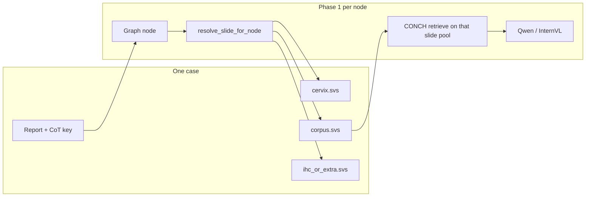

# Multi-slide cases — strategy for the agentic graph pipeline

**Context:** `chains.jsonl` and the label xlsx use **one row per patient case** (one report, one CoT chain). The `slide_id` field is a **comma-separated list** of `.svs` whole-slide images for that case. ~79% of cases have 2–3 slides.

**See also:** [PROJECT_OVERVIEW.md](PROJECT_OVERVIEW.md) · [UTERUS_GRAPH.md](UTERUS_GRAPH.md) · `data/case_slides.py`

---

## 1. What the slides usually are

| Pattern | Typical slides | Clinical meaning |
|---------|----------------|------------------|
| **2 slides** | cervix + corpus | **Fractional curettage** — two scrapes from one procedure, one integrated report |
| **3 slides** | cervix + corpus + extra | Same curettage **plus** a third block: extra H&E levels, **IHC** (p16, p53, MLH1, …), or a separate specimen (e.g. myoma resection) |
| **1 slide** | single block | Pipelle, corpus-only curettage, hysterectomy, etc. |

Important distinction:

- **Case** = one diagnostic workup → one reasoning chain + one final report (REG² eval unit).
- **Slide** = one scanned glass slide → one WSI file → own offline cache (`patch_embeddings_{zoom}.pt`, thumbnail, …).
- **IHC** = extra **stain** on sections from a block; sometimes scanned as its own slide. The uterus graph today has **no IHC-specific nodes** — IHC results appear in report text and in follow-up report sections, not as separate graph branches.

---

## 2. Design principle

> **Keep case-level reasoning; route vision per graph node.**

The graph already asks **compartment-level** questions (`endometrium`, `junctional_zone`, `myometrium`, …). Multi-slide handling should mirror how a pathologist works: after knowing *which compartment matters*, look at the **slide that actually contains that tissue** — not one arbitrary WSI for the whole case.



**Do not** merge all slides into one fake WSI or one concatenated embedding pool for retrieval — that breaks `zoom_level` semantics and per-slide offline artifacts.

---

## 3. Recommended handling (phased)

### Phase A — Baseline (implemented now)

| Item | Choice |
|------|--------|
| Eval / chains key | Full comma-separated `slide_id` (case id) |
| Vision input | **One primary WSI** per case: default **index 1 = corpus** (2-slide fractional curettage) |
| Code | `data/case_slides.py`, `wsi_slide_id=` in `run_agent_traversal`, `scripts/inference/run_test_baseline_batch.py` |
| Limitation | Cervix / IHC blocks invisible to VLM; acceptable for plumbing + endometrium-heavy graph smoke tests |

Use for: thumbnail baseline, first Edge-F1 runs on test split, LoRA dataset v1.

### Phase B — Graph-routed multi-slide (target for proper REG² inference)

After each node (or at least after `compartment`), select the WSI by **compartment + procedure**, not a fixed index:

| Graph context | Preferred slide | Rationale |
|---------------|-----------------|-----------|
| `compartment → endometrium` and downstream endometrium nodes | **Corpus** (index 1) | Endometrium lives in cavity scrape |
| `compartment → junctional_zone`, ectocervical work-up | **Cervix** (index 0) | TZ / cervical mucosa |
| `organ_procedure`, tier `global_features` | **Both thumbnails** @ 5× (or 10×), 1 patch each | Gross architecture across sites |
| `compartment → myometrium`, mass / leiomyoma | **Lesion slide** — often index 2 if third block is myoma; else corpus | Match macroscopy numbering |
| `synthesis_interpretation`, `diagnosis`, `report` | **Primary diagnostic slide** (corpus if endometrial path) | Align with where the principal lesion was scored |
| **IHC / supplementary block** (3rd slide, report mentions p16/p53/…) | **Skip in Phase 1 v1** | Graph has no IHC nodes; stain readout is text. Revisit when adding molecular / p16 nodes or Phase 2 multimodal re-grounding |

**Implementation sketch:**

```text
CaseContext
  case_id: str                    # comma-separated slide_id from chains.jsonl
  slides: list[{ wsi_id, role }]  # role ∈ cervix | corpus | supplemental | unknown
  caches: dict[wsi_id → SlideCache]

resolve_slide_for_node(node, case_ctx, steps) -> wsi_id
  if node.tier == global: return all slides (multi-image prompt)
  compartment = answer at compartment step (if past it)
  map compartment → role → wsi_id
  fallback: primary_wsi_for_baseline(case_id)
```

Offline preprocessing **unchanged**: tile / encode / K-means **per individual `.svs`**. Phase 1 only changes *which* `SlideCache` is passed into `retriever.retrieve()` per node.

### Phase C — Phase 2 report generation

| Option | Input | When |
|--------|-------|------|
| **C0 (current)** | Serialized CoT text only | Baseline MedGemma |
| **C1** | CoT + **2 thumbnails** (cervix + corpus) | Cheap multimodal re-grounding |
| **C2** | CoT + top evidence patches **per slide used in Phase 1** | SlideSeek-style summary |
| IHC slide | **Text only** unless graph explicitly models stain interpretation | Avoid showing unstained IHC slide to VLM without stain-aware training |

Phase 2 never needs to re-merge slides at the embedding level if Phase 1 already recorded which slide supported each chain step (`inference_wsi` per step → extend to full log).

---

## 4. Slide role assignment

**v1 (no new labels):** positional heuristic on comma-separated order in xlsx — matches most fractional curettage reports (`1. Cervix … 2. Corpus …`):

```python
# data/case_slides.py
roles = ["cervix", "corpus", "supplemental"]  # index 0, 1, 2+
```

**v2 (optional):** parse macroscopy headings from report at index time, or add `slide_roles` column to manifest / xlsx.

**v3 (future):** compartment classifier on thumbnails @ 5× to assign roles when order is ambiguous (laparoscopy multi-specimen cases).

---

## 5. Training (LoRA / WP3)

| Version | Sampling | Aligns with inference |
|---------|----------|------------------------|
| **v1** | One primary WSI per case (corpus) | Phase A baseline |
| **v2** | Same routing as Phase B — per-node WSI from `resolve_slide_for_node` | **Preferred** before serious LoRA |
| v3 ablation | KEEP-style cross-slide pooling by `node_id` | Only after v2 baseline; watch train/serve skew |

Supervision stays **case-level** (one target answer per node); only the **visual source slide** changes.

---

## 6. Eval & manifests

| Field | Level | Notes |
|-------|-------|-------|
| `slide_id` in `chains.jsonl` | **Case** | Comma-separated; pred JSONL must use **identical** string |
| `n_slides` in `cases.csv` | Case | From `build_manifest.py` |
| Per-slide metrics | Optional ablation | e.g. “corpus-only oracle” upper bound — not primary REG² score |

Primary metric: **case-level** Edge-F1 / BPV on the full chain, same as single-slide cases.

---

## 7. Summary table

| Stage | Multi-slide behavior |
|-------|----------------------|
| **Labels / WP3** | One chain per case; slides listed in `slide_id` |
| **Offline vision** | Per `.svs` cache (no change) |
| **Phase A baseline** | Corpus WSI only (`primary_index=1`) |
| **Phase B target** | Route WSI by graph compartment + tier |
| **IHC 3rd slide** | Defer vision; report text / Phase 2 |
| **Phase 2** | CoT text → optional multi-thumbnail |

---

## 8. References in repo

| Artifact | Purpose |
|----------|---------|
| `data/case_slides.py` | `parse_slide_ids`, `primary_wsi_for_baseline`, `iter_chain_records` |
| `scripts/inference/run_test_baseline_batch.py` | Test-split thumbnail baseline (Phase A) |
| `baselines/agent_runner.py` | `slide_id` (case) vs `wsi_slide_id` (vision) |
| `data/manifests/README.md` | `slide_ids`, `n_slides` columns |

**Related work (not implemented):** PolyPath — multi-slide report gen with Gemini LoRA ([PROJECT_OVERVIEW.md](PROJECT_OVERVIEW.md) references).
