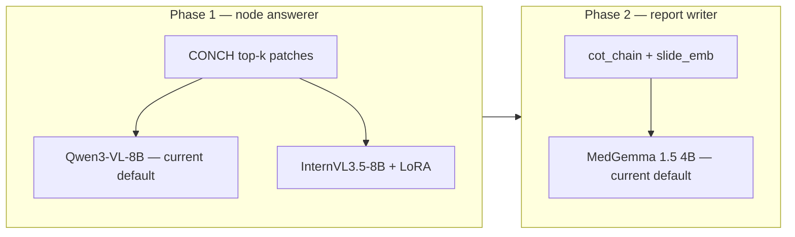

# MLMI REG² — Interactive Pathology Report Generation

**TUM MLMI Practical Course · Summer 2026** · Dr. Han Li · REG² challenge-oriented project

| Also read | |
|-----------|---|
| [cluster_setup.md](cluster_setup.md) | Garching SLURM, enroot, local VLM + vLLM (WP3) |
| [WSI_Patching_Retrieval_Research.md](WSI_Patching_Retrieval_Research.md) | Patch retrieval methods & zoom routing |
| [WSI_Background_Filtering.md](WSI_Background_Filtering.md) | Tissue vs glass filtering (offline tiling) |
| [../README.md](../README.md) | Repo tree, quick start, owner lanes |

---

## 1. Goal

Build a system that, **given only a WSI at test time**, walks a **diagnostic graph** question-by-question, answers from **visual evidence** (+ memory), and outputs:

1. **Reasoning chain** — evaluated with Binary Path Validity, Edge-F1, MESS  
2. **Final pathology report** — ROUGE-L, BLEU-4, clinical accuracy  

**Train vs inference (critical):**

| | Training | Inference |
|---|----------|-----------|
| Input | WSI + report | **WSI only** |
| Report | Supervision (WP3 chains) + HippoRAG 2 index (train split only) | **Not available** |

**WSI data:** `.svs` files under `/mnt/projects/mlmi/TUMUntera/TUM_Untera_data` (~220 slides). Canonical path in [`configs/paths.yaml`](../configs/paths.yaml) → `cluster.data_dir`.

**Cluster-only assets** (not on local laptops — see [cluster_setup.md](cluster_setup.md)):

| Location | Contents |
|----------|----------|
| `/mnt/projects/mlmi/reg2/containers/` | Team `.sqsh` bases: `qwen25_graphrag.sqsh`, `qwen25.sqsh`, `qwen25_dev_updated.sqsh`, `qwen25_dev_v2.sqsh`; personal exports e.g. `dominik_20260529_base.sqsh`. **Each person creates their own** enroot env + export — follow §3 in `cluster_setup.md`. |
| `/mnt/projects/mlmi/reg2/models/` | **Only these five today:** `Qwen3-VL-8B-Instruct`, `Qwen3-VL-30B-A3B-Instruct`, `InternVL3_5-8B`, `InternVL3_5-14B`, `medgemma-1.5-4b-it` — see [§2d](#2d-model-deployment-status) |
| `/mnt/projects/mlmi/reg2/repos/` | Cloned code: `mlmi_reg2_pathology_report_gen`, `TITAN`, `Patho-R1`, `quilt-llava` |
| `/mnt/projects/mlmi/reg2/dataset/` | Team thumbnail JPEG banks — see [§2a Thumbnail options](#2a-thumbnail-options-cluster) |

---

### 2a. Thumbnail options (cluster)

Precomputed whole-slide JPEGs for Phase 1 (`--visual thumbnail`) live under a **shared flat directory** (not per-slide cache folders):

```text
/mnt/projects/mlmi/reg2/dataset/
  thumbnails/              # default P1 baseline — openslide pyramid downsample, max edge 1024 px
  thumbnails_kmeans/       # tissue-emphasized composite (k-means on low-res patches; k≈100)
  thumbnails_kmeans_5/     # coarser tissue summary (k=5) — less glass, smaller files
```

| Directory | Files | Naming | Recommended use |
|-----------|-------|--------|-----------------|
| `thumbnails/` | 460 × `.jpg` | `TUM_Uterus_0001.jpg` (= stem of `TUM_Uterus_0001.svs`) | **Default baseline** while full tiling / CONCH encode runs |
| `thumbnails_kmeans/` | 460 × `.jpg` | same | **Preferred thumbnail upgrade** — more tissue signal, less empty glass |
| `thumbnails_kmeans_5/` | 460 × `.jpg` | same | **Ablation** — very coarse tissue overview; fastest VLM context |

All three are valid Phase 1 inputs. Start with `thumbnails/` or `thumbnails_kmeans/`; use `thumbnails_kmeans_5/` only as an ablation (coarser global context).

**How the agent resolves thumbnails**

Set in `configs/vision.yaml` → `thumbnail.dataset_root` and `thumbnail.variant` (`thumbnails` \| `thumbnails_kmeans` \| `thumbnails_kmeans_5`). Inference loads:

```text
{dataset_root}/{variant}/{stem}.jpg     # e.g. …/thumbnails_kmeans/TUM_Uterus_0001.jpg
```

Falls back to `{cache_root}/{slide_id}/thumbnail.png` when the dataset file is missing (offline `build_thumbnail_cache` output).

**While offline encode is running:** use any `dataset/` bank above for thumbnail-only Phase 1; switch to `--visual patch_retrieve --retriever graph_guided` per slide once `patch_embeddings_{zoom}.pt` exist under the same `cache_root`.

---

## 2. Target architecture (hardware-limited)

**Hardware budget:** 1× A100-80G or 2× A100-40G. Models reload between phases on the same GPU(s).

```mermaid
flowchart TD
    subgraph offline [Offline preprocessing — once per WSI]
        WSI[WSI .svs]
        Tile[openslide native px @ 5×/10×/20×/40×]
        Thumb[thumbnail PNG per slide]
        CONCH[CONCHv1.5 ×4 pools → patch_embeddings_{zoom}.pt]
        TITAN20[TITAN slide encoder @ 20× only]
        WSI --> Tile --> CONCH
        WSI --> Thumb
        Tile --> TITAN20
    end

    subgraph phase1 [Phase 1 — graph traversal per WSI]
        Node[Node: zoom_level + description]
        Zoom[Load patch_embeddings_{zoom}.pt]
        Ret[CONCH text×vision cosine → raw patch images]
        HR[HippoRAG 2 top-2 CoT steps]
        VLM[Qwen3-VL-8B-Instruct — current default]
        CoT[cot_chain.json]
        Node --> Zoom --> Ret
        Node --> HR
        Ret --> VLM
        HR --> VLM
        VLM --> CoT
        CoT --> HR
    end

    subgraph phase2 [Phase 2 — report generation]
        Proj[slide_emb 1024 → 4096 linear]
        LLM[medgemma-1.5-4b-it — current default]
        Report[CAP pathology report]
        Edges[reasoning graph edges]
        CoT --> LLM
        Proj --> LLM
        LLM --> Report
        Report --> Edges
    end

    offline --> phase1
    phase1 --> phase2
```

**Design lineage:** Phase 1/2 structure follows SlideSeek's *evidence chain → report* pattern ([arXiv:2506.20964](https://arxiv.org/abs/2506.20964)); magnification routing follows MMNavAgent's MST/CMT ideas via a **fixed uterus graph** instead of a learned navigator ([arXiv:2603.02079](https://arxiv.org/abs/2603.02079)). See §10 for borrow/skip tables.

### Phase 0 — Offline preprocessing

| Step | Spec | Artifact |
|------|------|----------|
| Thumbnail | `openslide` pyramid downsample, max edge 1024 px | `thumbnail.png` per slide under `cache_root/`; team JPEG banks in `dataset/thumbnails{,_kmeans,_kmeans_5}/` — see [§2a](#2a-thumbnail-options-cluster) |
| Multi-scale tiling | Non-overlapping patches at **four zoom levels** (native px → resize to 224×224 before CONCH); **tissue filter:** mean grayscale ≤ 220 today — see [WSI_Background_Filtering.md](WSI_Background_Filtering.md) for planned upgrade | `coords_{5x,10x,20x,40x}.pt`, `meta_{zoom}.json` |
| | **5×:** 2048×2048 → 224×224 | |
| | **10×:** 1024×1024 → 224×224 | |
| | **20×:** 512×512 → 224×224 | |
| | **40×:** 256×256 → 224×224 | |
| CONCH encode | Run CONCHv1.5 **vision encoder separately at each zoom** | `patch_embeddings_{5x,10x,20x,40x}.pt` — shape `[N, 768]` each |
| TITAN slide encode | Aggregate **×20 patches only** (TITAN native training mag) | `slide_embedding.pt` (1024-d) |

**Critical split:** Four CONCH pools feed **Phase 1 retrieval only**. TITAN slide embedding uses the ×20 pool exclusively — not multi-scale aggregation.

Per-slide cache layout:

```text
cache_root/{slide_id}/
  patch_embeddings_5x.pt   coords_5x.pt
  patch_embeddings_10x.pt  coords_10x.pt
  patch_embeddings_20x.pt coords_20x.pt   ← TITAN slide_embedding.pt source
  patch_embeddings_40x.pt  coords_40x.pt
  slide_embedding.pt
```

### Phase 1 — Graph traversal

For each node in `data/graph/execution_graph.jsonl` (**deterministic** order; graph owns navigation):

**a. Zoom tier** — read `tier = node["zoom_level"]` (`5x` \| `10x` \| `20x` \| `40x`); load `patch_embeddings_{tier}.pt` for this WSI.

**b. Text query** — encode `node.retrieval_text` (question + description) via **`TitanEncoder.encode_text()`** (768-d, aligned with offline CONCH patch embeddings):

```python
node_text_emb = titan_encoder.encode_text(node.retrieval_text)  # (768,)
```

**c. Cross-modal retrieval** — cosine similarity within that zoom pool. **Default:** search K-means centroids first (`kmeans_centroids_{tier}.pt`, `k=100` in `configs/vision.yaml`); optional `--search-all-patches` for full-pool scan (simpler, slower):

```python
similarities = cosine_similarity(node_text_emb, patch_embeddings[tier])  # or centroid pool
top_k = top_k_for_zoom(tier)   # 3 @ 5×/10×; 5 @ 20×/40×
top_k_patches = load_raw_patches(tier, top_k_indices)
```

**c′. Adjacent-scale context (CMT enricher)** — for each retrieved patch, optionally attach coarser parent tiles per `retrieval.adjacent_scale.parent_map` in `configs/vision.yaml` (40×→20×, 20×→10×, 10×→5×). Integration/report nodes also receive a **grandparent** tile. Dual-scale images go to the VLM bundle; no learned fusion module.

**d. VLM answer** — pass `top_k_patches` (raw images) + node question + HippoRAG context → **Qwen3-VL-8B-Instruct** (current default — vLLM or HF inside enroot); append to `cot_chain`; online-update HippoRAG 2. **Always run inside a container** — see [cluster_setup.md](cluster_setup.md) §3.

Every graph node **must** carry `zoom_level` and should include `description` for richer CONCH text queries.

Output: `runs/{slide_id}/cot_chain.json`

### Phase 2 — Report generation

1. Serialize `cot_chain` as JSON string  
2. Project `slide_emb` (1024-d) through learned linear layer → 4096-d → `[SLIDE]` prefix token  
3. Prompt **medgemma-1.5-4b-it** (text-only, same GPU after VLM unload): CoT + slide prefix → CAP-format report  
4. Parse report into reasoning-graph edges for REG² eval  

Output: `runs/{slide_id}/report.txt`, `runs/{slide_id}/pred_edges.jsonl`

### Model roles & selection (Phase 1 vs Phase 2)

Two **different** model jobs — do not reuse the same weights for both phases without measuring trade-offs.

| Phase | Job | Input | Output |
|-------|-----|-------|--------|
| **1** | Per-node patch VLM (graph answerer) | top-k **raw patch images** + node question + HippoRAG context | Structured node answer → `cot_chain` |
| **2** | Final report LLM | Serialized `cot_chain` + projected TITAN slide emb (text-only) | CAP-format pathology report |

Cluster weights live under `/mnt/projects/mlmi/reg2/models/`. **Only five models are staged today** — plan below uses what is on disk; see [§2d](#2d-model-deployment-status) for optional future downloads.

#### Role 1 — Per-node patch VLM (Phase 1)

| Model | Params | Relevant strength | Weakness for this role | On cluster |
|-------|--------|-------------------|------------------------|------------|
| **Qwen3-VL-8B-Instruct** | 8B | **Current default** — staged; vLLM + HF paths; strong instruction-following | General-purpose; no histopathology pretraining | ✅ **default Phase 1** |
| **InternVL3.5-8B** | 8B | LoRA substrate; multi-image prompts; zero-shot ablation | No pathology tuning out of the box; HF inference script needed | ✅ ablation + fine-tune |
| **InternVL3.5-14B** | 14B | Upper-bound open VLM | 2× GPU; slow per-node loop | ✅ ablation only |
| **Qwen3-VL-30B-A3B-Instruct** | 30B | Quality upper bound | Needs 2+ GPUs; too heavy for default graph loop | ✅ upper-bound eval |
| **MedGemma 1.5 4B** | 4B | Medical / WSI-trained | **Wrong role** — slide-level model, not per-patch node Q&A | ✅ on disk — **Phase 2 only** |

**Verdict — Phase 1 (current plan):** Run graph traversal with **Qwen3-VL-8B-Instruct**. Ablate with **InternVL3.5-8B**; LoRA **InternVL3.5-8B** when training lane is ready. Use **Qwen3-VL-30B** only for quality ceiling experiments. **Do not use MedGemma** for node answering.

#### Role 2 — Final report generation (Phase 2)

| Model | Params | Relevant strength | Weakness | On cluster |
|-------|--------|-------------------|----------|------------|
| **MedGemma 1.5 4B** | 4B | **Current default** — 335K WSI→report pairs; medical reasoning | Smaller; CAP instruction-following untested | ✅ **default Phase 2** |
| **Qwen3-VL-8B-Instruct** | 8B | On cluster | Vision LM — wasteful for text-only report stage | ✅ wrong role for Phase 2 |
| **InternVL3.5** | 8B / 14B | On cluster | Vision LM — wrong role | ❌ Phase 2 |
| **Qwen2.5-7B-Instruct** | 7B | Strong CAP instruction-following | Not staged | ❌ optional future download |

**Verdict — Phase 2 (current plan):** **medgemma-1.5-4b-it** is the only staged report LLM — use it for Phase 2 now. **Run a quick CAP-format test** on 5–10 slides and tune prompts before locking eval defaults.

#### Where InternVL3.5 fits in the pipeline



| InternVL3.5 variant | Phase | Role |
|---------------------|-------|------|
| **8B zero-shot** | 1 | Ablation baseline vs **Qwen3-VL-8B** (current default) |
| **8B + LoRA** | 1 | Specialized node answerer after uterus-graph fine-tune |
| **14B** | 1 | Upper-bound ablation (2× GPU) |
| **8B / 14B** | 2 | **Not used** — text-only report stage |

**Practical order (with current weights only):** (1) offline artifacts + K-means index → (2) Phase 1 with **Qwen3-VL-8B** + `graph_guided` retrieval → (3) HippoRAG 2 real index → (4) Phase 2 projector + **MedGemma 1.5 4B** report writer → (5) eval edge parser → (6) LoRA **InternVL3.5-8B** ablation.

---

## 2b. Locked architectural decisions

| Question | Decision | Rationale |
|----------|----------|-----------|
| Graph artifact | **Keep** `data/graph/execution_graph.jsonl` as uterus ontology | DOGA-maintained ground truth; deterministic traversal already wired; no separate JSON schema |
| CONCH loading | **`TitanEncoder.return_conch()` only** — no standalone `MahmoodLab/CONCH` HF loader | Single `MahmoodLab/TITAN` checkpoint yields CONCH vision + slide aggregator + shared transform; already in `vision/encoders/titan.py` and locked in `configs/vision.yaml`; avoids duplicate weights and embedding-space drift |
| Retrieval query encoder | **`TitanEncoder.encode_text()`** on `node.retrieval_text` | MahmoodLab's paired text head for zero-shot text→CONCH-patch retrieval (768-d); same model load as offline encoding; **not** a separate CONCH HF text-only import |
| K-means pool | **Default on** (`kmeans_k: 100`, adjustable in `configs/vision.yaml`) | Centroid pre-filter before cosine rank; optional full-pool search for ablation/debug |
| Phase 1 VLM | **Qwen3-VL-8B-Instruct** (staged on cluster) — vLLM for WP3 / smoke tests; HF multi-image for agent loop when wired | Only five models on disk today — see §2d |
| WSI data path | **`/mnt/projects/mlmi/TUMUntera/TUM_Untera_data`** | Canonical in `configs/paths.yaml` → `cluster.data_dir` |
| Phase 2 report LLM | **medgemma-1.5-4b-it** (only staged report LLM) | Qwen2.5-7B optional future download — not on cluster |

---

## 2c. Implementation roadmap (validated order)

Build in this sequence — each step depends on the previous artifacts:

| Step | Work | Owner lane | Key outputs |
|------|------|------------|-------------|
| **1. Offline pipeline** | Tile 5×/10×/20×/40× → CONCH encode (4 pools) → TITAN slide emb @ 20× → K-means centroids | DOMI | `cache_root/{slide_id}/patch_embeddings_{zoom}.pt`, `slide_embedding.pt`, `kmeans_centroids_{zoom}.pt` |
| **2. Artifact layout** | Standardize cache filenames + `meta_{zoom}.json`; verify one slide end-to-end | DOMI | `configs/vision.yaml` paths match on-disk layout |
| **3. Phase 1** | `graph_guided` retrieval (K-means default) + HippoRAG 2 stub→real + **Qwen3-VL-8B** node VLM | DOMI + NICK + XUN | `runs/{slide_id}/cot_chain.json` |
| **4. Phase 2** | TITAN slide projector (1024→4096) + **MedGemma 1.5 4B** report writer | XUN + DOMI | `runs/{slide_id}/report.txt` |
| **5. Eval edge parser** | Report text → `pred_edges.jsonl` for REG² Edge-F1 | ALL | `eval/` wired to full pipeline |
| **6. Cluster scripts** | SLURM wrappers for offline batch, Phase 1/2 inference, model load in enroot | XUN + DOMI | `scripts/cluster/*.sh` |

**Parallel track (start with step 1):** thumbnail baseline and WP3 extraction can proceed on existing caches; graph JSONL expansion (DOGA) is independent of offline encode.

**Do not invert:** Phase 1 VLM before offline embeddings exist; Phase 2 before `cot_chain.json`; edge parser before report generation.

---

## 2d. Model deployment status

### Staged on cluster today (`ls /mnt/projects/mlmi/reg2/models/`)

| Model | Phase | Current role |
|-------|-------|--------------|
| `Qwen3-VL-8B-Instruct` | 1 | **Default node VLM** — `configs/paths.yaml` → `qwen.*`; `scripts/cluster/start_qwen_server.sh` |
| `Qwen3-VL-30B-A3B-Instruct` | 1 | Upper-bound quality eval (2× GPU) |
| `InternVL3_5-8B` | 1 | Zero-shot ablation + LoRA fine-tune substrate |
| `InternVL3_5-14B` | 1 | Upper-bound ablation (2× GPU) |
| `medgemma-1.5-4b-it` | 2 | **Default report LLM** |

### Optional future downloads (not required for current plan)

| Model | Why | Priority |
|-------|-----|----------|
| `Qwen2.5-VL-7B-Instruct` | Smaller general VLM; INT8 on 1× GPU | Low — Qwen3-VL-8B already staged |
| `Qwen2.5-7B-Instruct` | Text-only CAP report alternative to MedGemma | Low — MedGemma already staged for Phase 2 |
| MedGemma 27B (text) | Stronger medical text | Low — budget / staging cost |

---

## 3. Current codebase status (audit snapshot)

| Component | Status | Location |
|-----------|--------|----------|
| Graph loader + deterministic traversal | **Partial** — seed graph has 3 nodes; traversal works | `graph/`, `agent/controller.py` |
| Thumbnail baseline (P1) | **Done on cluster** — `dataset/thumbnails{,_kmeans,_kmeans_5}/`; `thumbnail.variant` in `configs/vision.yaml` | `vision/cache.py`, `vision/thumbnail.py` |
| openslide tiling 512×512 | **Implemented** — four bands (×4/×10/×20/×40) | `vision/wsi_io.py`, `scripts/vision/tile_slides.py` |
| CONCH patch encoder (4 pools) | **Partial** — via `TitanEncoder.return_conch()` only | `vision/encoders/titan.py`, `scripts/vision/encode_patches_offline.py` |
| TITAN slide encoder | **Implemented** — ×20-only slide emb (1024-d); canonical `patch_embeddings_20x.pt` if missing | `scripts/vision/encode_slide_embeddings.py` |
| K-means retrieval pool | **Implemented** — default `kmeans_k=100`; `--search-all-patches` ablation | `retrieval/kmeans_index.py`, `retrieval/titan_cosine.py` |
| CONCH/TITAN unified offline job | **Implemented** — tile → verify → encode → kmeans → slide emb | `scripts/preprocess/run_offline_wsi.py`, `scripts/cluster/run_offline_wsi.sh` |
| Graph-tier zoom retrieval | **Implemented** — `node.zoom_level` → pool; **`TitanEncoder.encode_text()`** query | `retrieval/graph_guided.py`, `retrieval/titan_cosine.py` |
| Patch retrieval (cosine) | **Implemented** — K-means centroid pool + diversity filter + full-pool flag | `retrieval/titan_cosine.py` |
| HippoRAG 2 | **Partial** — embedding fallback for smoke tests; full KG TODO (NICK) | `memory/hipporag2.py`, `scripts/memory/build_hipporag_index.py` |
| Per-node VLM | **Partial** — Qwen3-VL-8B via vLLM API | `agent/backends.py`, `scripts/inference/run_phase1.py` |
| Phase 2 report LLM + slide projector | **Implemented** — MedGemma 1.5 4B + linear projector stub | `agent/report_writer.py`, `scripts/inference/run_phase2.py` |
| cot_chain / report disk persistence | **Implemented** — `runs/{slide_id}/cot_chain.json`, `report.txt` | `scripts/inference/run_phase1.py`, `run_phase2.py` |
| REG² chain metrics (BPV, Edge-F1, MESS) | **Implemented** | `eval/metrics/chain.py`, `eval/run_eval.py` |
| Report → edge parser | **Implemented** — `pred_edges.jsonl` + `build_predictions.py` | `eval/edge_parser.py`, `scripts/inference/build_predictions.py` |
| Deployed VLMs + sibling repos | **Cluster only** — see §1 asset table | `/mnt/projects/mlmi/reg2/models/`, `repos/` |

---

## 4. Graph artifact

| Artifact | Path | Role |
|----------|------|------|
| **Execution graph** | `data/graph/execution_graph.jsonl` | Agent walk — DOGA maintains (**schema is read-only ground truth**; no separate ontology JSON schema change) |
| Ontology mirror | `data/graph/ontology_graph.jsonl` | Optional full drawio export (not present yet) |

Navigation is **deterministic**: `JsonGraphStore.next()` follows `edges` keyed by VLM answer. The LLM never chooses the next node.

Drawio labels are **medical categories**, not questions. Templated `question` fields and `interaction` types are added in JSONL.

---

## 5. JSONL node schema

| Field | Description |
|-------|-------------|
| `id`, `label`, `question`, `description` | Node identity; `description` augments CONCH text retrieval |
| `tier` | `global_features` \| `local_features` \| `integration` |
| `node_kind` | `global` \| `compartment` \| `local` \| `integration` \| `report` |
| `interaction` | `single_select` \| `multi_select` \| `boolean` \| `free_text` |
| `options`, `edges` | Answers; `__default__` for multi_select converge |
| `zoom_level` | **`5x` \| `10x` \| `20x` \| `40x`** — required on every node; selects CONCH pool |
| `visual_policy` | `thumbnail_only` \| `patch_retrieve` \| `both` |
| `root`, `is_leaf` | Traversal anchors |

---

## 6. Memory

| Layer | Target | Current |
|-------|--------|---------|
| Episodic | Partial CoT in prompt | `memory/episodic.py` ✅ |
| Semantic | HippoRAG 2 — build on train CoT, retrieve top-2, online update | `memory/hipporag2.py` stub |

Factory: `--memory flat|hipporag2|graphrag` (graphrag = ablation stub).

---

## 7. Team workflow

- Pull from `main` often; **feature branches → PR → reviewer → merge**
- Document on **ShareLaTeX** for the final report

### Owner lanes

| Person | Owns | Entry points |
|--------|------|--------------|
| **DOGA** | Graph JSONL | `data/graph/execution_graph.jsonl`, `graph/loader.py` |
| **NICK** | HippoRAG 2 | `memory/hipporag2.py`, `scripts/memory/` |
| **DOMI** | WSI offline + retrieval + pipeline | `vision/`, `scripts/vision/`, `scripts/preprocess/`, `scripts/inference/` |
| **XUN** | VLM serve (**Qwen3-VL-8B**) + MedGemma Phase 2 | `configs/paths.yaml`, `agent/backends/`, `scripts/cluster/` |
| **ALL** | Eval, agent | `eval/`, `baselines/run_agent.py` |

---

## 8. Commands

```bash
# Tests
pytest tests/

# --- Target pipeline (to be implemented) ---
# Offline (cluster GPU)
python -m scripts.preprocess.run_offline_wsi --slide CASE.svs

# Phase 1 + 2 inference
python -m scripts.inference.run_phase1 --slide-id CASE.svs
python -m scripts.inference.run_phase2 --slide-id CASE.svs

# --- Current baselines (cluster: models under /mnt/projects/mlmi/reg2/models/) ---
python -m baselines.run_agent --memory flat --visual thumbnail --navigator graph_guided
python -m baselines.run_agent --backend qwen --visual patch_retrieve --retriever graph_guided --slide-id CASE.svs
# Primary path: node.zoom_level → one of four CONCH pools (not a flat pool)

# Eval
python -m eval.run_eval --pred runs/predictions.jsonl --gt data/labels/chains.jsonl --split test

# Offline vision (existing cluster jobs)
python -m scripts.vision.tile_slides --slide CASE.svs
python -m scripts.vision.encode_patches_offline --slide CASE.svs
python -m scripts.vision.encode_slide_embeddings --slide CASE.svs
```

---

## 9. Ablations (legacy + target)

**Default inference stack to try first:** `--visual patch_retrieve --retriever graph_guided` with each node’s `zoom_level` selecting its magnification-specific CONCH pool.

| Knob | Values | Notes |
|------|--------|-------|
| `--visual` | `thumbnail`, `patch_retrieve`, `slide_embed`, `none` | `thumbnail` = P1 baseline (cluster caches ready) |
| `--memory` | `flat`, `hipporag2` | |
| `--retriever` | `none`, `titan_cosine`, `graph_guided` | **`graph_guided` = default** — `zoom_level` → pool |
| `--navigator` | `graph_guided` | Same graph-as-MST policy |
| VLM (Phase 1) | **Qwen3-VL-8B** (default) → InternVL3.5-8B zero-shot / LoRA → Qwen3-VL-30B upper bound | Only staged VLMs on cluster |
| K-means pool | **Default on** (`kmeans_k=100`); `--search-all-patches` ablation | Faster retrieval; k tunable in `configs/vision.yaml` |
| Report LLM (Phase 2) | **MedGemma 1.5 4B** (only staged report LLM) | `models/medgemma-1.5-4b-it` |
| Flat ×20 pool | Ablation | Force all nodes to `embeddings_high.pt` regardless of `zoom_level` |

---

## 10. Influencing prior work — what we borrow vs skip

Two recent pathology-agent papers shape our design. We **do not** replicate either system end-to-end (hardware, data scale, and REG² eval constraints differ), but we explicitly steal specific ideas.

### PathChat+ & SlideSeek ([arXiv:2506.20964](https://arxiv.org/abs/2506.20964))

**What they do:** PathChat+ is a pathology-specific MLLM trained on ~1M instruction samples. **SlideSeek** wraps it in a multi-agent loop that iteratively inspects gigapixel WSIs through hierarchical diagnostic reasoning and produces visually grounded summary reports (strong on DDxBench).

| Idea from PathChat+ / SlideSeek | Our adoption |
|-----------------------------------|--------------|
| **Evidence-based per-step reasoning** — each answer grounded in selected patch images, not slide-level guess | ✅ Phase 1: top-k CONCH-retrieved patches → **Qwen3-VL-8B** per graph node |
| **Iterative chain accumulation** — partial reasoning carried forward across steps | ✅ `cot_chain` list + episodic memory + HippoRAG 2 retrieval of similar past steps |
| **Hierarchical diagnostic structure** — coarse → fine reasoning over a case | ✅ Uterus ontology tiers (`global_features` → `local_features` → `integration`); deterministic graph replaces SlideSeek's learned agent planner |
| **Separate synthesis stage** — chain of evidence → final human-readable report | ✅ Phase 2: dedicated **MedGemma 1.5 4B** report writer (not the same call as node answering) |
| **Visually grounded outputs** — answers tied to WSI regions | ✅ Retrieved patch PNGs in VLM prompt; optional edge parser links answers to graph nodes |
| **Pathology-native VLM (PathChat+ in SlideSeek)** | ❌ Weights not public — use **Qwen3-VL-8B** + **InternVL3.5-8B LoRA** instead |
| **Autonomous multi-agent navigation** (SlideSeek agents pick where to look next) | ❌ REG² requires reproducible reasoning paths → **deterministic graph traversal** owns navigation |
| **End-to-end SlideSeek training** | ❌ Out of scope; we reuse MahmoodLab encoders + open VLMs |

**Net effect:** SlideSeek validates the *shape* of our pipeline (retrieve evidence → answer step-by-step → synthesize report). We swap their proprietary agent stack for a **fixed uterus graph + CONCH retrieval + HippoRAG memory + smaller open VLMs**.

### MMNavAgent ([arXiv:2603.02079](https://arxiv.org/abs/2603.02079))

**What they do:** Two tools in a closed loop — **MST** (magnification selection agent) and **CMT** (cross-magnification navigation with attention heatmaps). An LLM starts from a thumbnail, picks zoom/actions, and aggregates features across adjacent magnifications.

| Idea from MMNavAgent | Our adoption |
|----------------------|--------------|
| **Thumbnail as global anchor** before patch-level inspection | ✅ P1 baseline + optional `visual_policy: both` (thumbnail + retrieved patches) |
| **Magnification should match question granularity** | ✅ **Primary path:** each node’s `zoom_level` (`4x`/`10x`/`20x`/`40x`) selects a separate pre-extracted CONCH pool via `GraphGuidedRetriever` — **graph-as-MST** |
| **Cross-magnification context (CMT)** — fuse adjacent-scale features for the same region | ✅ **Config-driven adjacent-scale enricher:** `retrieval.adjacent_scale.parent_map` in `configs/vision.yaml` attaches parent patches for every adjacent tier (40×→20×, 20×→10×, 10×→5×); integration/report nodes also get a **grandparent** (`retrieval/titan_cosine.py`, `find_parent_patch_index`) |
| **Navigation memory bank** of prior zoom/move steps | ✅ Partial analogue: episodic CoT + HippoRAG 2 (text memory, not spatial action log) |
| **Trained MST policy** (slide-label supervision) | ❌ We have explicit graph tiers instead of learning zoom policy |
| **Full MST ↔ CMT agent loop** | ❌ Too complex for 220-slide course project; hook stub in `vision/navigation.py` only |
| **Attention heatmap region proposal** | ❌ Not implemented; CONCH cosine sim replaces CMT heatmaps for patch selection |

**Net effect:** MMNavAgent tells us *how* to think about magnification — we encode that knowledge in the **ontology graph**, and steal only the **CMT adjacent-scale fusion** idea as an optional retrieval enricher.

---

## 11. References

| Resource | Link |
|----------|------|
| PathChat+ & SlideSeek | [arXiv:2506.20964](https://arxiv.org/abs/2506.20964) |
| MMNavAgent | [arXiv:2603.02079](https://arxiv.org/abs/2603.02079) |
| TITAN / CONCH | MahmoodLab encoders |
| HippoRAG 2 | [github.com/OSU-NLP-Group/HippoRAG](https://github.com/OSU-NLP-Group/HippoRAG) |
| Qwen3-VL-8B / 30B | Phase 1 node VLM — **current default** (8B) |
| InternVL3.5 | Phase 1 ablation + LoRA (`models/InternVL3_5-{8,14}B`) |
| SlideSeek (evidence chain → report) | Design lineage for Phase 1/2 pipeline |
| MedGemma 1.5 4B | Phase 2 report LLM — **current default** |
| MedGemma | [github.com/google-health/medgemma](https://github.com/google-health/medgemma) |
| PolyPath | [arXiv:2502.10536](https://arxiv.org/abs/2502.10536) — multi-slide report gen via Gemini LoRA |
| Patho-R1, MedMemoryBench | CoT supervision & memory benchmarks |
