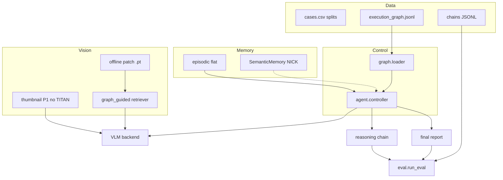

# MLMI REG² — Interactive Pathology Report Generation

**TUM MLMI Practical Course · Summer 2026** · Dr. Han Li · REG² challenge-oriented project

| Also read | |
|-----------|---|
| [cluster_setup.md](cluster_setup.md) | Garching SLURM, enroot, vLLM |
| [../README.md](../README.md) | Repo tree, quick start, owner lanes |

---

## 1. Goal

Build a system that, **given only a WSI at test time**, walks a **diagnostic graph** question-by-question, answers from **visual evidence** (+ memory), and outputs:

1. **Reasoning chain** — evaluated with Binary Path Validity, Edge-F1, MESS  
2. **Final pathology report** — ROUGE-L, BLEU-4, clinical accuracy  

**Train vs inference (critical):**

| | Training | Inference |
|---|----------|-----------|
| Input | WSI + report | **WSI only** |
| Report | Supervision (WP3 chains) + semantic RAG index (train split only) | **Not available** |

---

## 2. Architecture



**Rules:** Controller + JSONL own navigation; RAG never picks `next_question`. No LangGraph (manual loop).

---

## 3. Two graphs

| Artifact | Path | Role |
|----------|------|------|
| **Execution graph** | `data/graph/execution_graph.jsonl` | Agent walk — DOGA maintains |
| **Ontology graph** | `data/graph/ontology_graph.jsonl` | Optional full drawio mirror |

Drawio labels are **medical categories**, not questions. You add templated `question` fields and `interaction` (`single_select`, `multi_select`, …).

---

## 4. JSONL node schema (DOGA)

One JSON object per line:

| Field | Description |
|-------|-------------|
| `id`, `label`, `question` | Node identity |
| `tier` | `global_features` \| `local_features` \| `integration` |
| `node_kind` | `global` \| `compartment` \| `local` \| `integration` \| `report` |
| `interaction` | `single_select` \| `multi_select` \| `boolean` \| `free_text` |
| `options`, `edges` | Answers; `__default__` for multi_select converge |
| `retrieval_level` | `low` \| `medium` \| `high` — offline cache band (graph-as-MST) |
| `visual_policy` | `thumbnail_only` \| `patch_retrieve` \| `both` |
| `root`, `is_leaf` | Traversal anchors |

Defaults if omitted: global/compartment → `low` + `thumbnail_only`; local → `high` + `patch_retrieve`; integration/report → `both`.

---

## 5. Vision & magnification

| Phase | `--visual` | TITAN? |
|-------|------------|--------|
| **P1 default** | `thumbnail` | **No** — whole-slide thumbnail → VLM |
| P2a | offline jobs only | Encode patches to `.pt` on cluster |
| P2b | `patch_retrieve` | Yes — read caches only at inference |
| Ablation | `slide_embed`, `none` | Optional / debug |

**Offline only:** `scripts/vision/build_thumbnail_cache.py`, `scripts/vision/encode_patches_offline.py`.

**MMNavAgent** ([arXiv:2603.02079](https://arxiv.org/pdf/2603.02079)): borrow ideas (thumbnail start, dual-mag cache, `both` at synthesis); graph replaces learned MST; `vision/navigation.py` hook for future code — not required P1–P2.

---

## 6. Memory (NICK)

| Layer | Implementation | Routing? |
|-------|----------------|----------|
| Episodic | `memory/episodic.py` — flat (Q,A) in prompt | No |
| Semantic | `memory/hipporag2.py` or `graphrag.py` — **stubs** | Retrieves **context** only |

Factory: `--memory flat|hipporag2|graphrag` for ablations.

---

## 7. Team workflow (meeting 2026-06-01)

- Pull from `main` often; **feature branches → PR → reviewer → merge**
- Document everything on **ShareLaTeX** for the final report

### Owner lanes

| Person | Owns | Entry points |
|--------|------|--------------|
| **DOGA** | Graph JSONL | `data/graph/execution_graph.jsonl`, `graph/loader.py` |
| **NICK** | Semantic RAG | `memory/hipporag2.py`, `memory/graphrag.py` |
| **DOMI** | WSI, WP3, LoRA data | `vision/`, `scripts/vision/`, `extraction/qa_extractor.py`, `training/` |
| **XUN** | VLM serve | `configs/paths.yaml`, `scripts/cluster/start_qwen_server.sh` |
| **ALL** | Eval, agent | `eval/`, `baselines/run_agent.py` |

### Week-1 todos (from meeting)

- DOGA: encode uterus graph → JSONL  
- NICK: choose + implement RAG over reports xlsx (HippoRAG2 suggested)  
- DOMI: thumbnail baseline + patching/encoding stubs  
- XUN: deployed VLM + cluster docs  

---

## 8. Work packages (Han PDF)

| WP | Task |
|----|------|
| WP1 | Data exploration |
| WP2 | WSI pipeline — thumbnails (P1), offline TITAN encode (P2) |
| WP3 | Q→A / CoT extraction from reports |
| WP4 | Baselines + eval harness |
| WP5 | LoRA fine-tune + agent memory / correction |
| WP6–10 | Present, refine, integrate, benchmark, document |

### Phases

| Phase | Exit criteria |
|-------|----------------|
| P0 | Cluster + manifest + seed graph loads |
| P1 | Agent + thumbnail + eval on ≥20 cases |
| P2 | Offline embeddings + patch retrieval |
| P3 | LoRA with train/inference visual parity |

---

## 9. Commands

```bash
# Tests
pytest tests/

# P1 agent (no TITAN)
python -m baselines.run_agent --memory flat --visual thumbnail --navigator graph_guided

# Eval
python -m eval.run_eval --pred runs/predictions.jsonl --gt data/labels/chains.jsonl --split test

# Manifest
python scripts/data/build_manifest.py

# Offline vision (cluster sbatch)
python scripts/vision/build_thumbnail_cache.py
python scripts/vision/encode_patches_offline.py
```

---

## 10. Ablations

Vary: `--memory` × `--visual` × `--retriever` × VLM model × graph version.

---

## 11. References

- Patho-R1 — CoT supervision for pathology VLMs  
- MedMemoryBench — memory method comparison  
- TITAN — patch/slide encoders  
- GraphRAG / HippoRAG2 / ReMem — semantic memory options  
- MMNavAgent — [2603.02079](https://arxiv.org/pdf/2603.02079) — multi-mag navigation (Han co-author)
