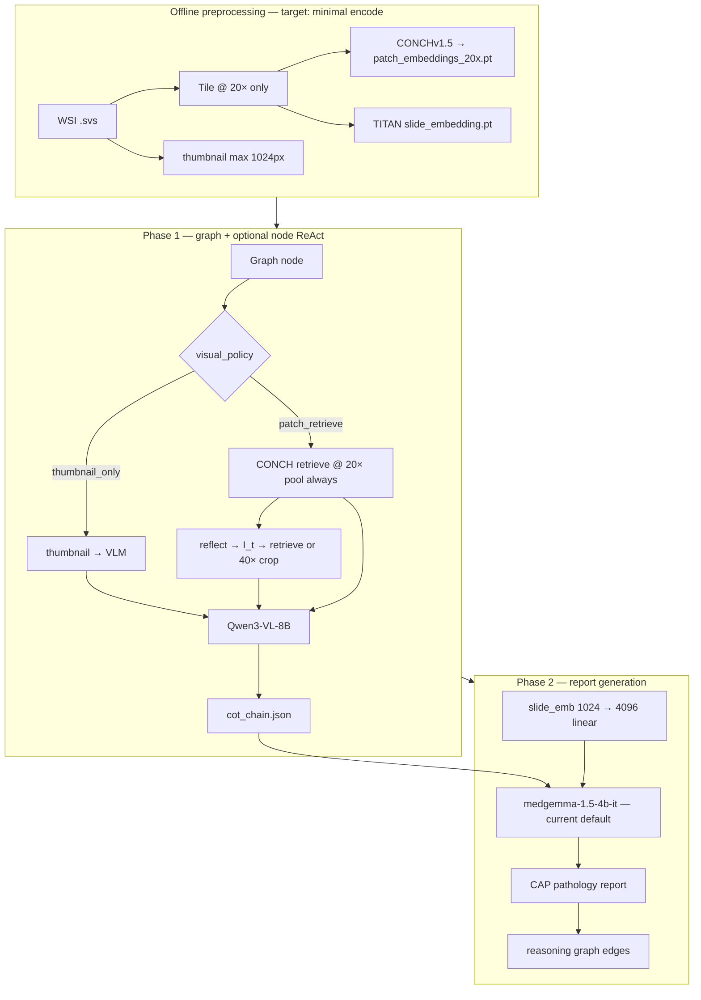
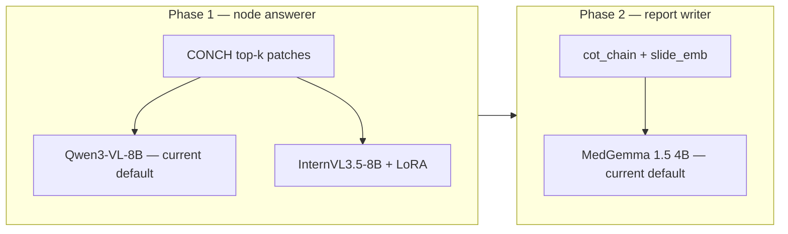
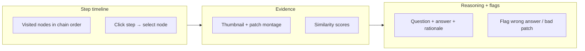

# MLMI REG² — Interactive Pathology Report Generation

## TODOs


| Status   | Item                                                                                                                                                                                                                                                                                                         | Owner / notes          |
| -------- | ------------------------------------------------------------------------------------------------------------------------------------------------------------------------------------------------------------------------------------------------------------------------------------------------------------ | ---------------------- |
| ✅ Done   | **HybridRAG reference corpus (scaffold)** — train reports + curated chunks under `data/memory/reference/`; seed uterus JSONL (12 CAP/WHO-aligned sections); build via `scripts/memory/build_hybridrag_index.py`                                                                                              | NICK — [§6](#6-memory) |
| ⬜ Open   | **Expand reference chunks** — ingest full [CAP Endometrium v5.1](https://documents.cap.org/protocols/Uterus_5.1.0.0.REL.CAPCP.pdf) + [CAP Uterine Sarcoma v4.4](https://documents.cap.org/protocols/Uterus.Sarc_4.4.0.0.REL_CAPCP.pdf) by protocol section; map `graph_nodes` to `execution_graph.jsonl` ids |                        |
| ⬜ Open   | **Benign-branch reference** — cycle dating, endometritis, polyp morphology (PMC/StatPearls chunks for nodes without CAP cancer protocol coverage)                                                                                                                                                            |                        |
| ⬜ Open   | **Cluster index rebuild** — `sbatch scripts/cluster/build_hybridrag_index.sh` with `FORCE_REBUILD=1` after reference corpus changes                                                                                                                                                                          |                        |
| ✅        | **Ablation** — `--memory hybridrag` vs `hipporag2` vs `flat` on dev slides; measure node-answer + report quality                                                                                                                                                                                             | ALL                    |
| ✅ Done   | **Mag simplification (target)** — offline **20× only** CONCH pool; `thumbnail_only` global nodes; retriever ignores `zoom_level` for pool routing ([§2h](#2h-simplified-magnification--offline-cost))                                                                                                        | DOMI                   |
| ✅ Done   | `vision.yaml` — `encode_levels: [20x]`; `retrieval.fixed_pool: 20x`; disable `adjacent_scale`                                                                                                                                                                                                                | DOMI                   |
| ✅ Done   | **Stratified patch encode** — full encode when `n_tissue ≤ full_encode_threshold` (1024); else 8×8 grid sample up to `max_patches_per_slide` (4096); no raster `[:512]` cap ([§2k](#2k-offline-patch-pool-policy))                                                                                         | DOMI                   |
| ✅ Done   | **HSV slide tissue mask** — `tissue_filter.method: slide_mask` + `min_tissue_fraction: 0.40`; saves `tissue_mask.png` per slide ([§2k](#2k-offline-patch-pool-policy), [WSI_Background_Filtering.md](WSI_Background_Filtering.md))                                                                          | DOMI                   |
| ✅ Done   | **Retrieval text steering** — spatial `description` updates on `background_endometrium`, `stage_extent`, `cellular_features`, integration nodes in `execution_graph.jsonl`                                                                                                                                    | DOGA                   |
| ⬜ Open   | **Re-tile + re-encode cluster corpus** — existing caches used raster `[:512]` + mean-220 filter; batch re-run `tile_slides` → `encode_patches_offline` @ 20× to pick up §2k policy                                                                                                                            | DOMI                   |
| ✅ Done   | **PathAgent prompt pack** — `agent/prompts.py`: Perceptor + Step A/B/C templates ([§2g](#2g-pathagent-style-bounded-react-per-graph-node))                                                                                                                                                                   | DOMI                   |
| ✅ Done   | **Structured node answers** — `agent/backends.py`: preamble + JSON `{answer_key, rationale, confidence}` via `--node-react` or `--structured-answer`                                                                                                                                                          | DOMI                   |
| ✅ Done   | **Per-node ReAct loop** — `agent/node_react.py` + `agent/controller.py` flags; B/C dispatch; `node_traces[]` in `cot_chain`; wire `Node.retrieval_text_with_context(prior_steps, sub_query=I_t)` on re-retrieve ([§2g](#2g-pathagent-style-bounded-react-per-graph-node), `graph/schema.py`)                  | DOMI                   |
| ✅ Done   | **Runtime 40× zoom tool** — `vision/wsi_io.py` + ReAct zoom branch; no offline `patch_embeddings_40x.pt`                                                                                                                                                                                                     | DOMI                   |
| ⬜ Open   | **Phase 2 report prompts** — `report_writer.py`: PathAgent observable-findings rules (no glossaries)                                                                                                                                                                                                         | XUN                    |
| ✅ Done   | **Retrieval coord logging** — patch coords in `cot_chain.json` / `node_traces[]` per patch node                                                                                                                                                                                                              | DOMI                   |
| ⬜ Open   | `paired_regions` **geom filter (narrow fallback)** — only if ReAct ablation weak on `background_endometrium` + `stage_extent`                                                                                                                                                                                | DOMI                   |
| ⬜ Open   | `spatial_policy` **tags (minimal)** — `paired_regions` + `specimen_global` only                                                                                                                                                                                                                              | DOGA                   |
| ⬜ Open   | **Retrieval ablation** — cosine-only vs `--structured-answer` vs `--node-react` vs ReAct + geom                                                                                                                                                                                                              | ALL                    |
| ⬜ **Optional** | **Graph escape options** — add `unsure` + `none_of_above` on `*_assessment` / subtype nodes; wire edges ([§2j](#2j-graph-coverage-escape-hatches-optional))                                                                                                                                                    | DOGA                   |
| ⬜ **Optional** | **`novel_finding_capture` node** — `multi_select` + `__default__` → `synthesis_interpretation` after `none_of_above` ([§2j](#2j-graph-coverage-escape-hatches-optional))                                                                                                                                     | DOGA                   |
| ⬜ **Optional** | **Taxonomy escape in Step A** — `taxonomy_fit` + `proposed_label` in JSON; controller routing; `--taxonomy-escape` flag ([§2j](#2j-graph-coverage-escape-hatches-optional))                                                                                                                                   | DOMI                   |
| ⬜ **Optional** | **`graph_overlays[]` in cot_chain** — log per-case taxonomy misses; no runtime mutation of `execution_graph.jsonl` ([§2j](#2j-graph-coverage-escape-hatches-optional))                                                                                                                                          | DOMI                   |
| ⬜ **Optional** | **Overlay curation script** — aggregate flagged runs → review queue for DOGA graph PRs ([§2j](#2j-graph-coverage-escape-hatches-optional))                                                                                                                                                                    | DOGA + ALL             |
| ⬜ Future (v2a) | **Streamlit replay cockpit** — slide picker; load saved `cot_chain.json` + `retrieval_log.json`; step timeline scrubber; Q/A per node ([§2i](#2i-pathologist-interpretability-cockpit-streamlit-v2))                                                                                                        | ALL                    |
| ⬜ Future (v2a) | **Evidence panel** — thumbnail + retrieved patch montage per node (`frontend.evidence_images()`); show `node_traces[]` when ReAct lands ([§2g](#2g-pathagent-style-bounded-react-per-graph-node))                                                                                                              | DOMI                   |
| ⬜ Future (v2a) | **Lightweight supervision flags** — wrong answer / bad patch buttons → append-only `runs/{slide_id}/supervision.jsonl` (logging only; no branch rewind)                                                                                                                                                        | ALL                    |
| ⬜ Deferred (v2b) | **Live inference streaming** — Phase 1 event stream (`node_started`, `retrieve`, `reflect`, `zoom`, …); incremental UI or pseudo-live replay animation                                                                                                                                                     | DOMI + XUN             |
| ⬜ Deferred (v2b) | **Active steering** — override answer, inject `I_t`, pause-before-commit, branch rewind → resume traversal; corrected chain → Phase 2 re-run                                                                                                                                                               | ALL                    |


**TUM MLMI Practical Course · Summer 2026** · Dr. Han Li · REG² challenge-oriented project


| Also read                                                                           |                                                           |
| ----------------------------------------------------------------------------------- | --------------------------------------------------------- |
| [cluster_setup.md](cluster_setup.md)                                                | Garching SLURM, enroot, local VLM + vLLM (WP3)            |
| [WSI_Patching_Retrieval_Research.md](WSI_Patching_Retrieval_Research.md)            | Patch retrieval methods & zoom routing                    |
| [UTERUS_GRAPH.md](UTERUS_GRAPH.md)                                                  | Execution graph design + node walkthrough                 |
| [WSI_Background_Filtering.md](WSI_Background_Filtering.md)                          | Tissue vs glass filtering (offline tiling)                |
| `[data/memory/reference/README.md](../data/memory/reference/README.md)`             | HybridRAG reference chunk schema + CAP ingest             |
| [§2f Multi-WSI per case](#2f-multiple-wsis-per-case)                                | SS-LLM merge vs PolyPath-style fusion                     |
| [§2g PathAgent-style node ReAct](#2g-pathagent-style-bounded-react-per-graph-node)  | Self-reflect + retrieve/zoom tools inside fixed graph     |
| [§2h Simplified magnification](#2h-simplified-magnification--offline-cost)          | **Target:** 20×-only CONCH encode + thumbnail global mode |
| [§2k Offline patch pool policy](#2k-offline-patch-pool-policy)                      | Stratified encode + HSV tissue mask + patch count bands   |
| [§2i Pathologist cockpit UI](#2i-pathologist-interpretability-cockpit-streamlit-v2) | **v2a:** replay + evidence + flags; **v2b:** live stream + steering (deferred) |
| [§2j Graph escape hatches (optional)](#2j-graph-coverage-escape-hatches-optional) | `unsure` / `none_of_above`, per-case overlays, offline curation |
| [../README.md](../README.md)                                                        | Repo tree, quick start, owner lanes                       |


---

## 1. Goal

Build a system that, **given only a WSI at test time**, walks a **diagnostic graph** question-by-question, answers from **visual evidence** (+ memory), and outputs:

1. **Reasoning chain** — evaluated with Binary Path Validity, Edge-F1, MESS
2. **Final pathology report** — ROUGE-L, BLEU-4, clinical accuracy

**Train vs inference (critical):**


|        | Training                                                       | Inference         |
| ------ | -------------------------------------------------------------- | ----------------- |
| Input  | WSI + report                                                   | **WSI only**      |
| Report | Supervision (WP3 chains) + HippoRAG 2 index (train split only) | **Not available** |


**WSI data:** `.svs` files under `/mnt/projects/mlmi/TUMUntera/TUM_Untera_data` (~220 **cases**, ~460 **slides**, ~2 slides/case on average). Labels xlsx `slide_ids` is comma-separated per case (e.g. cervix + corpus + polyp blocks). Canonical path in `[configs/paths.yaml](../configs/paths.yaml)` → `cluster.data_dir`. **Inference today uses the first slide only** — see [§2f](#2f-multiple-wsis-per-case).

**Cluster-only assets** (not on local laptops — see [cluster_setup.md](cluster_setup.md)):


| Location                              | Contents                                                                                                                                                                                                                                                 |
| ------------------------------------- | -------------------------------------------------------------------------------------------------------------------------------------------------------------------------------------------------------------------------------------------------------- |
| `/mnt/projects/mlmi/reg2/containers/` | Team `.sqsh` bases: `qwen25_graphrag.sqsh`, `qwen25.sqsh`, `qwen25_dev_updated.sqsh`, `qwen25_dev_v2.sqsh`; personal exports e.g. `dominik_20260529_base.sqsh`. **Each person creates their own** enroot env + export — follow §3 in `cluster_setup.md`. |
| `/mnt/projects/mlmi/reg2/models/`     | **Only these five today:** `Qwen3-VL-8B-Instruct`, `Qwen3-VL-30B-A3B-Instruct`, `InternVL3_5-8B`, `InternVL3_5-14B`, `medgemma-1.5-4b-it` — see [§2d](#2d-model-deployment-status)                                                                       |
| `/mnt/projects/mlmi/reg2/repos/`      | Cloned code: `mlmi_reg2_pathology_report_gen`, `TITAN`, `Patho-R1`, `quilt-llava`                                                                                                                                                                        |
| `/mnt/projects/mlmi/reg2/dataset/`    | Team thumbnail JPEG banks — see [§2a Thumbnail options](#2a-thumbnail-options-cluster)                                                                                                                                                                   |


---

### 2a. Thumbnail options (cluster)

Precomputed whole-slide JPEGs for Phase 1 (`--visual thumbnail`) live under a **shared flat directory** (not per-slide cache folders):

```text
/mnt/projects/mlmi/reg2/dataset/
  thumbnails/              # default P1 baseline — openslide pyramid downsample, max edge 1024 px
  thumbnails_kmeans/       # tissue-emphasized composite (k-means on low-res patches; k≈100)
  thumbnails_kmeans_5/     # coarser tissue summary (k=5) — less glass, smaller files
```


| Directory              | Files        | Naming                                                  | Recommended use                                                        |
| ---------------------- | ------------ | ------------------------------------------------------- | ---------------------------------------------------------------------- |
| `thumbnails/`          | 460 × `.jpg` | `TUM_Uterus_0001.jpg` (= stem of `TUM_Uterus_0001.svs`) | **Default baseline** while full tiling / CONCH encode runs             |
| `thumbnails_kmeans/`   | 460 × `.jpg` | same                                                    | **Preferred thumbnail upgrade** — more tissue signal, less empty glass |
| `thumbnails_kmeans_5/` | 460 × `.jpg` | same                                                    | **Ablation** — very coarse tissue overview; fastest VLM context        |


All three are valid Phase 1 inputs. Start with `thumbnails/` or `thumbnails_kmeans/`; use `thumbnails_kmeans_5/` only as an ablation (coarser global context).

**How the agent resolves thumbnails**

Set in `configs/vision.yaml` → `thumbnail.dataset_root` and `thumbnail.variant` (`thumbnails`  `thumbnails_kmeans`  `thumbnails_kmeans_5`). Inference loads:

```text
{dataset_root}/{variant}/{stem}.jpg     # e.g. …/thumbnails_kmeans/TUM_Uterus_0001.jpg
```

Falls back to `{cache_root}/{slide_id}/thumbnail.png` when the dataset file is missing (offline `build_thumbnail_cache` output).

**While offline encode is running:** use any `dataset/` bank above for thumbnail-only Phase 1; switch to `--visual patch_retrieve --retriever graph_guided` per slide once `patch_embeddings_{zoom}.pt` exist under the same `cache_root`.

---

## 2. Target architecture (hardware-limited)

**Hardware budget:** 1× A100-80G or 2× A100-40G. Models reload between phases on the same GPU(s).




**Design lineage:** Phase 1/2 structure follows SlideSeek's *evidence chain → report* pattern ([arXiv:2506.20964](https://arxiv.org/abs/2506.20964)); magnification routing follows MMNavAgent's MST/CMT ideas via a **fixed uterus graph** instead of a learned navigator ([arXiv:2603.02079](https://arxiv.org/abs/2603.02079)). See §10 for borrow/skip tables.

### Phase 0 — Offline preprocessing

**Target (locked in [§2h](#2h-simplified-magnification--offline-cost)):** one CONCH pool @ **20×** only. Legacy multi-zoom artifacts may still exist on disk from earlier batch jobs — retriever should **always** load `patch_embeddings_20x.pt`.


| Step               | Spec                                                                                      | Artifact                                                                                                                   |
| ------------------ | ----------------------------------------------------------------------------------------- | -------------------------------------------------------------------------------------------------------------------------- |
| Thumbnail          | `openslide` pyramid downsample, max edge 1024 px                                          | `thumbnail.png` + team `dataset/thumbnails{,_kmeans,_kmeans_5}/` — **replaces PathAgent's 5× WSI survey** for global nodes |
| Tiling             | Non-overlapping **512×512 @ 20×**; **HSV slide mask** + `min_tissue_fraction ≥ 0.40`; **all** tissue coords saved (no cap at tile time) | `coords_20x.pt`, `meta_20x.json`, `tissue_mask.png`                                                                        |
| CONCH encode       | **20× pool** — if `n_tiled ≤ 1024` encode **all**; else **8×8 stratified grid** → up to **4096** patches | `patch_embeddings_20x.pt` — `[N, 768]`; `meta_20x.json` records `sampling_mode` + `n_patches_tiled`                        |
| K-means (optional) | Centroids on 20× pool — **ablation only**, not used at inference by default                | `kmeans_centroids_20x.pt` (optional)                                                                                       |
| TITAN slide encode | Aggregate encoded ×20 patches                                                             | `slide_embedding.pt` (1024-d)                                                                                              |


**Do not encode offline:** 5× / 10× / 40× CONCH pools (≈3× less tile+encode GPU time vs current 3-pool batch). Optional ablation: add **10×** pool only if compartment retrieval fails at 20×.

Per-slide cache layout (target):

```text
cache_root/{slide_id}/
  thumbnail.png
  tissue_mask.png
  coords_20x.pt
  meta_20x.json          # n_patches_tiled, n_patches_encoded, sampling_mode
  patch_embeddings_20x.pt
  kmeans_centroids_20x.pt   # optional — ablation only
  slide_embedding.pt
```

### Phase 1 — Graph traversal

For each node in `data/graph/execution_graph.jsonl` (**deterministic** order; graph owns navigation):

**Two visual modes only:**


| Mode             | Nodes                                     | Evidence                                           |
| ---------------- | ----------------------------------------- | -------------------------------------------------- |
| `thumbnail_only` | `organ_procedure`, `compartment` (global) | Whole-slide JPEG — no CONCH retrieval              |
| `patch_retrieve` | All other nodes                           | CONCH top-k @ `patch_embeddings_20x.pt` **always** |


`zoom_level` on each node stays as **documentation / ontology hint** (what a pathologist would use); retriever **does not** switch pools by zoom. PathAgent-style **zoom** = runtime `load_patch_at_coord` @ 40× on the best 20× ROI (pixels to VLM, no 40× embedding pass).

**a. Retrieve (patch nodes)** — `TitanEncoder.encode_text(query)` → cosine on **full 20× pool** (`search_all_patches: true` in `configs/vision.yaml`) → top-k (default 5) + `d_min` diversity:

```python
pool = "20x"  # fixed; ignore node.zoom_level for pool routing
query = node.retrieval_text  # spatial nodes: steer via description (see execution_graph.jsonl)
# ReAct (planned): node.retrieval_text_with_context(prior_steps, sub_query=I_t)
# Ablation only: --kmeans-pool restricts rank to kmeans_k centroid representatives
```

**b. Context images** — attach **thumbnail** alongside retrieved patches (replaces offline 5×/10× parent tiles; disable `adjacent_scale` when on single pool).

**c. VLM answer** — Qwen3-VL-8B + HippoRAG/HybridRAG context → `cot_chain`. Optional **[§2g](#2g-pathagent-style-bounded-react-per-graph-node)** inner loop before committing answer.

Every node should include `description` for richer retrieval text. `zoom_level` retained in JSONL for graph readability and future ablations.

Output: `runs/{slide_id}/cot_chain.json`

#### Spatial locality gap (patch clustering)

**Problem (still real):** Cosine retrieval on a fixed 20× pool does not know *where* on the slide to sample, or that some questions require **different regions** than the prior step (e.g. background endometrium **away from** tumor). Top-k can repeat the same tumor ROI across nodes.


| Factor                               | Why it matters                                                                                                                       |
| ------------------------------------ | ------------------------------------------------------------------------------------------------------------------------------------ |
| **Specimen type**                    | **Hysterectomy:** spatial rules apply. **Curettage/biopsy:** fragments on glass — in-uterus location mostly lost; skip geom filters. |
| **Disease biology**                  | Focal vs diffuse vs multifocal — affects whether patches should cluster or spread.                                                   |
| **Deliberate multi-region sampling** | **background endometrium**, **stage / extent** — must sample away from tumor bulk (CAP/ISGyP).                                       |


**What PathAgent ReAct already covers ([§2g](#2g-pathagent-style-bounded-react-per-graph-node)):**


| Gap                                | ReAct mechanism                                                  | Enough alone?                                                      |
| ---------------------------------- | ---------------------------------------------------------------- | ------------------------------------------------------------------ |
| Wrong feature in same node         | VLM `I_t` + re-retrieve + `exclude` seen patches                 | Often yes                                                          |
| Need finer detail                  | Runtime 40× crop on best 20× coord                               | Often yes                                                          |
| **Different region vs prior node** | `I_t` can say *"non-neoplastic endometrium away from carcinoma"* | **Sometimes** — depends on VLM; first pass may still land on tumor |
| Focal lesion clustering            | `d_min` diversity in retriever                                   | Partial — prevents duplicate neighbours, not one-lesion cluster    |
| Curettage / biopsy                 | —                                                                | Still need `specimen_global` skip                                  |


**Revised plan (do not build full 6-policy taxonomy for v1):**

1. **Always** log retrieval coords in `cot_chain.json` (every patch node).
2. **Primary fix:** enable `--node-react` on integration nodes and any node with `spatial_policy: paired_regions`.
3. **Narrow geom fallback (only if ablation shows ReAct insufficient):** for `background_endometrium` + `stage_extent` only — after cosine rank, re-rank top-k to maximize distance from **tumor coords** stored from earlier chain steps (`mass_`* / carcinoma nodes). Skip when `organ_procedure` → curettage/biopsy.
4. **Defer:** `single_roi`, `multi_roi_lesion`, `diffuse`, `multifocal` post-filters — ReAct + `d_min` + good `description` text is enough for course v1 unless eval proves otherwise.

```text
paired_regions     # background_endometrium, stage_extent — geom min-distance OR ReAct I_t
specimen_global    # skip geom on curettage/biopsy (set after organ_procedure)
# single_roi | diffuse | multifocal — documentation only in JSONL; no retriever hook v1
```

**Owners:** DOMI — ReAct + coord logging first; geom `paired_regions` only after ablation. DOGA — tag `paired_regions` / `specimen_global` only. Han review on paired nodes.

### Phase 2 — Report generation

**Target design (REG² / embedding-decoder lineage):**

1. Serialize `cot_chain` as text
2. Load frozen **TITAN** `slide_embedding.pt` (1024-d, ×20 pool)
3. **Trained** adapter maps slide emb → report-LLM conditioning (linear projector or small cross-attn — not a random layer)
4. Generate CAP report with **MedGemma 1.5 4B**

**As implemented today (**`agent/report_writer.py`**):** chain text only. MedGemma is loaded as a **text-only** causal LM; the TITAN projector exists but is **untrained** and the projected vector is **not injected** into the model — only a text note in the prompt. Treat Phase 2 baseline as **cot_chain → MedGemma** until real prefix injection or native MedGemma image input is wired.

**MedGemma 1.5 4B (model card):** native **multimodal** input — text + histopathology **images** (896×896, multiple WSI patches). That is often a **better intended path** than piping TITAN vectors through an untrained linear layer. See [§2e — Images vs embeddings](#2e-images-vs-embeddings--when-to-use-what).

1. Parse report into reasoning-graph edges for REG² eval

Output: `runs/{slide_id}/report.txt`, `runs/{slide_id}/pred_edges.jsonl`

### Model roles & selection (Phase 1 vs Phase 2)

Two **different** model jobs — do not reuse the same weights for both phases without measuring trade-offs.


| Phase | Job                                 | Input                                                                                                      | Output                               |
| ----- | ----------------------------------- | ---------------------------------------------------------------------------------------------------------- | ------------------------------------ |
| **1** | Per-node patch VLM (graph answerer) | top-k **raw patch images** + node question + HippoRAG context                                              | Structured node answer → `cot_chain` |
| **2** | Final report LLM                    | Serialized `cot_chain` (+ optional slide context: TITAN emb **or** MedGemma-native patch/thumbnail images) | CAP-format pathology report          |


Cluster weights live under `/mnt/projects/mlmi/reg2/models/`. **Only five models are staged today** — plan below uses what is on disk; see [§2d](#2d-model-deployment-status) for optional future downloads.

#### Role 1 — Per-node patch VLM (Phase 1)


| Model                         | Params | Relevant strength                                                           | Weakness for this role                                         | On cluster                   |
| ----------------------------- | ------ | --------------------------------------------------------------------------- | -------------------------------------------------------------- | ---------------------------- |
| **Qwen3-VL-8B-Instruct**      | 8B     | **Current default** — staged; vLLM + HF paths; strong instruction-following | General-purpose; no histopathology pretraining                 | ✅ **default Phase 1**        |
| **InternVL3.5-8B**            | 8B     | LoRA substrate; multi-image prompts; zero-shot ablation                     | No pathology tuning out of the box; HF inference script needed | ✅ ablation + fine-tune       |
| **InternVL3.5-14B**           | 14B    | Upper-bound open VLM                                                        | 2× GPU; slow per-node loop                                     | ✅ ablation only              |
| **Qwen3-VL-30B-A3B-Instruct** | 30B    | Quality upper bound                                                         | Needs 2+ GPUs; too heavy for default graph loop                | ✅ upper-bound eval           |
| **MedGemma 1.5 4B**           | 4B     | Medical / WSI-trained                                                       | **Wrong role** — slide-level model, not per-patch node Q&A     | ✅ on disk — **Phase 2 only** |


**Verdict — Phase 1 (current plan):** Run graph traversal with **Qwen3-VL-8B-Instruct**. Ablate with **InternVL3.5-8B**; LoRA **InternVL3.5-8B** when training lane is ready. Use **Qwen3-VL-30B** only for quality ceiling experiments. **Do not use MedGemma** for node answering.

#### Role 2 — Final report generation (Phase 2)


| Model                    | Params   | Relevant strength                                                                                            | Weakness                                              | On cluster                              |
| ------------------------ | -------- | ------------------------------------------------------------------------------------------------------------ | ----------------------------------------------------- | --------------------------------------- |
| **MedGemma 1.5 4B**      | 4B       | **Current default** — WSI→report pretraining; native **multimodal** (patches/thumbnail + text) in model card | Our code path is text-only today; CAP format untested | ✅ **default Phase 2**                   |
| **Qwen3-VL-8B-Instruct** | 8B       | On cluster; can take thumbnail + patch **images** at report stage                                            | General VLM; not pathology-report-specialized         | ✅ Phase 2 **ablation** (chain + images) |
| **InternVL3.5**          | 8B / 14B | On cluster                                                                                                   | Vision LM — wrong role                                | ❌ Phase 2                               |
| **Qwen2.5-7B-Instruct**  | 7B       | Strong CAP instruction-following                                                                             | Not staged                                            | ❌ optional future download              |


**Verdict — Phase 2 (current plan):** **Now:** cot_chain → **MedGemma** (text baseline). **Next:** wire MedGemma **multimodal** (chain + key WSI patches or thumbnail) *or* a **trained** TITAN→decoder adapter (REG²-style). Ablate **Qwen3-VL-8B** with chain + thumbnail/patches vs MedGemma chain-only / chain+images.

#### Where InternVL3.5 fits in the pipeline




| InternVL3.5 variant | Phase | Role                                                   |
| ------------------- | ----- | ------------------------------------------------------ |
| **8B zero-shot**    | 1     | Ablation baseline vs **Qwen3-VL-8B** (current default) |
| **8B + LoRA**       | 1     | Specialized node answerer after uterus-graph fine-tune |
| **14B**             | 1     | Upper-bound ablation (2× GPU)                          |
| **8B / 14B**        | 2     | **Ablation only** — chain + images if needed           |


**Practical order (with current weights only):** (1) offline artifacts (`patch_embeddings_20x.pt`; optional K-means index for ablation) → (2) Phase 1 with **Qwen3-VL-8B** + `graph_guided` full-pool retrieval → (3) HippoRAG 2 real index → (4) Phase 2 **chain-only MedGemma** baseline, then multimodal or TITAN adapter → (5) eval edge parser → (6) LoRA **InternVL3.5-8B** ablation.

---

## 2e. Images vs embeddings — when to use what

This section answers: *Why raw patches in Phase 1 but vectors in Phase 2? Are embeddings “better”? Can we plug TITAN/KEEP into a VLM directly?*

### Core rule


| Representation                             | Best for                                        | Why                                                                                                                                                        |
| ------------------------------------------ | ----------------------------------------------- | ---------------------------------------------------------------------------------------------------------------------------------------------------------- |
| **Raw patch / thumbnail images**           | **VLMs** (Qwen, InternVL, MedGemma vision path) | Model was trained on **pixels** (or its own SigLIP tokens). It cannot read arbitrary 768-d/1024-d vectors without an **adapter trained for that encoder**. |
| **Frozen embeddings** (CONCH, TITAN, KEEP) | **Retrieval, indexing, similarity, decoders**   | Compact, fast, good for cosine search and **embedding→text decoders** (BioBART-style REG² winners).                                                        |
| **Embeddings → VLM**                       | Only with a **learned bridge**                  | e.g. trained projector, Q-Former, or encoder co-trained with the LLM. **Random linear layer on few samples will not work well.**                           |


**Embeddings carry more structured information per byte than one downsampled thumbnail** — but only if the **downstream model knows that space**. A general VLM does not understand TITAN 1024-d any more than it understands KEEP 768-d unless you train the interface.

### Phase 1 — why raw images, not CONCH/TITAN vectors?

Per graph node the agent must answer a **fine-grained visual question** (“glandular architecture”, “LVSI”, …). VLMs need **local pixels** at the right magnification. We use embeddings **offline** to **find** those patches (`encode_text` × CONCH pool → cosine → load raw PNGs). That split is standard and matches SlideSeek’s *evidence from inspection*, not *evidence from dot product in prompt text*.

`--visual slide_embed` (P1 ablation) still sends **thumbnail + evidence patch images** to the VLM; TITAN `slide_embedding.pt` is attached for logging / future use, **not** as LLM input tokens today.

### Phase 2 — three sensible options (not all implemented)


| Option                   | Mechanism                                                                                                                           | Fits REG² / SlideSeek?                                                             | Our status                                             |
| ------------------------ | ----------------------------------------------------------------------------------------------------------------------------------- | ---------------------------------------------------------------------------------- | ------------------------------------------------------ |
| **A. Chain-only text**   | MedGemma(text = cot_chain)                                                                                                          | SlideSeek synthesis stage without re-looking at slide                              | ✅ **current code**                                     |
| **B. Multimodal report** | MedGemma or Qwen(**images** + chain text) — e.g. thumbnail + top evidence patches from Phase 1                                      | SlideSeek re-grounds report in visuals; MedGemma 1.5 supports WSI patches natively | ❌ not wired                                            |
| **C. Embedding decoder** | Frozen CONCH/TITAN (+ aux objectives) → **trained** text decoder (REG² top methods used BioBART; we planned linear→MedGemma prefix) | **Yes — challenge lineage**                                                        | ⚠️ stub only (untrained projector, no token injection) |


**Recommendation for ablations (small dev set first):**

1. **MedGemma:** cot_chain only (baseline)
2. **MedGemma:** cot_chain + **native images** (thumbnail or 3–5 key patches) — likely **best MedGemma-native path**
3. **Qwen3-VL-8B:** cot_chain + same images (fair cross-model comparison)
4. **TITAN projector → MedGemma** — only after **≥ dozens–hundreds** of (chain, slide_emb, report) training pairs; do not expect gains from 5–10 samples + random init

Do **not** feed `slide_embedding.pt` into Qwen as raw numbers — it will not work. Feed **images**, or train a proper adapter.

### SlideSeek vs REG² lessons (how our stack maps)


| Source                              | Lesson                                                                                                                 | Our adoption                                                                                         |
| ----------------------------------- | ---------------------------------------------------------------------------------------------------------------------- | ---------------------------------------------------------------------------------------------------- |
| **SlideSeek**                       | Iterative **visual** evidence → chain → **separate report synthesis**                                                  | Phase 1 patches/thumbnail to VLM; Phase 2 report writer; fixed graph instead of learned navigator    |
| **REG² / MICCAI challenge winners** | **Fuse WSI embeddings** (CONCH + TITAN + aux) → **text decoder** for report; embeddings excel at slide-level synthesis | TITAN `slide_embedding.pt` + planned adapter (option C); CONCH pools for retrieval not report tokens |
| **PathChat+** (SlideSeek internals) | Pathology-native VLM on pixels                                                                                         | Open substitute: Qwen / InternVL LoRA                                                                |


SlideSeek says **look at images while reasoning**; REG² winners say **compress slide to vectors then decode report**. Both are valid — we use **images in Phase 1** and aim for **either MedGemma images or TITAN→decoder in Phase 2**, not TITAN vectors in the node VLM.

### KEEP ([MAGIC-AI4Med/KEEP](https://github.com/MAGIC-AI4Med/KEEP)) — future, not on cluster

Your colleague is right about the **ontology alignment**: KEEP embeddings are trained with **hierarchical disease semantics**, which matches a tiered uterus graph better than generic CLIP-style space.


| Use KEEP where                                              | Rationale                                                          |
| ----------------------------------------------------------- | ------------------------------------------------------------------ |
| **Retrieval** (replace or augment CONCH text×vision cosine) | Query with node ontology text → KEEP patch/slide similarity        |
| **Phase 2 decoder input** (with trained fusion)             | Same REG² pattern as CONCH+TITAN→BioBART, if KEEP is fused offline |


| Do not assume                               | Rationale                                                                                                                                      |
| ------------------------------------------- | ---------------------------------------------------------------------------------------------------------------------------------------------- |
| **Drop-in KEEP vectors into Qwen/InternVL** | No shared training with that VLM — need adapter or use KEEP only for retrieval then pass **images**                                            |
| **Immediate swap**                          | KEEP not staged; `training/README.md` documents KEEP-style **ontology grouping for LoRA data** as a **future ablation**, not current inference |


**Practical order:** lock CONCH/TITAN offline pipeline → Phase 1/2 baselines → eval → then experiment KEEP for **retrieval** or **decoder fusion** on train split only.

### Training sample size (projector / adapters)


| Component                         | Few samples (5–20 slides)?                  | Needs more data?                                        |
| --------------------------------- | ------------------------------------------- | ------------------------------------------------------- |
| LoRA Phase 1 VLM (InternVL)       | Maybe — if tasks are narrow multiple-choice | Hundreds+ node samples ideal                            |
| Linear TITAN→MedGemma projector   | **Unlikely to help**                        | Treat like training a small head on (emb, report) pairs |
| MedGemma multimodal prompt tuning | Prompt/format only                          | Fine-tune if reports still poor                         |
| Chain-only MedGemma               | **Zero-shot OK** to start                   | Prompt engineering first                                |


---

## 2f. Multiple WSIs per case

One **case** in the labels spreadsheet maps to **one integrated pathology report**, but often **several** `.svs` **files** (separate tissue parts or paraffin blocks: cervix curettage, corpus curettage, polyp block, etc.). Agent papers we borrow from (SlideSeek, PathAgent, PathNavigate, MMNavAgent) all reason on **one gigapixel slide per run**; SlideSeek explicitly lists multi-slide fusion as **future work**. Our current baseline (first `slide_id` in the comma-separated list) matches PolyPath’s **SS-Random** single-slide baseline.


|             | Training                                  | Inference (target)                                 |
| ----------- | ----------------------------------------- | -------------------------------------------------- |
| Unit        | Case-level report in xlsx                 | **All WSIs for the case** (not first slide only)   |
| Supervision | One `english_reports` per row             | No report at test time                             |
| Eval        | Match preds to report by `slide_id` today | Prefer **case-level** scoring when fusion is wired |


Manifest: `data/manifests/cases.csv` (`case_id`, `slide_ids`, `n_slides`) via `scripts/data/build_manifest.py`.

### Two planned fusion approaches (not implemented)

Neither is wired in code yet. Both replace “first slide only” when multi-slide cases matter.

#### A. SS-LLM-style — per-slide chain → text merge (cheap, graph-friendly)

**Lineage:** PolyPath baselines **SS-Random** / **SS-LLM** ([arXiv:2502.10536](https://arxiv.org/abs/2502.10536)); fits our existing Phase 1 → Phase 2 split.

**Flow:**

1. For each WSI in `slide_ids`: run **full graph traversal** → `runs/{slide_id}/cot_chain.json` (and optional per-slide mini-report).
2. **Merge at text only** before or inside Phase 2:
  - **Pick:** LLM chooses the most clinically significant per-slide chain/report (PolyPath SS-LLM; no images in merge step).
  - **Synthesize:** MedGemma (or Qwen text) writes one case report from all chains + slide index labels (e.g. “slide 1 = cervix, slide 2 = corpus”).
3. Optional: prefix each chain step with `slide_id` for REG² edge parsing.


| Pros                                                          | Cons                                                                                     |
| ------------------------------------------------------------- | ---------------------------------------------------------------------------------------- |
| Reuses offline cache + graph as-is; 2–3× Phase 1 only         | Merge can drop cross-slide visual conflicts                                              |
| No long-context VLM; works with **MedGemma chain-only** today | Per-slide graph may mis-route on wrong tissue (cervix slide answering endometrium nodes) |
| Deterministic chains per slide → auditable                    | SS-LLM merge is text-only; no re-grounding in pixels                                     |
| Natural first upgrade from current pipeline                   |                                                                                          |


**Suggested order:** implement after single-slide Phase 1/2 baseline is stable; try **synthesize** merge into Phase 2 before **pick**-only.

#### B. PolyPath-style — long-context patch fusion (report-centric, vision-heavy)

**Lineage:** PolyPath ([arXiv:2502.10536](https://arxiv.org/abs/2502.10536)) — Gemini 1.5 Flash + LoRA on **all slides per specimen part**.

**Flow:**

1. Offline: tissue patches @ fixed mag (PolyPath uses **10×**, 768×768; we could align with ×10 CONCH pool or TITAN ×20 pool).
2. Concatenate patches from **all case WSIs** (row-major per slide) into one long visual sequence.
3. Single forward through a **long-context LMM** (Gemini-class, or MedGemma multimodal if context allows) with specimen label + optional Phase 1 chain text → **one part-level / case-level report**.


| Pros                                                                           | Cons                                                                                    |
| ------------------------------------------------------------------------------ | --------------------------------------------------------------------------------------- |
| Matches clinical “integrate all slides” workflow                               | Needs **very large** context or aggressive patch subsampling                            |
| Strong PolyPath numbers vs single-slide (≈68% human preference for 2–5 slides) | Weak fit for **stepwise REG² graph eval** unless graph runs per slide separately anyway |
| One report call; no hand-written merge rules                                   | LoRA / tuning cost; Gemini not on our cluster — adapt to MedGemma or Qwen3-VL           |
|                                                                                | Performance drops at 6+ slides in PolyPath                                              |


**Our stack mapping:** frozen patch encoder (CONCH / MedGemma SigLIP) + LoRA on report LLM; or Phase 2 **multimodal MedGemma** with top-k patches **pooled across slides** (budget-capped subset of PolyPath’s full sequence).

### Comparison


|                                       | SS-LLM-style                         | PolyPath-style                                         |
| ------------------------------------- | ------------------------------------ | ------------------------------------------------------ |
| **Primary signal**                    | Text chains from graph               | Pixels (many patches)                                  |
| **Phase 1 graph**                     | Once per slide                       | Optional per slide, or skip graph for report-only path |
| **Phase 2**                           | Merge / synthesize text              | Long-context image + text generation                   |
| **REG² chain metrics**                | Per-slide chains + case-level report | Harder — may need case-level eval only                 |
| **Compute**                           | O(n_slides) × Phase 1                | O(1) heavy Phase 2; huge patch encode                  |
| **Cluster fit (A100, staged models)** | ✅ **First target**                   | ⚠️ Later — context / patch budget engineering          |


**Practical recommendation:** Ship **SS-LLM-style** as the multi-slide v1 (minimal code: loop `slide_ids`, merge in `report_writer.py`). Treat **PolyPath-style** as Phase 2 multimodal or a separate report track once patch budgets and case-level eval are defined. Intermediate hack: **pooled CONCH retrieval** across slides (one virtual patch pool) without full PolyPath token count — see [WSI_Patching_Retrieval_Research.md](WSI_Patching_Retrieval_Research.md).

---

## 2g. PathAgent-style bounded ReAct per graph node

**Paper:** [PathAgent](https://arxiv.org/pdf/2511.17052) — Navigator (PLIP ROI) + Perceptor (Patho-R1 captions) + Executor (Qwen3-4B: answer → reflect → explore/zoom → stop). Defaults: `T≤5`, `k₁=⌈0.1N⌉` patch pools.

**Our stance:** Keep the **deterministic uterus graph**. Add a **bounded micro-loop inside each node** ([§2h](#2h-simplified-magnification--offline-cost): CONCH @ **20× only**, thumbnail = PathAgent 5× survey).

### Reconciliation — chat consensus vs minimal code plan


| Topic                | Chat consensus               | Code plan proposal           | **Merged**                                            |
| -------------------- | ---------------------------- | ---------------------------- | ----------------------------------------------------- |
| Graph edges          | Fixed graph                  | Same                         | ✅                                                     |
| Navigator            | CONCH @ 20×, not PLIP        | Same                         | ✅                                                     |
| Perceptor preamble   | Question-guided prefix       | `backends.py` + `prompts.py` | ✅ **Step A**                                          |
| Answer JSON          | `answer_key` + rationale     | `--structured-answer` flag   | ✅ JSON if `--node-react` **or** `--structured-answer` |
| Reflect field        | `missing`                    | `missing_info`               | ✅ `missing_info` (PathAgent name; B→C)                |
| Explore fields       | `sub_query` (`I_t`)          | + `zoom_reason`              | ✅ both in **Step C**                                  |
| Prompts              | Inline in doc                | `agent/prompts.py`           | ✅ centralize                                          |
| Loop                 | `node_react.py`              | Same                         | ✅                                                     |
| Spatial geom filter  | ReAct first; narrow fallback | (not in code plan)           | ✅ keep deferred                                       |
| Phase 2 report       | —                            | `report_writer.py` rules     | ✅ observable findings; no glossaries                  |
| 10% patch captioning | Skip                         | Skip                         | ❌                                                     |


### What to steal vs skip


| PathAgent idea                           | Steal? | Our mapping                                                    |
| ---------------------------------------- | ------ | -------------------------------------------------------------- |
| Steps A→B→C (answer / reflect / explore) | ✅      | `max_node_iters=3` per node                                    |
| VLM `sub_query` on re-retrieve           | ✅      | Step C → `encode_text(retrieval_text + sub_query)` + `exclude` |
| Runtime zoom                             | ✅      | 40× `load_patch_at_coord` on best 20× coord                    |
| Perceptor preamble                       | ✅      | `PERCEPTOR_PREAMBLE` in `prompts.py`                           |
| PLIP + mass captioning                   | ❌      | CONCH top-k=5 + thumbnail                                      |
| `summarize_patches_in_chunks`            | ❌      | Text-only PathAgent helper; we pass images to VLM              |
| Quilt-LLaVA system prompt swap           | ❌      | Legacy baseline, not PathAgent core                            |


### Architecture note — what transfers

PathAgent is **text-in-the-middle**: Patho-R1 captions patches → Qwen3-4B Executor reads descriptions. We are **image-in-the-loop**: Qwen3-VL-8B sees raw patches. Steal **prompt structure and field names**, not a 1:1 caption pipeline.


| PathAgent module     | Their input                                         | Our equivalent                                                                     |
| -------------------- | --------------------------------------------------- | ---------------------------------------------------------------------------------- |
| Perceptor (Patho-R1) | Patch image → caption text                          | `PERCEPTOR_PREAMBLE` prefix on Qwen answer call (optional Patho-R1 ablation later) |
| Executor Step A      | Descriptions + question → answer + `thinking_steps` | Step A on **attached images** → `answer_key` + `rationale`                         |
| Executor Step B      | Sufficiency on descriptions                         | Step B on draft JSON + images context                                              |
| Executor Step C      | `missing_info` + zoom Yes/No                        | `action` retrieve|zoom + `sub_query` + `zoom_reason`                               |
| `slide_llm_answer`   | Final answer from aggregated captions               | Phase 2 MedGemma from `cot_chain` (+ steal wording rules)                          |


**Source prompts:** paper §3.1 + [PathAgent `models/inference.py](https://github.com/G14nTDo4/PathAgent/blob/main/models/inference.py)`. **Ours today:** `agent/backends.py` one-shot MCQ (no rationale, no reflect).

### Prompt steal map (PathAgent → ours)


| Prompt                     | PathAgent (paper / code)                                                                              | Ours today                          | Target (`agent/prompts.py`)                                                |
| -------------------------- | ----------------------------------------------------------------------------------------------------- | ----------------------------------- | -------------------------------------------------------------------------- |
| Perceptor generic          | `Please describe the pathology features in this image.`                                               | —                                   | Skip standalone caption pass                                               |
| Perceptor question-guided  | `Please describe the pathology features related to the question: [QUESTION] in this image.`           | —                                   | `PERCEPTOR_PREAMBLE` (merged with code variant below)                      |
| Perceptor + choices (code) | `Question: … Answer the question and list pathological features that support your answer. Choices: …` | —                                   | Fold into preamble before Step A                                           |
| Step A system              | Expert assistant; JSON `answer` + `thinking_steps` from **descriptions**                              | System: one key, **no explanation** | JSON `answer_key` + `rationale` + `confidence` from **images**             |
| Step A choices rule        | Answer must be exactly one of given options                                                           | `guided_choice` only                | Explicit in system + `guided_choice` fallback                              |
| Step B                     | `{"sufficient": "Yes" | "No"}` on descriptions + prior answer                                         | —                                   | `{"sufficient": bool, "missing_info": "…"}` (bool not Yes/No strings)      |
| Step C                     | `missing_info`, `zoom_recommendation`, `recommended_zoom_level`, `zoom_reason`                        | —                                   | `action`, `sub_query`, `zoom_reason` (retrieve = PathAgent explore branch) |
| Phase 2 final              | Observable slide result; no term definitions; short `answer` + `explanation`                          | CAP synthesis from chain only       | Add rules to `build_report_prompt`                                         |


**Keep from ours (PathAgent lacks):** uterine scope, `node.description` diagnostic guidance, HybridRAG `extra_context`, graph prior chain (`Q: … A: …`), retry on invalid keys.

### PathAgent source prompts (reference — do not copy verbatim)

From [PathAgent `models/inference.py](https://github.com/G14nTDo4/PathAgent/blob/main/models/inference.py)`. Their Executor reads **text descriptions**, not images.

**Perceptor (paper §3.1):** `Please describe the pathology features in this image.`

**Perceptor question-guided (paper §3.1):** `Please describe the pathology features related to the question: [QUESTION] in this image.`

**Step A system:** Expert AI pathology assistant; answer from patch descriptions step-by-step; JSON `answer` + `thinking_steps`.

**Step B system:** Judge if descriptions sufficient; JSON `{"sufficient": "Yes" or "No"}`.

**Step C system:** If insufficient — JSON `missing_info`, `zoom_recommendation` (Yes/No), `recommended_zoom_level`, `zoom_reason`.

`**slide_llm_answer` rules:** Answer observable slide-level result, not term definitions; biomarker → status/score; quantitative → number; `answer` must match one choice if given; JSON `answer` + `explanation`.

Our targets below adapt these for **Qwen3-VL + uterus graph + images** (see [Concrete prompts](#concrete-prompts-agentpromptspy--canonical-targets) in this section).

### Side-by-side — one node

```text
PATHAGENT (text Executor)          OURS TODAY                 TARGET (§2g)
─────────────────────────          ──────────                 ─────────────
Caption 10% patches (Patho-R1)     —                        Preamble on Qwen only
PLIP top-10% / 5% retrieve         CONCH top-k (3–5)        same + exclude on re-pass
Step A: answer + thinking_steps    answer key, no rationale answer_key + rationale + confidence
Step B: sufficient Yes/No          —                        sufficient + missing_info
Step C: missing + zoom Yes/No      —                        action retrieve|zoom + sub_query
Final: slide_llm_answer            MedGemma cot_chain        MedGemma + observable-findings rules
Graph navigation                   —                        Fixed uterus graph (ours)
```

### Bounded loop — Steps A → B → C

`patch_retrieve` nodes with `--node-react`. `thumbnail_only` nodes: **Step A only** (thumbnail, no B/C).

```text
query₀ = node.retrieval_text
repeat up to max_node_iters (default 3):
  RETRIEVE → top-k @ patch_embeddings_20x.pt (+ thumbnail); exclude on re-pass

  STEP A — Answer:  VLM → {answer_key, rationale, confidence}
  STEP B — Reflect: VLM → {sufficient, missing_info}
    if sufficient → normalize_answer → exit node
  STEP C — Explore (if not sufficient):
    VLM → {action, sub_query, zoom_reason}
    retrieve → query = retrieval_text + ". " + sub_query → RETRIEVE
    zoom     → 40× crop at best coord → append image → STEP A

fallback → best-confidence answer_key from any Step A
```

Log each step + patch coords in `cot_chain.json` → `node_traces[]`. Only final `answer_key` selects the graph edge.

### Concrete prompts (`agent/prompts.py` — canonical targets)

Constants: `PERCEPTOR_PREAMBLE`, `STEP_A_SYSTEM`, `STEP_A_USER`, `STEP_B_SYSTEM`, `STEP_B_USER`, `STEP_C_SYSTEM`, `STEP_C_USER`, `REPORT_RULES_ADDENDUM`. Substitute `[QUESTION]`, `[ALLOWED_KEYS]`, `[PRIOR_CHAIN]`, `[NODE_GUIDANCE]`, `[EXTRA_CONTEXT]`, `[MISSING_INFO]`, `[DRAFT_JSON]`, `[VISUAL_NOTE]`.

`**PERCEPTOR_PREAMBLE**` (prepend to Step A user message; PathAgent Perceptor + code variant):

```text
Question: [QUESTION]
Describe pathological features visible in the attached images that support answering this question.
Then answer using allowed keys only.
Allowed answer keys:
[ALLOWED_KEYS]
```

On ReAct re-rounds, append: `Focus on missing morphology: [MISSING_INFO]`

`**STEP_A_SYSTEM`:**

```text
You are an expert uterine pathology assistant.
Task: Based on the attached whole-slide thumbnail and tissue patch images, answer the current graph question.
Rules:
1. Use only visual evidence in the images and the prior diagnostic chain. Do not invent findings.
2. If allowed answer keys are provided, answer_key must be exactly one of them.
3. rationale must be 1-3 sentences, image-grounded.
Output ONLY a JSON object:
{"answer_key": "<string>", "rationale": "<string>", "confidence": <0.0-1.0>}
```

`**STEP_A_USER`:**

```text
[PERCEPTOR_PREAMBLE]

[VISUAL_NOTE]

Prior diagnostic answers:
[PRIOR_CHAIN]

Diagnostic guidance:
[NODE_GUIDANCE]

Additional context:
[EXTRA_CONTEXT]

Current question:
[QUESTION]
```

`**STEP_B_SYSTEM`:**

```text
You are an expert uterine pathology assistant.
Task: Judge whether the current visual evidence is sufficient to confidently support the draft answer.
Output ONLY a JSON object:
{"sufficient": true|false, "missing_info": "<short noun phrase of missing morphology, or empty string if sufficient>"}
```

`**STEP_B_USER`:**

```text
Question: [QUESTION]
Allowed answer keys: [ALLOWED_KEYS]

Draft answer (Step A):
[DRAFT_JSON]

Prior diagnostic answers:
[PRIOR_CHAIN]

Is visual evidence sufficient? Return JSON only.
```

`**STEP_C_SYSTEM**` (only if Step B `sufficient` is false):

```text
You are an expert uterine pathology assistant.
Evidence is insufficient. Choose one action to obtain missing morphology.
Output ONLY a JSON object:
{
  "action": "retrieve"|"zoom",
  "sub_query": "<short noun phrase for CONCH re-retrieval; empty if action is zoom>",
  "zoom_reason": "<brief reason; empty if action is retrieve>"
}
Use retrieve when a different region or feature is needed at similar magnification.
Use zoom when the current region is correct but nuclear or cytologic detail needs higher magnification (40x crop).
```

`**STEP_C_USER`:**

```text
Question: [QUESTION]
Missing morphology (from reflect): [MISSING_INFO]
Draft answer: [DRAFT_JSON]
Choose retrieve or zoom. Return JSON only.
```

**JSON schemas (parser targets):**

Step A: `{"answer_key": "...", "rationale": "...", "confidence": 0.85}`

Step B: `{"sufficient": false, "missing_info": "stromal invasion front not visible"}`

Step C retrieve: `{"action": "retrieve", "sub_query": "deep stroma away from main tumor bulk", "zoom_reason": ""}`

Step C zoom: `{"action": "zoom", "sub_query": "", "zoom_reason": "need nuclear detail for mitoses in same ROI"}`

Re-retrieve encode: `encode_text(node.retrieval_text_with_context(prior_steps, sub_query=I_t))` with `exclude` = prior patch indices. First-pass spatial nodes (`background_endometrium`, `stage_extent`) may pass `prior_steps` from `cot_chain` even before ReAct lands.

`**REPORT_RULES_ADDENDUM**` (append to `build_report_prompt`; steal from PathAgent `slide_llm_answer`):

```text
Rules:
- State only findings supported by the diagnostic chain and specimen.
- Do not define medical terms or explain basic pathology vocabulary.
- Write observable slide-level results (what is present/absent, grade, extent), not textbook definitions.
- CAP-style concise prose; do not mention answer keys or internal reasoning steps.
```

### CLI flags


| Flag                  | Effect                                             |
| --------------------- | -------------------------------------------------- |
| `--node-react`        | Full Step A→B→C on eligible nodes                  |
| `--structured-answer` | Step A JSON only (test prompts without ReAct cost) |
| (default)             | Legacy one-shot string MCQ in `backends.py`        |


### Minimal implementation plan (high value, small diff)

Build in this order. Each step is independently testable.


| #   | File                     | Change                                                                                  |
| --- | ------------------------ | --------------------------------------------------------------------------------------- |
| 1   | `agent/prompts.py`       | New module: constants above + `format_step_a/b/c_user(...)` helpers                     |
| 2   | `agent/backends.py`      | `--structured-answer`: use Step A prompts + JSON parse; keep legacy one-shot as default |
| 3   | `agent/node_react.py`    | Step B/C calls, retrieve/zoom dispatch, append `node_traces[]`                          |
| 4   | `agent/controller.py`    | `--node-react` / `--structured-answer` flags; delegate eligible nodes to `node_react`   |
| 5   | `vision/wsi_io.py`       | `zoom_crop_at_coord(coord, from_zoom=20x, to_zoom=40x)` for ReAct zoom branch           |
| 6   | `agent/report_writer.py` | Append `REPORT_RULES_ADDENDUM` in `build_report_prompt`                                 |


**Test order:** (1) `--structured-answer` on dev slides (prompt-only, no ReAct cost) → (2) `--node-react` on `integration` + `paired_regions` nodes → (3) Phase 2 report wording ablation.

**Enable** `--node-react` **on:** `tier=integration`, `spatial_policy=paired_regions`, ablations. Default off.

**Pairs with:** [§2h](#2h-simplified-magnification--offline-cost), [Spatial locality gap](#spatial-locality-gap-patch-clustering) (ReAct before geom fallback). Optional taxonomy escape: [§2j](#2j-graph-coverage-escape-hatches-optional).

---

## 2h. Simplified magnification & offline cost

**Problem:** Four CONCH pools (5×/10×/20×/40×) multiply tile + encode cluster time (~3–4×) for marginal gain — graph already uses **no 40×** ([UTERUS_GRAPH.md](UTERUS_GRAPH.md)); global nodes use thumbnails anyway.

**Target policy:**


| Layer                        | Decision                                                                                    |
| ---------------------------- | ------------------------------------------------------------------------------------------- |
| **Offline encode**           | **20× only** — `patch_embeddings_20x.pt` per slide; optional `kmeans_centroids_20x.pt` for ablation |
| **Global nodes**             | `thumbnail_only` — `organ_procedure`, `compartment` (PathAgent 5× survey → our thumbnail)   |
| **All patch nodes**          | Retrieve from **fixed 20× pool**; ignore `zoom_level` for pool routing                      |
| `zoom_level` **in JSONL**    | Keep as ontology documentation; optional hint in prompts — not a cache selector             |
| **Coarse context**           | **Thumbnail + 20× patches** to VLM — disable `adjacent_scale` parent pools                  |
| **Fine detail (ReAct zoom)** | Runtime **40×** `load_patch_at_coord` on best 20× coord — **no** `patch_embeddings_40x.pt`  |
| **Optional ablation**        | Add **10×** pool only if compartment localization fails at 20× with good `description` text |


**Do you need CONCH embeddings at multiple zooms?** **No** for this stack. Embeddings are **retrieval indices** only. One 20× pool at 512 px native (TITAN/CONCH training mag) covers gland, stroma, and most nuclear cues; text query (`description` + optional `I_t`) selects *what* to find, not which mag pool. Multi-zoom offline encode made sense when each graph node hard-switched pools (MMNavAgent-style); with **PathAgent ReAct + thumbnail**, magnification moves to **runtime tools**, not separate embed passes.

**Cost estimate (per slide, rough):**


| Config                  | Tile+encode passes | Notes                                    |
| ----------------------- | ------------------ | ---------------------------------------- |
| Legacy 5×+10×+20×       | 3×                 | Current `encode_levels` in `vision.yaml` |
| **Target 20× only**     | **1×**             | + cheap thumbnail (no CONCH)             |
| + optional 10× ablation | 2×                 | Only if eval demands                     |


**Config changes (planned):** `configs/vision.yaml` → `encode_levels: [20x]`; add `retrieval.fixed_pool: 20x`; `adjacent_scale.enabled: false`; retriever maps all `patch_retrieve` to 20× in `graph_guided.py` / `mag_config.py`.

**PathAgent + simplified mag (how they fit):**

```text
PathAgent 5× survey     →  our thumbnail (thumbnail_only nodes + context image on patch nodes)
PathAgent PLIP retrieve →  CONCH @ 20× fixed pool
PathAgent zoom Action 2 →  runtime 40× crop (ReAct only, no embed)
PathAgent reflect/I_t   →  VLM explore → sub_query → re-retrieve with exclude
Graph navigation        →  ours (deterministic); PathAgent does not replace this
```

---

## 2k. Offline patch pool policy

**Problem (legacy):** Tiling saved all tissue coords, but `encode_patches_offline.py` truncated with `coords[:512]` in raster scan order. Large hysterectomy slides often have **thousands** of tissue patches @ 20× after filtering — **512 was exceeded on most large slides**, so tumor, background endometrium, and deep myometrium outside the first corner were never encoded.

### Typical patch counts (uterine H&E @ 20×, 512 px native, after tissue filter)

| Specimen / slide type | Approx. `n_patches_tiled` | Old pipeline `n_encoded` | New policy `n_encoded` |
| --------------------- | ------------------------- | ------------------------ | ---------------------- |
| Curettage / biopsy fragment | 50–400 | all (under 512) | **all** (`sampling_mode: full`) |
| Medium hysterectomy | 800–2,500 | **512 raster head** | **all** if ≤1024, else stratified ≤4096 |
| Large hysterectomy | 3,000–12,000+ | **512 raster head** | stratified **4096** (`sampling_mode: stratified`) |

Inspect per slide: `meta_20x.json` → `n_patches_tiled`, `n_patches_encoded`, `sampling_mode`.

### Encode policy (locked in `configs/vision.yaml`)

```yaml
titan:
  full_encode_threshold: 1024   # n_tiled <= this → encode EVERY coord (no subsampling)
  max_patches_per_slide: 4096   # upper cap when stratified subsample kicks in
  grid_cells: [8, 8]

tissue_filter:
  method: slide_mask
  min_tissue_fraction: 0.40
  hsv_sat_min: 0.08
  hsv_val_max: 0.95
```

```text
tile_slides (CPU):
  iter all candidate patches → HSV slide mask gate → save ALL coords + tissue_mask.png

encode_patches_offline (GPU):
  n = len(coords)
  if n <= full_encode_threshold (1024):
      encode all n patches                    # sampling_mode: full
  else:
      stratified_grid_sample(min(n, 4096))    # sampling_mode: stratified
```

**Implementation:** `vision/patch_sampling.py`, `vision/encode_selection.py`, `vision/tissue_mask.py`, wired in `vision/patching.py` + `scripts/vision/{tile_slides,encode_patches_offline}.py`.

**Cluster action required:** Re-tile + re-encode existing caches — legacy artifacts still reflect raster `[:512]` until batch jobs rerun.

**Inference unchanged:** Phase 1 still does full-pool cosine over whatever was encoded (`search_all_patches: true`).

---

## 2i. Pathologist interpretability cockpit (Streamlit v2)

**Goal:** Turn `streamlit run app.py` into a **pathologist-facing audit UI** — inspect what the model looked at, step through the diagnostic chain, and log disagreements. Split into two scopes so the course ships something useful without building a full clinical product.

**Today:** `app.py` runs the full chain in one blocking call, then renders static Q/A cards. `agent/frontend.py` already has `discover_slides()`, `run_phase1()`, `load_retrieval_log()`, and `evidence_images()` — unused in the UI. ReAct traces are planned in [§2g](#2g-pathagent-style-bounded-react-per-graph-node).

### Scope split


| | **v2a — course target** (~few days) | **v2b — deferred** (post-course / thesis) |
| --- | --- | --- |
| **Mode** | Post-hoc **replay** of saved runs | **Live** streaming during inference |
| **Graph** | Vertical step timeline (visited nodes + answers) | Full interactive graph with active-node highlight |
| **Evidence** | Thumbnail + patch montage per selected step | Click patch → WSI coord overlay |
| **ReAct** | Show `node_traces[]` when present | Animate reflect / retrieve / zoom as they happen |
| **Supervision** | Flag wrong answer / bad patch → `supervision.jsonl` | Override answer, inject `I_t`, pause, branch rewind |
| **Backend** | Read `cot_chain.json` + `retrieval_log.json` only | Event stream from `controller.py` / `node_react.py` |


**Effort rule:** v2a needs **no** controller changes. v2b needs streaming + graph rewind — treat as a separate project.

### v2a layout (replay cockpit)



| Pane | Shows | Data source |
| ---- | ----- | ----------- |
| **Timeline** | Chain steps in visit order; `node_id`, `answer_key`, confidence | `cot_chain.json` |
| **Evidence** | Thumbnail + top-k patches for selected step | `retrieval_log.json` via `evidence_images()` |
| **ReAct trace** | Step A/B/C history when `--node-react` was on | `node_traces[]` on chain step |
| **Flags** | Buttons write append-only supervision log | UI → `supervision.jsonl` |

### v2a implementation order (after Phase 1 baseline)


| # | Work | Files | Depends on |
| - | ---- | ----- | ---------- |
| 1 | Slide picker (not upload-only) + "load existing run" | `app.py`, `agent/frontend.py` | `discover_slides()`, saved runs |
| 2 | Step timeline + Q/A detail for selected step | `app.py` | `load_saved_run()` |
| 3 | Evidence montage per step | `app.py` | `load_retrieval_log()`, coord logging TODO |
| 4 | `node_traces[]` expander when ReAct data exists | `app.py` | [§2g](#2g-pathagent-style-bounded-react-per-graph-node) |
| 5 | Flag buttons → `supervision.jsonl` | `app.py`, `agent/correction.py` | step 2 |

Optional polish: **pseudo-live** mode — auto-advance through timeline with `st.empty` + sleep (demo-friendly, no backend streaming).

### v2b — deferred (live + active steering)

Only pursue after v2a ships and ReAct + coord logging are stable.

**Live streaming:** Phase 1 yields events as each sub-step completes (`node_started`, `retrieve_done`, `react_step_a/b/c`, `node_committed`). UI tails `runs/{slide_id}/events.jsonl` on shared storage while cluster job runs.

**Active steering (heavy):** override `answer_key` and rewind graph traversal; inject pathologist `I_t` into re-retrieve; pause before high-stakes nodes; re-run Phase 2 from corrected chain. Requires `controller.py` + `graph/loader.py` changes — not a Streamlit-only task.

```json
{"ts": "...", "slide_id": "...", "node_id": "...", "action": "flag_patch", "patch_path": "...", "reason": "artifact"}
```

**Downstream uses of flags (v2a):** retrieval failure analysis, human-validated eval subset, future LoRA relabeling.

### What we borrow


| Prior work | v2a | v2b |
| ---------- | --- | --- |
| **SlideSeek** | Stepwise evidence + chain scrubber | — |
| **PathAgent** | `node_traces[]` display | Live reflect / explore timeline |
| **MMNavAgent** | Thumbnail + 20× patch context | Runtime 40× inset + coord overlay |

**Out of scope (both):** training a new navigator, multi-slide fusion UI ([§2f](#2f-multiple-wsis-per-case)), CAP report editor.

---

## 2j. Graph coverage escape hatches (optional)

**Status:** Optional enhancement — ship after Phase 1 ReAct baseline ([§2g](#2g-pathagent-style-bounded-react-per-graph-node)) is stable. **Not required** for course v1.

**Problem:** A deterministic uterus graph covers common cases and REG² eval well, but fails when (a) the VLM sees a real finding that is not in `options` (rare subtype, unusual morphology), or (b) the patient needs a cross-branch path the static graph never wired (co-pathology on one slide). Today `agent/backends.py` uses closed MCQ + `guided_choice`; invalid keys hard-fail in `agent/controller.py`.

### Sweet spot (fixed graph + graceful degradation)


| Principle | What we do | What we avoid |
| --------- | ---------- | ------------- |
| **Canonical graph** | Keep `execution_graph.jsonl` frozen for ~95% of cases and strict REG² Edge-F1 | Runtime mutation of the ground-truth JSONL at inference |
| **Evidence vs taxonomy** | `unsure` = need more pixels (ReAct B/C); `none_of_above` = menu mismatch | Treating reflect loops as a fix for wrong taxonomy |
| **Per-case overlays** | Log `graph_overlays[]` in `cot_chain.json` for taxonomy misses | Inventing new edges only in memory for one slide |
| **Offline reintegration** | DOGA promotes recurring overlays into static graph via PR | Auto-merging overlays without human review |
| **Late + report escape** | `synthesis_interpretation` → `diagnosis: descriptive` → Phase 2 prose for rare labels | Free-form navigation like PathAgent |

### Two failure modes (do not conflate)


| Signal | Meaning | Handler |
| ------ | ------- | ------- |
| `unsure` / `taxonomy_fit: unsure` | Evidence insufficient at current patches/mag | ReAct Step B/C ([§2g](#2g-pathagent-style-bounded-react-per-graph-node)); after `max_node_iters` still unsure → route to `synthesis_interpretation` with flag |
| `none_of_above` / `taxonomy_fit: none_of_above` | Confident finding not in `options` | `novel_finding_capture` (`free_text`) → `synthesis_interpretation` + overlay log |

Reflect fixes **where to look**; escape options fix **what label bucket fits**.

### Graph changes (`data/graph/execution_graph.jsonl` — DOGA)

**1. Universal escape keys on local assessment nodes** (minimum set: `*_assessment`, subtype, grade nodes). Append to `options` and `edges`:

```json
"options": ["physiologic_cycling", "atrophic", "endometritis", "polyp", "hyperplasia", "carcinoma", "unsure", "none_of_above"],
"edges": {
  "physiologic_cycling": "endometrium_cycle_phase",
  "atrophic": "synthesis_interpretation",
  "endometritis": "endometritis_type",
  "polyp": "synthesis_interpretation",
  "hyperplasia": "endometrial_hyperplasia_grade",
  "carcinoma": "endometrial_carcinoma_subtype",
  "unsure": "synthesis_interpretation",
  "none_of_above": "novel_finding_capture"
}
```

- **`unsure`:** when `--node-react` is on, controller runs B/C first; only commit `unsure` if still insufficient after `max_node_iters`. When ReAct is off, `unsure` skips straight to synthesis (same as exhausted ReAct).
- **`none_of_above`:** always routes to capture node (never fuzzy-match to nearest MCQ option).

**2. New node `novel_finding_capture`** (one shared node for all branches):

```json
{
  "id": "novel_finding_capture",
  "label": "Novel finding",
  "question": "Describe the finding that does not fit the prior answer options.",
  "description": "State observable morphology and a concise diagnostic label in pathology terms. Do not force-fit a prior menu option.",
  "tier": "integration",
  "node_kind": "integration",
  "interaction": "multi_select",
  "options": [],
  "edges": {"__default__": "synthesis_interpretation"},
  "zoom_level": "20x",
  "visual_policy": "both",
  "requires_visual_evidence": true,
  "root": false,
  "is_leaf": false
}
```

Use `interaction: multi_select` + `edges["__default__"]` so `Node.next_id()` always converges to `synthesis_interpretation` regardless of the free-text answer string (`graph/schema.py` multi_select branch). Step answer = VLM free-text description; `proposed_label` from the prior overlay is copied into episodic memory for Phase 2.

**3. Optional cross-branch node (defer unless eval shows co-pathology failures):** after `synthesis_interpretation`, add `second_compartment_check` — boolean "Is there a second principal compartment process on this slide?" → re-enter `compartment` with prior chain in episodic memory. Prefer [§2f](#2f-multiple-wsis-per-case) SS-LLM merge when co-findings are on **different slides**.

**Existing late escape (no new nodes):** `synthesis_interpretation` already has `differential_pending` / `descriptive_only`; `diagnosis` has `descriptive`. Escape hatches make these reachable **early** instead of only after a wrong forced MCQ.

### Prompt + controller changes (DOMI)

**Extend Step A JSON** ([§2g](#2g-pathagent-style-bounded-react-per-graph-node) `STEP_A_SYSTEM`):

```json
{
  "answer_key": "serous",
  "rationale": "...",
  "confidence": 0.82,
  "taxonomy_fit": "matched"
}
```

`taxonomy_fit` enum: `matched` | `unsure` | `none_of_above`. Rules in `agent/prompts.py`:

- If `taxonomy_fit` is `unsure`, `answer_key` must be `unsure`.
- If `taxonomy_fit` is `none_of_above`, `answer_key` must be `none_of_above` and include `proposed_label` (short pathology phrase).
- If `taxonomy_fit` is `matched`, `answer_key` must be one of the clinical options (not escape keys unless evidence truly warrants).

**Controller routing** (`agent/controller.py` / `agent/node_react.py`):

```text
Step A → parse taxonomy_fit
  matched + sufficient (Step B)     → normalize_answer → store.next()
  unsure + sufficient=false         → Step C (ReAct); repeat
  unsure + iters exhausted          → commit answer_key=unsure → synthesis
  none_of_above (+ proposed_label)  → append graph_overlay → novel_finding_capture → free_text answer → synthesis
```

**`guided_choice`:** keep for clinical options only. When `--taxonomy-escape` is on, pass `node.options` **including** `unsure` and `none_of_above` to vLLM; do not strip escape keys. Legacy one-shot backend: list escape keys explicitly in the prompt.

**`normalize_answer`:** accept `unsure` / `none_of_above` when present in `node.edges`; never fuzzy-map a free-text rare label onto a nearest clinical option.

### `cot_chain.json` overlay schema

Do **not** edit `execution_graph.jsonl` at inference. Append top-level:

```json
{
  "slide_id": "TUM_Uterus_0001",
  "chain-of-thought": [ ... ],
  "graph_overlays": [
    {
      "node_id": "endometrial_carcinoma_subtype",
      "answer_key": "none_of_above",
      "proposed_label": "mesonephric-like adenocarcinoma",
      "rationale": "...",
      "confidence": 0.88,
      "taxonomy_miss": true
    }
  ],
  "report": "..."
}
```

`chain_to_dict()` in `agent/controller.py` should emit `graph_overlays` when `--taxonomy-escape` is enabled. Streamlit v2a ([§2i](#2i-pathologist-interpretability-cockpit-streamlit-v2)) can badge steps with `taxonomy_miss: true`.

### Reintegration workflow (offline curation)


| Step | Owner | Action |
| ---- | ----- | ------ |
| 1 | DOMI | Write `graph_overlays[]` per run |
| 2 | ALL | `scripts/graph/aggregate_overlays.py` (new) — count `(node_id, proposed_label)` pairs across dev/test runs |
| 3 | DOGA | Review queue: recurring patterns → new `options` + `edges` in `execution_graph.jsonl` |
| 4 | NICK | Optional: link promoted labels to HybridRAG reference chunks (`graph_nodes` field) |
| 5 | ALL | Eval: report `edge_f1_strict` (canonical graph only) vs flag `taxonomy_miss` rate separately |

### Cross-branch and rare-case handling


| Case | v1 handler |
| ---- | ---------- |
| Rare subtype not in menu | `none_of_above` → `novel_finding_capture` → `synthesis_interpretation` → `diagnosis: descriptive` → Phase 2 report names entity |
| Co-pathology on **one** slide | `second_compartment_check` (optional graph node) or `differential_pending` at synthesis |
| Co-pathology on **multiple** slides | [§2f](#2f-multiple-wsis-per-case) SS-LLM: per-slide graph walk → MedGemma merge |
| Confident label, no static edge | Log overlay only; traversal uses existing escape routes — **no** runtime `proposed_next_node_id` in v1 |

### CLI + eval


| Flag | Effect |
| ---- | ------ |
| `--taxonomy-escape` | off (default) — legacy strict MCQ | on — enable escape keys, `taxonomy_fit`, `graph_overlays[]`, `novel_finding_capture` routing |

**Eval notes:** REG² BPV / Edge-F1 assume the canonical graph. Score escape steps as `taxonomy_miss` (audit metric), not as automatic Edge-F1 failures. Phase 2 report quality (ROUGE-L, clinical accuracy) is where rare labels matter most.

### Implementation order (optional track)


| # | File | Change |
| - | ---- | ------ |
| 1 | `data/graph/execution_graph.jsonl` | Add `unsure` / `none_of_above` + edges on assessment nodes; add `novel_finding_capture` |
| 2 | `agent/prompts.py` | `taxonomy_fit`, `proposed_label` in Step A; escape-key rules in preamble |
| 3 | `agent/answers.py` | Accept escape keys; reject fuzzy map when raw text matches no option |
| 4 | `agent/node_react.py` | Branch on `taxonomy_fit`: unsure → B/C; none_of_above → skip B/C, route capture |
| 5 | `agent/controller.py` | `--taxonomy-escape`; emit `graph_overlays[]` in `chain_to_dict()` |
| 6 | `agent/report_writer.py` | If overlays present, append "Novel findings (not in graph menu):" block to Phase 2 prompt |
| 7 | `scripts/graph/aggregate_overlays.py` | Dev-set histogram for DOGA curation |
| 8 | `eval/run_eval.py` | Optional `--taxonomy-escape` breakdown in metrics JSON |

**Depends on:** [§2g](#2g-pathagent-style-bounded-react-per-graph-node) structured Step A JSON. **Pairs with:** [§2f](#2f-multiple-wsis-per-case) for multi-slide rare cases, [§2i](#2i-pathologist-interpretability-cockpit-streamlit-v2) for overlay review UI.

---

## 2b. Locked architectural decisions


| Question                          | Decision                                                                                                                      | Rationale                                                                                                                                                                                                                     |
| --------------------------------- | ----------------------------------------------------------------------------------------------------------------------------- | ----------------------------------------------------------------------------------------------------------------------------------------------------------------------------------------------------------------------------- |
| Graph artifact                    | **Keep** `data/graph/execution_graph.jsonl` as uterus ontology                                                                | DOGA-maintained ground truth; deterministic traversal already wired; no separate JSON schema                                                                                                                                  |
| CONCH loading                     | `TitanEncoder.return_conch()` **only** — no standalone `MahmoodLab/CONCH` HF loader                                           | Single `MahmoodLab/TITAN` checkpoint yields CONCH vision + slide aggregator + shared transform; already in `vision/encoders/titan.py` and locked in `configs/vision.yaml`; avoids duplicate weights and embedding-space drift |
| Retrieval query encoder           | `TitanEncoder.encode_text()` on `node.retrieval_text`; ReAct re-retrieve uses `node.retrieval_text_with_context(prior_steps, sub_query=I_t)` ([`graph/schema.py`](../graph/schema.py)) | 768-d text→20× patch cosine; chain summary on spatial / integration nodes when wired |
| **Offline patch pool**            | HSV slide mask tiling + stratified encode ([§2k](#2k-offline-patch-pool-policy))                                              | Full encode ≤1024 coords; else spatial grid ≤4096; fixes raster 512 bias |
| **Magnification / offline pools** | **20× CONCH encode only** ([§2h](#2h-simplified-magnification--offline-cost))                                                 | Thumbnail = global; fixed retrieval pool; 40× = runtime crop in ReAct                                                                                                                                                         |
| Patch retrieval pool              | **Full 20× pool default** (`retrieval.search_all_patches: true`) — cosine over all **encoded** offline patches (N≤4096)       | Question-conditioned rank; K-means pre-filter dropped as default (recall loss, no speed gain at this N)                                                       |
| K-means pool (ablation)           | **Optional** — `--kmeans-pool` or `search_all_patches: false`; needs `kmeans_centroids_20x.pt`                                | Unsupervised centroid pre-filter; compare vs full pool on fixed slide set                                                                                       |
| Spatial post-filter               | **Deferred (narrow)** — try ReAct first; geom `paired_regions` only for 2 nodes if ablation fails                             | See [Spatial locality gap](#spatial-locality-gap-patch-clustering)                                                                                                                                                            |
| Per-node ReAct                    | **Implemented** — `agent/prompts.py` + `agent/node_react.py` + `--node-react` ([§2g](#2g-pathagent-style-bounded-react-per-graph-node)) | Steps A/B/C; `--structured-answer` for prompt-only baseline                                                                                                                                                                   |
| Taxonomy escape hatches           | **Optional** — `--taxonomy-escape`; `unsure` / `none_of_above` + `graph_overlays[]`; no runtime JSONL mutation ([§2j](#2j-graph-coverage-escape-hatches-optional)) | Fixed graph for REG²; per-case overlays + offline DOGA curation for rare / cross-menu cases                                                                                                                                   |
| Phase 1 VLM                       | **Qwen3-VL-8B-Instruct** (staged on cluster) — vLLM for WP3 / smoke tests; HF multi-image for agent loop when wired           | Only five models on disk today — see §2d                                                                                                                                                                                      |
| WSI data path                     | `/mnt/projects/mlmi/TUMUntera/TUM_Untera_data`                                                                                | Canonical in `configs/paths.yaml` → `cluster.data_dir`                                                                                                                                                                        |
| Phase 2 report LLM                | **medgemma-1.5-4b-it** (only staged report LLM)                                                                               | Qwen2.5-7B optional future download — not on cluster                                                                                                                                                                          |


---

## 2c. Implementation roadmap (validated order)

Build in this sequence — each step depends on the previous artifacts:


| Step                    | Work                                                                                         | Owner lane        | Key outputs                                                                |
| ----------------------- | -------------------------------------------------------------------------------------------- | ----------------- | -------------------------------------------------------------------------- |
| **1. Offline pipeline** | HSV mask tile + stratified CONCH encode **@ 20×** → TITAN slide emb → thumbnail (optional K-means ablation) | DOMI              | `patch_embeddings_20x.pt`, `tissue_mask.png`, `slide_embedding.pt` |
| **2. Artifact layout**  | Standardize cache filenames + `meta_{zoom}.json`; verify one slide end-to-end                | DOMI              | `configs/vision.yaml` paths match on-disk layout                           |
| **3. Phase 1**          | `graph_guided` full-pool retrieval + HippoRAG 2 stub→real + **Qwen3-VL-8B** node VLM         | DOMI + NICK + XUN | `runs/{slide_id}/cot_chain.json`                                           |
| **4. Phase 2**          | TITAN slide projector (1024→4096) + **MedGemma 1.5 4B** report writer                        | XUN + DOMI        | `runs/{slide_id}/report.txt`                                               |
| **5. Eval edge parser** | Report text → `pred_edges.jsonl` for REG² Edge-F1                                            | ALL               | `eval/` wired to full pipeline                                             |
| **6. Cluster scripts**  | SLURM wrappers for offline batch, Phase 1/2 inference, model load in enroot                  | XUN + DOMI        | `scripts/cluster/*.sh`                                                     |


**Parallel track (start with step 1):** thumbnail baseline and WP3 extraction can proceed on existing caches; graph JSONL expansion (DOGA) is independent of offline encode.

**Do not invert:** Phase 1 VLM before offline embeddings exist; Phase 2 before `cot_chain.json`; edge parser before report generation.

---

## 2d. Model deployment status

### Staged on cluster today (`ls /mnt/projects/mlmi/reg2/models/`)


| Model                       | Phase | Current role                                                                                   |
| --------------------------- | ----- | ---------------------------------------------------------------------------------------------- |
| `Qwen3-VL-8B-Instruct`      | 1     | **Default node VLM** — `configs/paths.yaml` → `qwen.`*; `scripts/cluster/start_qwen_server.sh` |
| `Qwen3-VL-30B-A3B-Instruct` | 1     | Upper-bound quality eval (2× GPU)                                                              |
| `InternVL3_5-8B`            | 1     | Zero-shot ablation + LoRA fine-tune substrate                                                  |
| `InternVL3_5-14B`           | 1     | Upper-bound ablation (2× GPU)                                                                  |
| `medgemma-1.5-4b-it`        | 2     | **Default report LLM**                                                                         |


### Optional future downloads (not required for current plan)


| Model                    | Why                                          | Priority                                  |
| ------------------------ | -------------------------------------------- | ----------------------------------------- |
| `Qwen2.5-VL-7B-Instruct` | Smaller general VLM; INT8 on 1× GPU          | Low — Qwen3-VL-8B already staged          |
| `Qwen2.5-7B-Instruct`    | Text-only CAP report alternative to MedGemma | Low — MedGemma already staged for Phase 2 |
| MedGemma 27B (text)      | Stronger medical text                        | Low — budget / staging cost               |


---

## 3. Current codebase status (audit snapshot)


| Component                               | Status                                                                                                                                                                                       | Location                                                                      |
| --------------------------------------- | -------------------------------------------------------------------------------------------------------------------------------------------------------------------------------------------- | ----------------------------------------------------------------------------- |
| Graph loader + deterministic traversal  | **Partial** — seed graph has 3 nodes; traversal works                                                                                                                                        | `graph/`, `agent/controller.py`                                               |
| Thumbnail baseline (P1)                 | **Done on cluster** — `dataset/thumbnails{,_kmeans,_kmeans_5}/`; `thumbnail.variant` in `configs/vision.yaml`                                                                                | `vision/cache.py`, `vision/thumbnail.py`                                      |
| openslide tiling                        | **Implemented** — four bands in config; **target: 20× only** offline                                                                                                                         | `vision/wsi_io.py`, `scripts/vision/tile_slides.py`                           |
| CONCH patch encoder                     | **Partial** — via `TitanEncoder.return_conch()`; **target: 20× pool only**                                                                                                                   | `vision/encoders/titan.py`, `encode_patches_offline.py`                       |
| TITAN slide encoder                     | **Implemented** — ×20-only slide emb (1024-d); canonical `patch_embeddings_20x.pt` if missing                                                                                                | `scripts/vision/encode_slide_embeddings.py`                                   |
| K-means retrieval pool                  | **Ablation only** — `kmeans_k=100`; inference default is full pool via `search_all_patches: true`                                                                                              | `retrieval/kmeans_index.py`, `retrieval/titan_cosine.py`                      |
| CONCH/TITAN unified offline job         | **Implemented** — tile → verify → encode → (optional kmeans) → slide emb                                                                                                                     | `scripts/preprocess/run_offline_wsi.py`, `scripts/cluster/run_offline_wsi.sh` |
| Graph-tier retrieval                    | **Implemented** — legacy routes `zoom_level` → pool; **target:** fixed 20× pool ([§2h](#2h-simplified-magnification--offline-cost))                                                          | `retrieval/graph_guided.py`, `titan_cosine.py`                                |
| Per-node ReAct                          | **Implemented** — `agent/prompts.py` / `agent/node_react.py` / `agent/backends.py` ([§2g](#2g-pathagent-style-bounded-react-per-graph-node))                                              |                                                                               |
| Patch retrieval (cosine)                | **Implemented** — full 20× pool + `d_min` diversity; `--kmeans-pool` ablation                                                                                                                | `retrieval/titan_cosine.py`                                                   |
| HippoRAG 2                              | **Partial** — embedding fallback for smoke tests; full KG TODO (NICK)                                                                                                                        | `memory/hipporag2.py`, `scripts/memory/build_hipporag_index.py`               |
| HybridRAG + reference corpus            | **Partial** — Chroma + BM25 over train reports **+** `data/memory/reference/**/*.jsonl`; 12 seed uterus chunks; reference boost on `local_features` / `integration` nodes                    | `memory/hybridrag.py`, `scripts/memory/build_hybridrag_index.py`              |
| Per-node VLM                            | **Partial** — Qwen3-VL-8B via vLLM API                                                                                                                                                       | `agent/backends.py`, `scripts/inference/run_phase1.py`                        |
| Phase 2 report LLM + slide projector    | **Partial** — MedGemma text-only chain baseline; projector stub (no trained injection). **Target:** multimodal MedGemma patches *or* trained TITAN→decoder                                   | `agent/report_writer.py`, `scripts/inference/run_phase2.py`                   |
| cot_chain / report disk persistence     | **Implemented** — `runs/{slide_id}/cot_chain.json`, `report.txt`                                                                                                                             | `scripts/inference/run_phase1.py`, `run_phase2.py`                            |
| REG² chain metrics (BPV, Edge-F1, MESS) | **Implemented**                                                                                                                                                                              | `eval/metrics/chain.py`, `eval/run_eval.py`                                   |
| Report → edge parser                    | **Implemented** — `pred_edges.jsonl` + `build_predictions.py`                                                                                                                                | `eval/edge_parser.py`, `scripts/inference/build_predictions.py`               |
| Deployed VLMs + sibling repos           | **Cluster only** — see §1 asset table                                                                                                                                                        | `/mnt/projects/mlmi/reg2/models/`, `repos/`                                   |
| Streamlit frontend                      | **Baseline** — upload image, batch chain, static Q/A cards; `frontend.py` helpers unused. **Target v2a:** replay timeline + evidence + flags ([§2i](#2i-pathologist-interpretability-cockpit-streamlit-v2)). **v2b deferred:** live stream + steering | `app.py`, `agent/frontend.py`, `agent/correction.py`                          |


---

## 4. Graph artifact


| Artifact            | Path                               | Role                                                                                                        |
| ------------------- | ---------------------------------- | ----------------------------------------------------------------------------------------------------------- |
| **Execution graph** | `data/graph/execution_graph.jsonl` | Agent walk — DOGA maintains (**schema is read-only ground truth**; no separate ontology JSON schema change) |
| Ontology mirror     | `data/graph/ontology_graph.jsonl`  | Optional full drawio export (not present yet)                                                               |


Navigation is **deterministic**: `JsonGraphStore.next()` follows `edges` keyed by VLM answer. The LLM never chooses the next node.

Drawio labels are **medical categories**, not questions. Templated `question` fields and `interaction` types are added in JSONL.

---

## 5. JSONL node schema


| Field                                    | Description                                                |
| ---------------------------------------- | ---------------------------------------------------------- |
| `id`, `label`, `question`, `description` | Node identity; `description` augments CONCH text retrieval |
| `tier`                                   | `global_features`                                          |
| `node_kind`                              | `global`                                                   |
| `interaction`                            | `single_select`                                            |
| `options`, `edges`                       | Answers; `__default__` for multi_select converge           |
| `zoom_level`                             | `5x` **                                                    |
| `visual_policy`                          | `thumbnail_only`                                           |
| `spatial_policy`                         | **Optional (minimal v1)** — `paired_regions`               |
| `root`, `is_leaf`                        | Traversal anchors                                          |


---

## 6. Memory


| Layer                      | Target                                                                                          | Current                          |
| -------------------------- | ----------------------------------------------------------------------------------------------- | -------------------------------- |
| Episodic                   | Partial CoT in prompt                                                                           | `memory/episodic.py` ✅           |
| Semantic (case similarity) | HippoRAG 2 — build on train CoT, retrieve top-2, online update                                  | `memory/hipporag2.py` stub       |
| Semantic (hybrid)          | **HybridRAG** — Chroma (PubMedBERT) + BM25 over **train case reports** and **reference chunks** | `memory/hybridrag.py` ✅ scaffold |


Factory: `--memory flat|hipporag2|hybridrag|graphrag` (`graphrag` = ablation stub).

### 6a. HybridRAG reference corpus

CONCH/TITAN encoders are **not** trained on pathology handbooks or diagnostic decision trees. HybridRAG adds a small **gold-standard text layer** alongside train-split case reports so Phase 1 nodes can retrieve CAP/WHO-aligned criteria, not only similar past reports.


| Piece                                                              | Path / command                                                          |
| ------------------------------------------------------------------ | ----------------------------------------------------------------------- |
| Chunk schema + ingest notes                                        | `[data/memory/reference/README.md](../data/memory/reference/README.md)` |
| Seed uterus chunks (12 sections)                                   | `data/memory/reference/uterus/chunks.jsonl`                             |
| Config root                                                        | `configs/paths.yaml` → `rag.reference_dir`                              |
| Build index (train reports + all `**/*.jsonl` under reference dir) | `python -m scripts.memory.build_hybridrag_index --split train`          |
| After editing chunks                                               | add `--force-rebuild` (Chroma must be recreated)                        |
| Cluster job                                                        | `sbatch scripts/cluster/build_hybridrag_index.sh`                       |


**Chunk fields:** `id`, `title`, `text`, `source`, `source_type: "reference"`, optional `graph_nodes` (links to `execution_graph.jsonl` node ids), `topic`, `tier`.

**Retrieval policy:** on `local_features` and `integration` tiers, reference chunks rank ahead of case reports when scores are similar; chunks whose `graph_nodes` contain the current node id get an extra boost.

**Primary sources to expand (see [TODOs](#todos)):** [CAP Endometrium v5.1](https://documents.cap.org/protocols/Uterus_5.1.0.0.REL.CAPCP.pdf), [CAP Uterine Sarcoma v4.4](https://documents.cap.org/protocols/Uterus.Sarc_4.4.0.0.REL_CAPCP.pdf), open PMC reviews for hyperplasia/EIN and benign branches.

**Train vs inference:** reference corpus is static (not slide-specific); case-report index is built from **train split only** (no test leakage).

---

## 7. Team workflow

- Pull from `main` often; **feature branches → PR → reviewer → merge**
- Document on **ShareLaTeX** for the final report

### Owner lanes


| Person   | Owns                                           | Entry points                                                                              |
| -------- | ---------------------------------------------- | ----------------------------------------------------------------------------------------- |
| **DOGA** | Graph JSONL                                    | `data/graph/execution_graph.jsonl`, `graph/loader.py`                                     |
| **NICK** | HippoRAG 2 + HybridRAG reference corpus        | `memory/hipporag2.py`, `memory/hybridrag.py`, `scripts/memory/`, `data/memory/reference/` |
| **DOMI** | WSI offline + retrieval + pipeline             | `vision/`, `scripts/vision/`, `scripts/preprocess/`, `scripts/inference/`                 |
| **XUN**  | VLM serve (**Qwen3-VL-8B**) + MedGemma Phase 2 | `configs/paths.yaml`, `agent/backends/`, `scripts/cluster/`                               |
| **ALL**  | Eval, agent                                    | `eval/`, `baselines/run_agent.py`                                                         |


---

## 8. Commands

```bash
# Tests
pytest tests/

# --- Target pipeline (to be implemented) ---
# Offline (cluster GPU)
python -m scripts.preprocess.run_offline_wsi --slide CASE.svs

# Phase 1 + 2 inference
python -m scripts.inference.run_phase1 --slide-id CASE.svs
python -m scripts.inference.run_phase2 --slide-id CASE.svs

# --- Current baselines (cluster: models under /mnt/projects/mlmi/reg2/models/) ---
python -m baselines.run_agent --memory flat --visual thumbnail --navigator graph_guided
python -m baselines.run_agent --backend qwen --visual patch_retrieve --retriever graph_guided --slide-id CASE.svs
# Primary path: fixed 20× CONCH pool + thumbnail context ([§2h](#2h-simplified-magnification--offline-cost))

# WP3 — ground-truth chains from reports (requires vLLM)
python -m scripts.extraction.build_chains_from_graph --limit 5
python -m scripts.memory.build_hipporag_index --split train
python -m scripts.memory.build_hybridrag_index --split train
# After editing data/memory/reference/**/*.jsonl:
python -m scripts.memory.build_hybridrag_index --split train --force-rebuild

# Eval
python -m eval.run_eval --pred runs/predictions.jsonl --gt data/labels/chains.jsonl --split test

# Offline vision (existing cluster jobs)
python -m scripts.vision.tile_slides --slide CASE.svs
python -m scripts.vision.encode_patches_offline --slide CASE.svs
python -m scripts.vision.encode_slide_embeddings --slide CASE.svs
```

---

## 9. Ablations (legacy + target)

**Default inference stack:** `--visual patch_retrieve --retriever graph_guided` with **fixed 20×** CONCH pool (+ thumbnail on patch nodes). Optional `--node-react` on integration / `paired_regions` nodes.


| Knob                  | Values                                               | Notes                                                                          |
| --------------------- | ---------------------------------------------------- | ------------------------------------------------------------------------------ |
| `--visual`            | `thumbnail`, `patch_retrieve`, `slide_embed`, `none` | Global nodes: `thumbnail_only` in graph                                        |
| `--memory`            | `flat`, `hipporag2`, `hybridrag`                     | `hybridrag` = Chroma + BM25 + reference corpus                                 |
| `--retriever`         | `graph_guided`                                       | **Always 20× pool** (target); legacy may read `zoom_level`                     |
| `--node-react`        | off (default), on                                    | Full Step A→B→C loop ([§2g](#2g-pathagent-style-bounded-react-per-graph-node)) |
| `--structured-answer` | off (default), on                                    | Step A JSON only — test prompts without ReAct cost                             |
| `--taxonomy-escape`   | off (default), on                                    | `unsure` / `none_of_above` routing + `graph_overlays[]` ([§2j](#2j-graph-coverage-escape-hatches-optional)) |
| `--navigator`         | `graph_guided`                                       | Graph `visual_policy` selects thumbnail vs patch_retrieve                      |
| VLM (Phase 1)         | **Qwen3-VL-8B** (default)                            |                                                                                |
| Patch pool (Phase 1)  | **Full 20× pool** (`search_all_patches: true`)       | `--kmeans-pool` ablation only (`kmeans_k=100`, needs centroids artifact)       |
| Multi-zoom offline    | **Dropped** (target)                                 | Optional 10× ablation only ([§2h](#2h-simplified-magnification--offline-cost)) |
| Report LLM (Phase 2)  | **MedGemma 1.5 4B**                                  |                                                                                |


---

## 10. Influencing prior work — what we borrow vs skip

Two recent pathology-agent papers shape our design. We **do not** replicate either system end-to-end (hardware, data scale, and REG² eval constraints differ), but we explicitly steal specific ideas.

### PathChat+ & SlideSeek ([arXiv:2506.20964](https://arxiv.org/abs/2506.20964))

**What they do:** PathChat+ is a pathology-specific MLLM trained on ~1M instruction samples. **SlideSeek** wraps it in a multi-agent loop that iteratively inspects gigapixel WSIs through hierarchical diagnostic reasoning and produces visually grounded summary reports (strong on DDxBench).


| Idea from PathChat+ / SlideSeek                                                                              | Our adoption                                                                                                                                   |
| ------------------------------------------------------------------------------------------------------------ | ---------------------------------------------------------------------------------------------------------------------------------------------- |
| **Evidence-based per-step reasoning** — each answer grounded in selected patch images, not slide-level guess | ✅ Phase 1: top-k CONCH-retrieved patches → **Qwen3-VL-8B** per graph node                                                                      |
| **Iterative chain accumulation** — partial reasoning carried forward across steps                            | ✅ `cot_chain` list + episodic memory + HippoRAG 2 retrieval of similar past steps                                                              |
| **Hierarchical diagnostic structure** — coarse → fine reasoning over a case                                  | ✅ Uterus ontology tiers (`global_features` → `local_features` → `integration`); deterministic graph replaces SlideSeek's learned agent planner |
| **Separate synthesis stage** — chain of evidence → final human-readable report                               | ✅ Phase 2: dedicated **MedGemma 1.5 4B** report writer (not the same call as node answering)                                                   |
| **Visually grounded outputs** — answers tied to WSI regions                                                  | ✅ Retrieved patch PNGs in VLM prompt; optional edge parser links answers to graph nodes                                                        |
| **Pathology-native VLM (PathChat+ in SlideSeek)**                                                            | ❌ Weights not public — use **Qwen3-VL-8B** + **InternVL3.5-8B LoRA** instead                                                                   |
| **Autonomous multi-agent navigation** (SlideSeek agents pick where to look next)                             | ❌ REG² requires reproducible reasoning paths → **deterministic graph traversal** owns navigation                                               |
| **End-to-end SlideSeek training**                                                                            | ❌ Out of scope; we reuse MahmoodLab encoders + open VLMs                                                                                       |
| **Multi-slide per case**                                                                                     | ❌ One WSI per DDxBench item; multi-slide IHC listed as future work                                                                             |


**Net effect:** SlideSeek validates the *shape* of our pipeline (retrieve evidence → answer step-by-step → synthesize report). We swap their proprietary agent stack for a **fixed uterus graph + CONCH retrieval + HippoRAG memory + smaller open VLMs**. Multi-slide cases are **our** gap — PolyPath is the direct precedent.

### MMNavAgent ([arXiv:2603.02079](https://arxiv.org/abs/2603.02079))

**What they do:** Two tools in a closed loop — **MST** (magnification selection agent) and **CMT** (cross-magnification navigation with attention heatmaps). An LLM starts from a thumbnail, picks zoom/actions, and aggregates features across adjacent magnifications.


| Idea from MMNavAgent                                         | Our adoption                                                                                                                                                  |
| ------------------------------------------------------------ | ------------------------------------------------------------------------------------------------------------------------------------------------------------- |
| **Thumbnail as global anchor** before patch-level inspection | ✅ P1 baseline + optional `visual_policy: both` (thumbnail + retrieved patches)                                                                                |
| **Magnification should match question granularity**          | ✅ Fixed 20× retrieve + thumbnail global; `zoom_level` = doc hint; ReAct runtime zoom crop at `10x/20x/40x`                                                    |
| **Cross-magnification context (CMT)**                        | ✅ Thumbnail + 20× patches (adjacent-scale parent pools disabled by default)                                                                                   |
| **Navigation memory bank** of prior zoom/move steps          | ✅ Partial analogue: episodic CoT + HippoRAG 2 (text memory, not spatial action log)                                                                           |
| **Trained MST policy** (slide-label supervision)             | ❌ We have explicit graph tiers instead of learning zoom policy                                                                                                |
| **Full MST ↔ CMT agent loop**                                | ❌ Too complex for 220-slide course project; hook stub in `vision/navigation.py` only                                                                          |
| **Attention heatmap region proposal**                        | ❌ Not implemented; CONCH cosine sim replaces CMT heatmaps for patch selection                                                                                 |


**Net effect:** MMNavAgent tells us *how* to think about magnification. We keep the deterministic uterus graph as the navigator, and use a fixed 20× retrieval pool plus runtime zoom crops for fine detail (no offline multi-pool embedding).

### PathAgent ([arXiv:2511.17052](https://arxiv.org/pdf/2511.17052))

**What they do:** Training-free agent — PLIP Navigator selects ROIs, Patho-R1 Perceptor captions patches, Qwen3-4B Executor loops (answer → reflect → explore new ROIs or zoom → conclude). Trident tiles WSIs; `T≤5`, large top-% patch pools.


| Idea from PathAgent                                               | Our adoption                                                                                              |
| ----------------------------------------------------------------- | --------------------------------------------------------------------------------------------------------- |
| **Per-node evidence sufficiency** (reflect before committing)     | ✅ Bounded ReAct inside each graph node — [§2g](#2g-pathagent-style-bounded-react-per-graph-node)          |
| **Sub-query retrieval** `I_t` on unvisited / excluded patches     | ✅ `exclude` in retriever + `node.retrieval_text` + `I_t`                                                  |
| **Adaptive zoom** within a region (Action 2)                      | ✅ Runtime zoom crop around best coord at `10x/20x/40x`                                                    |
| **Question-guided morphology preamble**                           | ✅ Steal Perceptor prompt into Qwen user message                                                           |
| **Explicit reasoning trace** per iteration                        | ✅ `node_traces[]` in `cot_chain.json`                                                                     |
| **Sub-query on re-retrieve**                                      | ✅ VLM `sub_query` in Step C; CONCH encodes `retrieval_text + sub_query`                                   |
| **Centralized prompt pack**                                       | ✅ `agent/prompts.py` Step A/B/C + Perceptor preamble                                                      |
| **Phase 2 report hygiene**                                        | ✅ Observable findings only; no term definitions in `report_writer.py`                                     |
| **PLIP Navigator + 10% patch captioning**                         | ❌ CONCH 20× top-k; no mass caption pass                                                                   |
| **Free-form Executor navigation** (replaces diagnostic structure) | ❌ Fixed uterus graph owns node order                                                                      |
| **Trident** as runtime dependency                                 | ❌ `openslide` + offline caches                                                                            |
| **Multi-WSI per case**                                            | ❌ Not in paper                                                                                            |


**Net effect:** PathAgent validates **reflect → retrieve/zoom → answer** inside a step. We keep the **graph skeleton** and graft that loop **inside** each node (max 3 iters, small k).

---

## 11. References


| Resource                            | Link                                                                                          |
| ----------------------------------- | --------------------------------------------------------------------------------------------- |
| PathChat+ & SlideSeek               | [arXiv:2506.20964](https://arxiv.org/abs/2506.20964)                                          |
| PathAgent                           | [arXiv:2511.17052](https://arxiv.org/pdf/2511.17052)                                          |
| MMNavAgent                          | [arXiv:2603.02079](https://arxiv.org/abs/2603.02079)                                          |
| TITAN / CONCH                       | MahmoodLab encoders                                                                           |
| HippoRAG 2                          | [github.com/OSU-NLP-Group/HippoRAG](https://github.com/OSU-NLP-Group/HippoRAG)                |
| Qwen3-VL-8B / 30B                   | Phase 1 node VLM — **current default** (8B)                                                   |
| InternVL3.5                         | Phase 1 ablation + LoRA (`models/InternVL3_5-{8,14}B`)                                        |
| SlideSeek (evidence chain → report) | Design lineage for Phase 1/2 pipeline                                                         |
| MedGemma 1.5 4B                     | Phase 2 report LLM — **current default**                                                      |
| MedGemma                            | [github.com/google-health/medgemma](https://github.com/google-health/medgemma)                |
| PolyPath                            | [arXiv:2502.10536](https://arxiv.org/abs/2502.10536) — multi-slide report gen via Gemini LoRA |
| Patho-R1, MedMemoryBench            | CoT supervision & memory benchmarks                                                           |


