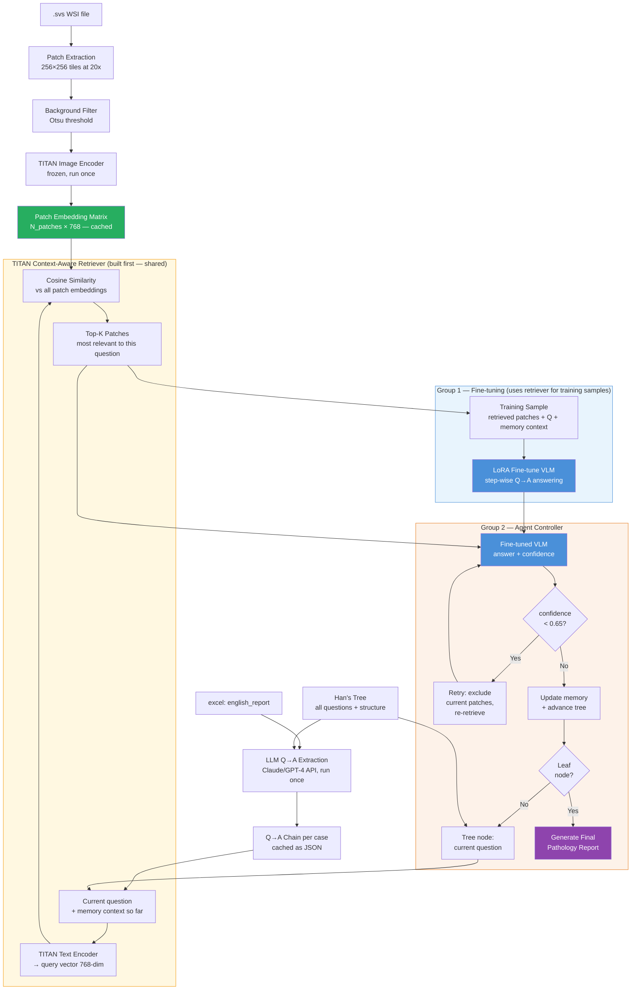

# Interactive Diagnostic Reasoning for Pathology Report Generation

**TUM MLMI Practical Course — Summer 2026**  
Contact: Dr. Han Li · [tum_han.li@tum.de](mailto:tum_han.li@tum.de) · REG² Challenge-Oriented Project

---

## 1. Context & Goal

Pathologists don't generate reports in one shot — they reason **step by step**: examine tissue architecture, evaluate candidate diagnoses, check IHC/molecular markers, then conclude. Current VLMs treat report generation as a direct image→text problem, skipping this reasoning process entirely.

**Our goal:** build a system that walks a structured diagnostic reasoning tree from WSI input, producing both a **reasoning chain** and a **final pathology report**.

**Both outputs are required and separately evaluated:**

- Reasoning chain → evaluated with Binary Path Validity, Edge-F1, MESS
- Final pathology report → evaluated with ROUGE-L, BLEU-4, clinical accuracy

---

## 2. What We Have


| Data                  | Description                                             |
| --------------------- | ------------------------------------------------------- |
| `.svs` files          | Gigapixel H&E WSIs, uterine pathology (Uteria dataset)  |
| `excel`               | `slide_id` · `case_class (A–E)` · `english_report`      |
| **Supervisor's tree** | Pre-built diagnostic reasoning graph (our WP3 shortcut) |


**case_class A–E** likely encodes report complexity/completeness (A = richest, E = sparse). Confirm with Dr. Han Li — determines which cases are clean enough for training.

**Some cases have two `.svs` files** (cervical + corpus curettage). Default: pool their patch embeddings into one matrix per case. Confirm with supervisor.

---

## 3. Han's Reasoning Tree

Directed graph: each node = clinical question, each edge = answer → next question. One path through the tree = one reasoning chain = one training case.

```
Root: "What specimen type?"
├── Uterine corpus
│   └── "What is the architecture?"
│       ├── Glandular
│       │   └── "Is there myometrial invasion?"
│       │       ├── Yes → "Invasion depth?" → "Tumor grade?" → ... → Report
│       │       └── No  → "Nuclear atypia?" → ... → Report
│       └── Papillary → ...
├── Uterine cervix → ...
└── ...
         (each leaf = final diagnosis + report generation)
```

The tree gives us WHAT to ask and in WHAT order. The `english_report` gives us WHICH path and WHAT the answers are. Together = labeled training data.

---

## 4. Work Packages


| WP   | Task                                                    | Who   |
| ---- | ------------------------------------------------------- | ----- |
| WP1  | Understand data: explore WSIs, reports, tree            | Both  |
| WP2  | Pipeline: patch extraction + TITAN encoding             | Both  |
| WP3  | Q→A extraction from reports (tree given by supervisor)  | Both  |
| WP4  | Zero-shot baselines + evaluation setup                  | Both  |
| WP5  | **G1:** Step-wise fine-tuning · **G2:** Agent framework | Split |
| WP6  | Compare results, intermediate presentation              | Both  |
| WP7  | Refine models                                           | Both  |
| WP8  | Integrate G1 + G2                                       | Both  |
| WP9  | Benchmark on test set                                   | Both  |
| WP10 | Final documentation & presentation                      | Both  |


---

## 5. Critical Design Principle: Train/Test Consistency

> **The retriever must be built first (Group 2) and used during fine-tuning (Group 1).**

The fine-tuned VLM must see the **same kind of visual input** during training as it will at inference. Mean-pooling all patches during training then feeding retrieved patches at inference = train/test mismatch. The model learns to answer from a blurry global average but gets sharp specific patches at test time — it has never seen that before.

**Correct approach:** for every training sample, retrieve the top-K patches for that specific question using TITAN cosine similarity — exactly as the agent does at inference — and use those as the visual input during fine-tuning.

This means the **build order** is:

```
1. Build TITAN retriever          (Group 2, first)
2. Use it to construct fine-tuning samples  (shared infrastructure)
3. Fine-tune VLM on retrieved patches       (Group 1)
4. Wrap fine-tuned VLM with full agent loop (Group 2)
```

The retriever is shared infrastructure, not just a Group 2 add-on.

---

## 6. Full System Architecture




---

## 7. Step-by-Step: Concrete Implementation

### 7.1 Patch Extraction & TITAN Encoding (WP2)

**One-time offline process. Results cached to disk.**

1. Open `.svs` with `openslide` → read at 20x magnification
2. Cut into 256×256 grid → ~500–2000 tissue tiles per slide
3. Filter background: grayscale mean > 220 → discard (white = glass)
4. Encode remaining patches with **TITAN image encoder** (frozen weights)

> **TITAN** (MahmoodLab, 2024): vision encoder pretrained on 335K pathology WSIs via contrastive vision-language training. Its image encoder and text encoder produce vectors in the **same 768-dim space** — cosine similarity between a text query and a patch embedding is semantically meaningful. Not a generative VLM — used here as the retrieval backbone.

```
Per slide output:
  embeddings.pt  →  [N_patches × 768]
  coords.pt      →  [(x1,y1), (x2,y2), ...]  ← spatial location of each patch
```

---

### 7.2 Q→A Chain Extraction from Reports (WP3)

**Most critical preprocessing step. One-time, cached as JSON.**

Feed each `english_report` + all tree questions to an LLM (Claude/GPT-4 API). It reads the report, answers each question, or returns "not mentioned."

Your reports map cleanly to tree nodes:


| Report layer    | Tree nodes                                     |
| --------------- | ---------------------------------------------- |
| Macroscopy      | Specimen type, size, fragments                 |
| Microscopy      | Architecture, invasion, nuclear grade, mitoses |
| IHC findings    | p53, WT1, p16, MMR proteins                    |
| Molecular       | MSI status                                     |
| Final diagnosis | Leaf node → report target                      |


**Example:**

```
Tree Q: "Is there myometrial invasion?"
Report: "...with deep myometrial invasion..."
→  A:  "Yes, deep myometrial invasion"

Tree Q: "MSI status?"
Report: "High-grade microsatellite instability (MSI-H)..."
→  A:  "MSI-H"

Tree Q: "Lymphovascular invasion?"
Report: (not mentioned)
→  A:  "not mentioned"
```

**Output per case:**

```json
{
  "slide_id": "1b2d0c53.svs",
  "case_class": "A",
  "qa_chain": [
    {"q": "What specimen type?",        "a": "Uterine corpus curettage"},
    {"q": "What architecture?",         "a": "Papillary, fibrovascular cores"},
    {"q": "Myometrial invasion?",       "a": "Yes, deep myometrial"},
    {"q": "Tumor grade?",               "a": "G2"},
    {"q": "p53 status?",                "a": "Pathological overexpression"},
    {"q": "MSI status?",                "a": "MSI-H, MSH6 loss"}
  ],
  "final_report": "Endometrioid adenocarcinoma G2, p53 aberrant, MSI-H..."
}
```

**Validate manually on 30 cases before running on all data.**  
Use class A + B cases for training — richest reports, fewest "not mentioned" answers.

---

### 7.3 Baselines (WP4)

Run before any fine-tuning. These are your "before" numbers.


| Baseline              | Setup                                                        | Metrics         |
| --------------------- | ------------------------------------------------------------ | --------------- |
| B1: Direct generation | Mean-pool all patches → VLM → report, no reasoning           | ROUGE-L, BLEU-4 |
| B2: Zero-shot CoT     | Tree questions one-by-one, off-the-shelf VLM, no fine-tuning | Edge-F1, MESS   |
| B3: GPT-4V            | API, expensive but upper bound                               | All             |


---

### 7.4 Context-Aware Retriever (Group 2 — built first)

NOTE that this is a) hard and b) there are multiple approaches, from which we need to adapt one. 

#### **My current main idea 2: Text-guided cosine retrieval - How it works:**

TITAN was trained so that invasion-related text ends up near invasion-showing patches in the same vector space. Cosine similarity exploits this directly.

```
Step 1: Build query from question + memory context
        
        Naive:   embed("Is there myometrial invasion?")
        Better:  embed("Given: papillary architecture, high nuclear atypia.
                        Is there myometrial invasion?")
        
        Context-aware query shifts the vector → retrieves better patches.
        Uses ground-truth previous answers at training time.
        Uses model's own previous answers at inference time.
        → train/test consistent.

Step 2: Cosine similarity vs all N patch embeddings
        scores = [0.82, 0.31, 0.79, 0.28, ...]

Step 3: Return top-K patches (K=3)
        → patches showing gland-stroma interface float to top
```

**Why context matters:**  
"Is there myometrial invasion?" alone retrieves any invasion-looking patch.  
With context "papillary architecture, high atypia" — retrieves patches showing papillary structures invading myometrium specifically. The prior answers narrow the visual search.

#### All other Approaches Compared To My Knowledge

Idea 1 — Attention MIL (ABMIL): learned attention weights
The model learns a score per patch during training. No text involved — purely supervised by the label. Standard since 2018, still widely used as a strong baseline.

Ilse et al. 2018 — original ABMIL
Lu et al. 2021 (CLAM) — most used implementation, open code

Idea 2 — Text-guided cosine retrieval (what we use)
Embed a text query and retrieve patches by cosine similarity in the shared vision-language space. No training needed for the retrieval itself — works because the encoder was contrastively pretrained. Vision-language pathology models have achieved patch-level classification, segmentation, captioning, and retrieval by aligning natural language descriptions with patch embeddings. Nature

CONCH (Lu et al., Nature Medicine 2024) — first strong pathology VL encoder enabling this
MI-Zero (Lu et al. 2023) — shows zero-shot WSI classification via text queries
ConcepPath (2024) — uses human expert knowledge concepts to guide patch retrieval, significantly outperforming previous SOTA methods in lung, breast, and gastric cancer tasks Nature

Idea 3 — Dual-scale / hierarchical text-guided retrieval
Query at multiple magnification levels simultaneously — low-res for architecture, high-res for nuclear detail. Multi-resolution paradigms extract histology patches at multiple resolutions and generate corresponding textual descriptions, with cross-resolution alignment to establish more effective text-guided visual representations. arxiv

ViLa-MIL (CVPR 2024) — takes a question and WSI as input, generates dual-scale visual descriptive text prompts via a frozen LLM, then uses prototype-guided patch decoding to progressively fuse patch features into slide features TheCVF
Multi-Resolution Path-Language (2025, arXiv 2504.18856) — extends this with cross-resolution alignment loss

Idea 4 — Region-text grounding (most cutting edge)
Instead of retrieval by similarity, explicitly align local image regions with sub-sentences of text. Goes beyond retrieval — the model knows which patch corresponds to which textual claim. PathFLIP establishes region-text correspondences by aligning localized visual features with semantically matched text segments, using a Region Q-Former to extract region-level embeddings while slide-level captions are decomposed into region-level subcaptions. arXiv

PathFLIP (2025, arXiv 2512.17621)
PathAlign (2024) — provides aligned WSI and text embeddings enabling embedding-based cross-modal retrieval, with the WSI-encoder further aligned with a frozen LLM for text generation and visual question answering arXiv

*Claude said*: Most relevant for your project: Idea 2 (cosine retrieval, what we already planned) + Idea 3 (extend to dual-scale). Idea 4 is too complex to implement from scratch in a semester.

---

### 7.5 Group 1 — Step-wise Fine-tuning (WP5-G1)

**Uses the retriever from 7.4 to build training samples — ensuring train/test consistency.**

For each Q→A step in each case, the training sample is:

```
Training sample — Q3 "Is there myometrial invasion?":

Visual input:   TITAN_retrieve(
                  query = "Given papillary architecture. Myometrial invasion?",
                  patch_embeddings = slide_patches,
                  k = 3
                )
                → [3 × 768]   ← same mechanism as inference

Text input:     "You are analyzing a uterine pathology slide.
                 Q: What specimen type?  A: Uterine corpus curettage
                 Q: What architecture?  A: Papillary, fibrovascular cores
                 Current question: Is there myometrial invasion?
                 Answer:"

Text target:    "Yes, deep myometrial invasion"
```

Unrolling a 6-step chain → 6 Q→A samples + 1 report generation sample = **7 training samples per case**.

**Fine-tuning setup:**

- Base model: **some VLM - we need to choose one which is LoRA fine-tunable. A key finding has been "Generalists (fine-tuned) > Specialists"!** Some model choices for both generalists(QWEN2-5, QWEN3, InternVL2, LLaVA-1.5) and Specialists (LLaVA-Med, PathChat, ....)
- Method: **LoRA** — updates ~0.1% of parameters, fits on 2× A100
- Loss: cross-entropy on target tokens only
- Validate with Edge-F1, not just loss

At inference: model answers Q1 → tree lookup → Q2 → answers → ... → leaf → generates report. Tree navigation is deterministic. Model only predicts answers.

---

### 7.6 Group 2 — Agent Framework (WP5-G2)

Wraps Group 1's fine-tuned model with a controller that manages retrieval, memory, and self-correction.

```
memory = []
node = tree.root

while node is not leaf:

    # 1. Context-aware retrieval (same mechanism as fine-tuning)
    query  = node.question + summarize(memory)
    patches = TITAN_retrieve(query, patch_embeddings, k=3)

    # 2. Answer with fine-tuned VLM
    answer, confidence = vlm.answer(node.question, patches, memory)

    # 3. Low confidence → retry with different patches
    if confidence < 0.65:
        patches_alt = TITAN_retrieve(query, patch_embeddings, k=3,
                                     exclude=current_patches)
        answer_alt, conf_alt = vlm.answer(node.question, patches_alt, memory)
        if conf_alt > confidence:
            answer, confidence = answer_alt, conf_alt

    # 4. Consistency check (rule-based on tree structure)
    #    e.g. memory says "no invasion" but answer is "grade 3" → flag

    # 5. Advance
    memory.append((node.question, answer))
    node = tree.next_node(node, answer)

report = vlm.generate_report(memory)
```

**Confidence** = softmax probability of first generated answer token.  
**Memory** = growing `(Q, A)` list formatted as a string in the prompt. No external database.  
**Consistency check** = rule-based from tree logic, not a neural net.

---

### 7.7 Integration (WP8)

```
Agent controller (Group 2)
    manages: retrieval · memory · retry · consistency
         ↓
Fine-tuned VLM (Group 1)
    answers: each question given retrieved patches + memory
         ↓
Han's tree
    routes: to next question given each answer
         ↓
Final pathology report
```

G1 = reliable answering. G2 = intelligent looking + self-correction. Retriever = shared foundation of both.

---

## 8. Evaluation Metrics (REG²)


| Metric                   | Measures                                                 | Notes            |
| ------------------------ | -------------------------------------------------------- | ---------------- |
| **Binary Path Validity** | Exact match of predicted vs. ground-truth path           | 1 or 0, strict   |
| **Edge-F1**              | Partial path agreement (precision + recall over edges)   | Graded credit    |
| **MESS**                 | Semantic similarity of answers via biomedical embeddings | Clinical meaning |
| Visual Grounding Score   | Background patches correctly called "not informative"    | Sanity check     |
| Counterfactual Score     | Correct update of conclusions under hypothetical changes | Logic check      |


---

## 9. Build Order & Priorities

```
Setup Cluster; Wait for data.....

WEEK 1   Extract Q→A chains from 50 reports
         Validate 20 manually → adjust LLM prompt if needed
         Run on all cases overnight

WEEK 2   Extract patch embeddings overnight (TITAN, frozen)
         Run baselines (WP4) — record numbers

WEEK 3   Build TITAN retriever (Group 2 — shared infrastructure)
         Validate retrieval quality on sample cases

WEEK 4+  Group 1: build training dataset using retriever
                  LoRA fine-tune LLaVA-Med
         Group 2: build agent loop, retry logic, consistency checks
                  (in parallel, using same retriever)

MID      Intermediate presentation: baselines vs. G1 step-wise results

WEEK 7+  Refine both models (WP7)
         Integrate G1 + G2 (WP8)
         Full benchmark (WP9)

FINAL    Documentation + presentation (WP10)
```

---

## 10. Key Technical Decisions


| Decision                                 | Choice                                                                                                                                                                                         | Reason                                          |
| ---------------------------------------- | ---------------------------------------------------------------------------------------------------------------------------------------------------------------------------------------------- | ----------------------------------------------- |
| **Patch encoder**                        | TITAN (frozen)                                                                                                                                                                                 | SOTA pathology VL encoder, text+image alignment |
| **Retrieval Method**                     | TITAN cosine similarity, context-aware query                                                                                                                                                   | Train/test consistent, no extra training needed |
| **VLM Base Model to be LoRA fine-tuned** | **A key finding has been "Generalists (fine-tuned) > Specialists"!** Some model choices for both generalists(QWEN2-5, QWEN3, InternVL2, LLaVA-1.5) and Specialists (LLaVA-Med, PathChat, ....) | Feasible on 2× GPU, medical domain base         |
| **Q→A extraction**                       | LLM API (Claude/GPT-4), one-time , check costs vs self-hosted                                                                                                                                  | Saves weeks of manual annotation                |
| **Build order**                          | Retriever first → fine-tuning uses it                                                                                                                                                          | Eliminates train/test distribution mismatch     |
| **Two-slide cases**                      | Pool embeddings                                                                                                                                                                                | Simpler — confirm with supervisor               |
| **Training filter**                      | Class A + B only (tentative)                                                                                                                                                                   | Richest reports → cleanest Q→A chains           |


## **Recommended first steps (in order)**

1. **WP1** — run `notebooks/explore_wsi.ipynb` (`.svs` inventory, `case_class` distribution, report-length-per-class). Confirms which classes are training-clean.
2. **Encode the graph** — translate Han's tree into `diagnostic_graph.py` nodes/edges; `validate_graph()` keeps it consistent. This is your highest-leverage artifact.
3. **WP3** — run reports through Qwen (`qa_extractor.py`) to get per-case path + answers; validate ~20–30 cases by hand against the graph. This both labels data and stress-tests graph coverage.
4. **WP2** — patch extraction + TITAN embeddings cached to disk; wire `TitanRetriever`.
5. **WP4** — run `baselines/zero_shot.py` through the controller. A working untrained agent = your "before" numbers and proof the whole loop runs *before* any training.
6. **WP5** — LoRA fine-tune; drop in a `FineTunedBackend`.

