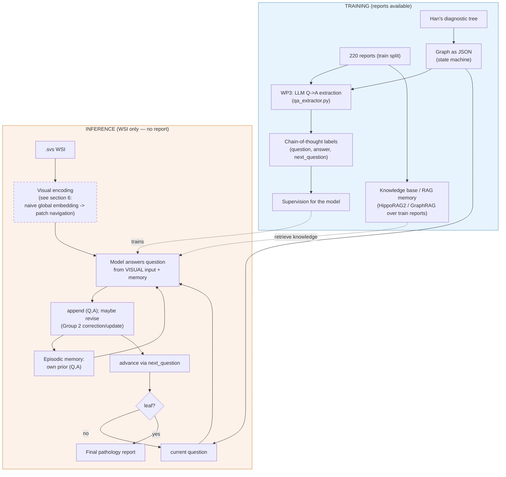

# Interactive Diagnostic Reasoning for Pathology Reports — v2

**TUM MLMI Practical Course — Summer 2026**
Contact: Dr. Han Li · REG² Challenge-Oriented Project

> **Status / provenance of this doc.** It reconciles three sources:
> 1. **`MLMI_Project_Summer2026_HanLi.pdf`** — the official task description (ground truth).
> 2. **Teammate's 30.5 meeting notes** — from a teammate who works closely with Han, *not from Han directly* (so treat as strong guidance, to be confirmed).
> 3. The original **`project_overview.md`** — kept as-is.
>
> Purpose: a clean, accurate overview to **discuss with Han** and get feedback on concrete
> next steps. Open questions for that meeting are collected in §10.

---

## 0. The single most important clarification: train vs. inference

This is the thing that was previously muddled. Get it right and everything else follows.

| | **Training time** | **Inference / test time** |
|---|---|---|
| Available input | WSI **+ report** | **WSI only** |
| Report's role | Source of supervision (WP3) and knowledge | **Not available** |
| Model must produce | (learns to reproduce) reasoning chain + report | reasoning chain + report **from the image alone** |

The official PDF is explicit: *"develop models that simulate diagnostic reasoning processes
**from WSIs**"* (§Abstract/§4), and **WP3 = "construct structured reasoning chains *from
reports*"** — i.e. reports build the **labels**, not the runtime input.

**Therefore the report has two training-only roles:**
1. **Supervision** — WP3 converts each training report into the ground-truth reasoning chain
   (which graph path, what the answers are). These are the targets the model is trained on.
2. **Knowledge base** — the corpus of *training* reports/diagnostic knowledge can be
   preprocessed into the RAG/memory structure the agent queries at inference (built from the
   **train split only**, so no leakage).

> A purely text-only system (answer the chain from the report) is **only an oracle/ablation
> baseline** — useful to validate the graph and the chain extraction in isolation, but it is
> **not the deliverable.** The deliverable reasons from the WSI.

---

## 1. The project in one paragraph

A pathologist does not write a report in one shot. They answer a sequence of questions in a
sensible order — *What organ? What procedure? Any abnormality? How many diagnoses? Diagnosis
#1? … → final report* — where **each answer decides the next question**. That ordered question
structure is a **graph**. We build a system that, **given only a WSI**, walks that graph
question-by-question, **answers each question by looking at the image** (plus its memory of its
own previous answers), and **formalizes** the result into a final report. We output **both**
the reasoning chain and the final report; both are evaluated. Reports are used **only during
training** to build the supervision and the retrievable knowledge.

---

## 2. Two framings, reconciled

**Official PDF (groups & work-packages):**
- **Both groups:** learn REG²/Uteria, set up the **WSI + report** pipeline, set up evaluation, run **baseline VLMs** for report generation and reasoning.
- **Group 1 — step-wise reasoning:** chain-of-thought, design a structured reasoning pipeline with the tutor, implement multi-step diagnostic reasoning.
- **Group 2 — interactive reasoning + memory:** agent-based models, design an interactive framework with **memory mechanisms**, implement **correction/update** strategies (revise predictions after feedback).

**Teammate's 30.5 notes (the immediate "do this first" sequencing):** four preprocessing tracks,
focus on 1 & 2 first.

| # | Track (teammate notes) | Maps to PDF | Priority |
|---|------------------------|-------------|----------|
| **1** | Preprocess the **graph** → RAG/memory structure (GraphRAG / HippoRAG / ReMem) | WP3 + Group 2 memory | **NOW** |
| **2** | Preprocess the **text** → per-case Q→A chains + knowledge for the memory | **WP3** | **NOW** |
| 3 | Preprocess the **WSI** → choose the correct patch | WP2 (vision side) | later / partly out of scope (§6) |
| 4 | **Navigation** → attention + divide-and-search with **TITAN** | WP2/WP5 vision side | later |

These are **consistent**: tracks 1 & 2 build the reasoning structure, the labels, and the
memory — all from text you already have, *before* tackling the hard vision problem (tracks
3 & 4). The image still enters the system; tracks 3 & 4 just decide *how* (see §6).

**Dataset:** 220 records → **150 train+val / 70 test**.

**Target output schema** (note inline `next_question` = graph edge):

```json
{
  "chain-of-thought": [
    { "question": "What is the organ?", "answer": "Stomach", "next_question": "Is there any abnormality present?" },
    { "question": "Is there any abnormality present?", "answer": "No, there is no abnormality.", "next_question": "What is the number of diagnoses to include?" },
    { "question": "What is the #1 diagnosis?", "answer": "Chronic gastritis", "next_question": "What is the final pathology report?" },
    { "question": "What is the final pathology report?", "answer": "Stomach, endoscopic biopsy;\n  Chronic gastritis", "next_question": "" }
  ]
}
```

---

## 3. The crucial distinction: two different "graphs"

The word *graph* means two things here. Keep them separate:

1. **Control-flow graph (the diagnostic tree).** Fixed, curated, small. This **is** Han's
   `data/Uterus pathology diagnostic flowchart.png` — a feature ontology in three tiers
   (**Global features** → organ/specimen/procedure; **Local features** → compartment → finding
   → microscopic pattern → cellular features; **Integration** → synthesis → diagnosis →
   reporting). Nodes = questions, edges = reasoning order. A **state machine** stored as JSON.
   Traversal is deterministic and needs no RAG. (Meeting task #3 = encode this — **done**, see
   `data/diagnostic_graph.json` and §8.)

2. **Agent memory (the RAG / memory structure).** Two kinds of content:
   - **Episodic** — the `(question, answer)` facts the agent has produced *so far on the
     current WSI*. This is what Group 2's correction/update operates on.
   - **Semantic / external** — diagnostic knowledge built from the **training** reports
     (e.g. "papillary architecture + atypia → consider serous carcinoma"), retrievable at
     inference even though the test case has no report.

   GraphRAG / HippoRAG / ReMem live in this second layer. Meeting task #1 ("RAG/memory for
   graph-like agent memory") is about this.

> For short chains (~5–8 steps), the simplest episodic memory — append every `(Q,A)` to the
> prompt — is a valid **baseline**. The heavier methods earn their keep when retrieving
> **external knowledge** from the training corpus or doing multi-hop reasoning over it.

---

## 4. Graph-as-memory methods compared

All four are benchmarked together in **MedMemoryBench**, so this doubles as the literature summary.

| Method | Core mechanism | Strength | Fit for us | Cost |
|--------|----------------|----------|------------|------|
| **Flat memory** (baseline) | Append every `(Q,A)` to the prompt; no retrieval. | Trivial, transparent. | **Sufficient** for the per-case episodic memory. Start here. | None |
| **GraphRAG** (MSFT, arXiv 2404.16130) | LLM extracts entity/relation KG → Leiden **communities** → hierarchical summaries → local/global search. | Global sensemaking over **large** corpora. | **Mostly overkill** — the control-flow graph is already structured; useful only to organize the *external knowledge* corpus, or as a comparison baseline. | High |
| **HippoRAG / HippoRAG 2** (NeurIPS'24 / ICML'25) | Schemaless KG + **Personalized PageRank** for single-step **multi-hop** retrieval; "long-term memory". | Cheap, fast, strong associative recall. | **Pragmatic upgrade** for retrieving diagnostic knowledge built from training reports. Open code. | Medium |
| **ReMem** (ICLR'26, arXiv 2602.13530) | Hybrid **gist + fact** memory graph; **ReAct agent** with retrieval / graph-exploration / flow-control tools; iterative retrieval. | Agentic, iterative, built for multi-step reasoning over a memory graph. | **Most aligned** with the agent + correction/update framing (Group 2); heaviest to build. | High |

**Recommended build order:** flat episodic memory + JSON graph first (working baseline) →
HippoRAG 2 for the external-knowledge layer if retrieval helps → ReMem-style agent as a stretch
goal. Use **MedMemoryBench** for the eval setup and **Patho-R1** for how to build pathology
chain-of-thought supervision.

---

## 5. Architecture (corrected — WSI is the runtime input)



The dashed `VIS` box is the only WSI-dependent part — and the only genuinely hard/optional
choice. See next section.

---

## 6. How do we feed the WSI? (the "step 3 is hard" question)

**Is "choose the correct patch" hard / out of scope? Largely yes.** A WSI is gigapixel (tens of
thousands of patches, only a few diagnostically decisive, **no patch-level labels**). Selecting
*the* right patch is the whole field of weakly-supervised MIL (CLAM/ABMIL) — a separate
semester-sized problem upstream of the reasoning work this project is about. So deprioritizing it
is reasonable. But note: **some** visual input is mandatory (inference is WSI-only). The choice
is *how rich* that visual input is:

### Level 0 — Whole-slide embedding (recommended starting point)
Feed **one global slide vector** per WSI; no patch selection. **TITAN already outputs a
whole-slide embedding** (it's a slide-level foundation model whose pretrained aggregator pools
patch features into one vector) — so this is principled, not a hack. The model answers each
question from `(question, slide_embedding, memory)`.
- **Pros:** multimodal, in scope, sidesteps the hard problem, fast. Natural fit for the WP4 baseline VLM.
- **Cons:** blurry — better for coarse questions (organ, gross abnormality) than fine ones (mitoses, invasion front).

### Level 1 — Fixed/heuristic patches
Tile the tissue (Otsu background filter), feed a handful of patches chosen by a cheap heuristic
(highest tissue density, or a fixed grid). No learning of *which* patch.
- Cheap robustness check on top of Level 0.

### Level 2 — Patch navigation (steps 3 + 4, the hard/stretch version)
Attention maps + divide-and-search + context-aware TITAN retrieval to pick question-specific
patches (most of the original `project_overview.md`).
- **Treat as a stretch goal**, attempted only if Level 0/1 work and the visual signal demonstrably matters.

### Pure text-only (oracle ablation, NOT a deliverable)
No image; answer from the report. Use **only** to validate the graph + chain extraction and to
get an upper bound on the reasoning component. Cannot be submitted as the system because
inference has no report.

**Plan:** Level 0 first (global TITAN embedding) → Level 1 as a cheap variant → Level 2 as a
stretch goal. Keep the text-only oracle around for debugging.

---

## 7. Concrete next steps

### This week (teammate's three tasks)
1. **Cluster access** — container on SOS, can submit a job and run an LLM (vLLM/Qwen) end-to-end.
2. **Literature search** — one paragraph each on GraphRAG, HippoRAG/HippoRAG2, ReMem, Patho-R1, MedMemoryBench → which memory method we adopt and why (draft: flat baseline + HippoRAG2 upgrade). §4 is the starting draft.
3. **Graph → JSON** — encode Han's tree as a state machine (schema in §8). Highest-leverage artifact.

### Following weeks (aligned to official WPs)
4. **WP1/WP2** — familiarize with Uteria; set up the **WSI + report** pipeline; encode WSIs to **global TITAN slide embeddings** (Level 0); set up the evaluation pipeline.
5. **WP3** — extend `qa_extractor.py` to emit the full `chain-of-thought` schema per training case (you already extract `organ / type_of_specimen / procedure` in `data/report_parts_extracted.json` — the first graph nodes). Validate ~20–30 chains by hand.
6. **WP4** — baseline VLMs: (a) **direct** WSI→report (no reasoning), (b) **zero-shot step-wise** walk of the graph answering from the slide embedding. These are the "before" numbers. Also run the **text-only oracle** to bound the reasoning component.
7. **WP5 — Group 1** step-wise reasoning model (train to answer each node from visual + memory, supervised by WP3 chains). **Group 2** interactive memory + correction/update over the graph.
8. **WP6** intermediate presentation; **WP7** refine; **WP8** integrate G1+G2; **WP9** benchmark on the 70 test cases; **WP10** final.

---

## 8. JSON schemas

**Graph (control-flow state machine).** A first faithful transcription of Han's flowchart
already exists at **`data/diagnostic_graph.json`** (22 nodes, 24 edges, three tiers). Shape:

```json
{
  "root": "organ",
  "tiers": ["global_features", "local_features", "integration"],
  "nodes": {
    "organ":        { "label": "Organ", "tier": "global_features", "type": "slot", "question": "What is the organ?", "expected": "Uterus" },
    "compartment":  { "label": "Compartment", "tier": "local_features", "type": "select",
                      "question": "Which uterine compartment(s) are represented?",
                      "options": ["endometrium", "myometrium", "junctional_zone", "serosa_perimetrium", "uterine_mass_lesion"] },
    "reporting":    { "label": "Reporting", "tier": "integration", "type": "terminal", "terminal": true, "question": "What is the final pathology report?" }
  },
  "edges": [
    { "from": "organ", "to": "specimen_type", "type": "sequence" },
    { "from": "compartment", "to": "myometrium", "type": "branch", "on_answer": "myometrium" },
    { "from": "cellular_features", "to": "synthesis", "type": "contributes_to" }
  ]
}
```

Edge `type` is `sequence` (ordered step), `branch` (choose compartment via `on_answer`),
`assesses` (compartment → its possible findings), or `contributes_to` (feeds synthesis). The
answer-conditioned routing is a **draft to refine with Han** — the flowchart is more a feature
ontology than a strict router.

**Per-case chain (training label, built from the report in WP3):**

```json
{
  "slide_ids": ["be61bc63-...svs"],
  "case_class": "C",
  "chain-of-thought": [
    { "question": "What is the organ?", "answer": "uterus", "next_question": "What is the procedure?" },
    { "question": "What is the procedure?", "answer": "Papanicolaou / HE / PAS staining", "next_question": "Is there any abnormality present?" }
  ]
}
```

---

## 9. What changed from the original overview

| From `project_overview.md` | Status in v2 |
|----------------------------|--------------|
| Step-wise reasoning, dual output (chain + report) | **Kept** — core. |
| Reports as direct input | **Corrected** → reports are **training-only** (supervision + knowledge); inference is **WSI-only**. |
| §7.2 Q→A extraction | **Kept & promoted** — WP3, already started. |
| Q→A schema `{q, a}` | **Changed** → `{question, answer, next_question}`. |
| Graph = deterministic tree | **Reframed** — control-flow tree (JSON) **separate** from RAG memory layer. |
| TITAN cosine patch **retrieval** | **Demoted** to Level 2 / stretch goal. |
| TITAN as visual encoder | **Kept, as a global slide embedding** (Level 0) by default. |
| LoRA fine-tuning, Group 1/2 split | **Kept** but sequenced after the structure/baseline work. |
| Build order "retriever first" | **Reordered** — graph + chains + baseline first; richer vision later. |

---

## 10. Open questions for the meeting with Han

1. **Visual input granularity** — is a **global TITAN slide embedding (Level 0)** acceptable for the core task, with patch navigation (Level 2) as a stretch goal? Or does he expect patch-level reasoning from the start?
2. **Memory scope** — should the RAG/memory be only **episodic** (the agent's own answers on the current case), or also a **semantic knowledge base built from training reports** retrieved at inference? This decides whether GraphRAG/HippoRAG/ReMem are central or optional.
3. **Graph fidelity** — the graph is `data/Uterus pathology diagnostic flowchart.png`, now encoded in `data/diagnostic_graph.json`. Confirm: (a) is the **answer-conditioned routing** ours to define, and (b) for the `*_finding` / `microscopic_pattern` / `cellular_features` nodes, do we treat them as single-select, multi-select, or free text? The flowchart shows features, not which answer leads where.
4. **Group split** — are we Group 1 (step-wise reasoning) or Group 2 (interactive memory), or covering both?
5. **Correction/update (Group 2)** — what "feedback" revises predictions at inference? Confidence-based self-revision, consistency rules, or a human/tutor signal?
6. **Two-slide cases** — pool embeddings, or treat cervix/corpus slides separately? (Many cases have 2–3 `.svs`.)
7. **case_class A–E** — what does it encode, and should we filter training to the richest classes?
8. **Evaluation** — confirm the metric set (Binary Path Validity, Edge-F1, MESS for the chain; ROUGE-L/BLEU-4 + clinical accuracy for the report) and whether we reuse a MedMemoryBench-style harness.

---

## 11. References

- **Patho-R1** — AAAI 2026, arXiv:2505.11404. Pathology CoT reasoning; CPT→SFT→RL on Qwen2.5-VL; Patho-CLIP. *(Building pathology chain-of-thought supervision — WP3.)*
- **MedMemoryBench** — arXiv:2605.11814; `AQ-MedAI/MedMemoryBench`. Benchmarks GraphRAG, HippoRAG-v2, ReMem, Zep (+Mem0/Letta) on ~2k medical sessions; "evaluate-while-constructing". *(Eval harness + method comparison.)*
- **GraphRAG** — Edge et al. (Microsoft), arXiv:2404.16130. KG extraction + Leiden communities + hierarchical summaries.
- **HippoRAG** — Gutiérrez et al., NeurIPS 2024, arXiv:2405.14831; **HippoRAG 2** ("From RAG to Memory"), ICML 2025, arXiv:2502.14802. KG + Personalized PageRank.
- **ReMem** — ICLR 2026, arXiv:2602.13530; `intuit-ai-research/ReMem`. Hybrid gist+fact memory graph + ReAct agent.
- **TITAN** — Mahmood Lab. Whole-slide pathology foundation model (slide-level embeddings; text+image alignment).
