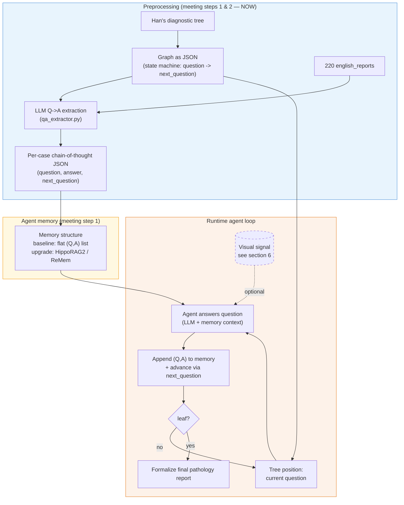

# Interactive Diagnostic Reasoning for Pathology Reports — v2 (post 30.5 meeting)

**TUM MLMI Practical Course — Summer 2026**
Contact: Dr. Han Li · REG² Challenge-Oriented Project

> This is a **rewrite of `project_overview.md`** to match the scope Dr. Li gave in the
> 30.5 meeting. The original doc is kept as-is. The big change: the project's center of
> gravity is the **graph + text → agent-memory** half (meeting steps 1 & 2), **not** the
> WSI/patch/fine-tuning half (steps 3 & 4), which is deprioritized and partly out of scope.
> See §6 for the honest discussion of step 3.

---

## 1. The project in one paragraph

A pathologist does not write a report in one shot. They answer a sequence of questions in a
sensible order — *What organ? What procedure? Any abnormality? How many diagnoses? Diagnosis
#1? … → final report* — where **each answer decides the next question**. That ordered
question structure is a **graph**. We build an **agent** that is told the graph, walks it
question-by-question, **remembers** the answers it has given so far, and at the end
**formalizes** everything into a final pathology report. We output **both** the reasoning
chain and the final report, and both are evaluated.

---

## 2. The meeting's framing (decoded)

**Runtime loop (the "project scope" line):**

```
Graph (question order)  →  tell the agent the graph  →  agent answers in that order  →  formalize final report
```

**Four preprocessing tracks — Dr. Li said "focus on 1 & 2 first":**

| # | Track | What it means | Priority |
|---|-------|---------------|----------|
| **1** | Preprocess the **graph** | Turn Han's diagnostic tree into a **RAG / memory structure** for graph-like agent memory (GraphRAG / HippoRAG / ReMem). | **NOW** |
| **2** | Preprocess the **text** | Convert the 220 reports into that structure: per-case Q→A chains that live on the graph. | **NOW** |
| 3 | Preprocess the **WSI** | Choose the correct patch to feed the agent. | later / partly out of scope (see §6) |
| 4 | **Navigation** | Attention map + divide-and-search over the slide, using **TITAN** embeddings. | later |

**Dataset:** 220 records → **150 train+val / 70 test**.

**Concrete tasks until next week:**
1. **Cluster access** ready (container, can run jobs).
2. **Literature search** on RAG-for-graph methods (GraphRAG / HippoRAG / ReMem) — understand them, pick one.
3. **Translate the graph into JSON** (open-ended; just start).

**Required reading:** *Patho-R1* (pathology chain-of-thought reasoning, for steps 1–2) and
*MedMemoryBench* (benchmarks exactly the memory methods above, in a medical setting).

**Target output schema** (note the inline `next_question` = graph edge):

```json
{
  "chain-of-thought": [
    { "question": "What is the organ?",   "answer": "Stomach",            "next_question": "Is there any abnormality present?" },
    { "question": "Is there any abnormality present?", "answer": "No, there is no abnormality.", "next_question": "What is the number of diagnoses to include?" },
    { "question": "What is the number of diagnoses to include?", "answer": "1", "next_question": "What is the #1 diagnosis?" },
    { "question": "What is the #1 diagnosis?", "answer": "Chronic gastritis", "next_question": "What is the final pathology report?" },
    { "question": "What is the final pathology report?", "answer": "Stomach, endoscopic biopsy;\n  Chronic gastritis", "next_question": "" }
  ]
}
```

---

## 3. The crucial distinction: two different "graphs"

A lot of the confusion comes from the word *graph* meaning two things here. Keep them separate:

1. **Control-flow graph (the diagnostic tree).** Fixed, curated, small (tens of nodes).
   Nodes = questions, edges = `answer → next_question`. This is a **state machine**. It does
   **not** need RAG to store — it's just a JSON file you traverse. This is the deliverable for
   meeting task #3.

2. **Agent memory (the RAG / memory structure).** As the agent walks the tree it accumulates
   `(question, answer)` facts. *This* is where GraphRAG / HippoRAG / ReMem apply — they are
   techniques for **storing and retrieving** an agent's accumulated knowledge so it can reason
   over it. Meeting task #1 ("build a RAG or memory structure for graph-like agent memory") is
   about this layer.

> **Practical implication:** for our short chains (~5–8 steps per case), the simplest memory —
> just appending every `(Q, A)` to a string in the prompt — is a perfectly valid **baseline**
> and may already solve per-case report generation. The fancy memory methods earn their keep
> only when memory must **scale** (many facts, cross-case knowledge, a diagnostic-criteria
> knowledge base, or long multi-session context). Build the trivial version first, then justify
> any upgrade with numbers.

---

## 4. Graph-as-memory methods compared

All four below are evaluated together in **MedMemoryBench**, so this table doubles as your
literature-search summary.

| Method | Core mechanism | Strength | Fit for us | Cost / complexity |
|--------|----------------|----------|------------|-------------------|
| **Flat memory** (baseline) | Append every `(Q,A)` to the prompt; no retrieval. | Trivial, transparent, zero infra. | Likely **sufficient** for short per-case chains. Start here. | None |
| **GraphRAG** (Microsoft, arXiv 2404.16130) | LLM extracts an entity/relation KG from a corpus → Leiden **community** detection → **hierarchical community summaries** → local/global search. | Global "sensemaking" over **large** corpora. | **Mostly overkill.** Our graph is already structured and tiny; we don't need to *extract* a KG or summarize communities. Useful only as a comparison baseline. | High (indexing-heavy) |
| **HippoRAG / HippoRAG 2** (NeurIPS'24 / ICML'25, arXiv 2405.14831, 2502.14802) | Schemaless KG + **Personalized PageRank** for single-step **multi-hop** retrieval; hippocampus-inspired "long-term memory". | Cheap, fast, strong associative multi-hop recall; continual knowledge integration. | **Pragmatic sweet spot** if we need real retrieval — e.g. retrieve relevant prior facts or diagnostic criteria for the current question. Open code. | Medium |
| **ReMem** (ICLR'26, arXiv 2602.13530) | Hybrid memory graph of **gists + facts**; a **ReAct agent** with retrieval / graph-exploration / flow-control tools does **iterative** retrieval ("mental time travel"). | Agentic, iterative, built for **complex multi-step reasoning over a memory graph**. | **Most aligned conceptually** with "agent walks a graph, answers in order, with memory" — but the heaviest to implement (agent + tool loop). Builds on HippoRAG. | High |

**Recommendation (build order):**

1. **Flat memory + JSON state-machine graph** → working end-to-end baseline. (This is meeting tasks #1–#3 in their minimal form.)
2. If/when memory needs to scale or retrieve from a knowledge base → adopt **HippoRAG 2** (best effort/reward ratio, open implementation, and it's the backbone ReMem extends).
3. **Stretch goal:** **ReMem**-style agentic memory, if results justify it and time allows — it's the closest match to the agent framing and gives a strong final-report story.
4. Use **MedMemoryBench** as the evaluation harness and to copy a fair experimental setup; cite **Patho-R1** for how to construct pathology chain-of-thought supervision.

---

## 5. Revised architecture (text-first)



The dashed visual box is the only thing that depends on the WSI — and that is exactly the
part in question. See next section.

---

## 6. Is step 3 ("choose the correct patch") really hard / out of scope?

**Short answer: yes, largely true.** Picking *the* diagnostically decisive patch out of a
gigapixel WSI is a genuine open research problem (it's the whole field of weakly-supervised
multiple-instance learning — CLAM, ABMIL, etc.). A WSI is ~100,000×100,000 px → tens of
thousands of patches, with only a handful actually carrying the diagnosis and **no patch-level
labels**. Building a strong patch selector is a separate semester-sized project, and it would
sit *upstream* of the reasoning/memory work this project is actually about. So Dr. Li
deprioritizing it (steps 3–4 = "later", "super hard, not really in scope") is reasonable: the
contribution here is the **graph-guided reasoning + memory agent**, not a new patch retriever.

You have three sensible scope options. Pick based on how multimodal the supervisor wants the
final system to be — **confirm with Dr. Li**, but option B is the safe default.

### Option A — Text-only (no WSI at all)
The agent reasons purely over the report-derived Q→A chains and the graph. The report *is* the
ground truth signal; the image is not used at runtime.

- **Pros:** Fully in scope, clean, fast, directly exercises steps 1 & 2 and the memory methods. Nothing is blocked on WSI infrastructure.
- **Cons:** Not multimodal — it's "report → structured reasoning → report", more of a text/agent-memory project. Weaker novelty story for a pathology-imaging course.
- **Good as:** the **primary baseline** and the thing to get working first regardless.

### Option B — Naive visual signal (recommended default)
Give the agent **one global slide embedding per WSI**, with **no patch selection**:

- **TITAN already produces a whole-slide embedding** (it's a slide-level foundation model whose pretrained aggregator pools patch features into a single vector). So you get a principled per-slide vector *for free*, no needle-in-haystack search.
- Alternatives if TITAN slide-encoding is awkward: mean-pool all patch embeddings, or encode a low-res thumbnail.
- The agent conditions each answer on `(question, memory, slide_embedding)`.

- **Pros:** Multimodal, but **sidesteps the hard problem entirely.** Realistic for one semester. Keeps the door open to step 4 as a clear "advanced extension".
- **Cons:** The global vector is blurry — it can't localize fine features (mitoses, invasion front). Expect it to help coarse questions (organ, gross abnormality) more than fine ones.
- **Step 4 becomes the optional upgrade:** replace the global vector with attention/divide-and-search patch selection *only if* time allows and Option B shows the visual signal matters.

### Option C — Full patch retrieval/navigation (steps 3 + 4, the hard version)
Context-aware patch retrieval + attention navigation (the bulk of the original `project_overview.md`).

- **Pros:** The "real" multimodal system; strongest result if it works.
- **Cons:** Hard, infra-heavy, train/test-consistency pitfalls, and **explicitly deprioritized**. High risk of eating the whole semester.
- **Treat as:** research stretch goal, not a milestone.

**Bottom line:** build **A first** (text-only, get the loop + memory + JSON working), add **B**
(one global TITAN slide vector) to make it multimodal cheaply, and keep **C** as a clearly
labeled stretch goal. This matches "focus on 1 & 2 first" while leaving a credible path to the
visual side.

---

## 7. Concrete steps

### This week (the meeting's three tasks)
1. **Cluster access** — container on SOS, can submit a job and run an LLM (vLLM/Qwen) end-to-end. (`docs/cluster_setup.md`.)
2. **Literature search** — one short paragraph each on GraphRAG, HippoRAG/HippoRAG2, ReMem, plus Patho-R1 and MedMemoryBench. Conclusion: which memory method we adopt and why (draft answer: flat baseline now, HippoRAG2 as the planned upgrade). §4 is your starting draft.
3. **Graph → JSON** — encode Han's tree as a state machine using the schema in §8. This is the highest-leverage artifact; everything else plugs into it.

### Following weeks
4. **Text → chains (step 2)** — extend `qa_extractor.py` to emit the full `chain-of-thought` schema (`question / answer / next_question`) per case. You already extract `organ / type_of_specimen / procedure` (see `data/report_parts_extracted.json`) — those are literally the first graph nodes, so you're partway there. Validate ~20–30 chains by hand against the graph.
5. **Memory + agent loop** — implement flat-memory agent that walks the JSON graph and produces the final report. This is the working baseline ("before" numbers).
6. **Evaluate** — reasoning chain (Binary Path Validity, Edge-F1, MESS) + final report (ROUGE-L, BLEU-4); reuse MedMemoryBench-style setup. Establish the 150/70 split.
7. **Memory upgrade** — swap flat memory → HippoRAG2; measure the delta.
8. **Visual (Option B)** — add TITAN slide embedding; measure whether it helps.
9. **Stretch** — ReMem-style agent and/or step-4 patch navigation, only if 5–8 are solid.

---

## 8. JSON schemas

**Graph (control-flow state machine) — one file for Han's tree:**

```json
{
  "nodes": {
    "q_organ":   { "question": "What is the organ?",                 "type": "categorical" },
    "q_abnorm":  { "question": "Is there any abnormality present?",  "type": "boolean" },
    "q_ndx":     { "question": "What is the number of diagnoses to include?", "type": "integer" },
    "q_report":  { "question": "What is the final pathology report?", "type": "free_text", "terminal": true }
  },
  "edges": [
    { "from": "q_organ",  "on_answer": "*",   "to": "q_abnorm" },
    { "from": "q_abnorm", "on_answer": "no",  "to": "q_report" },
    { "from": "q_abnorm", "on_answer": "yes", "to": "q_ndx" },
    { "from": "q_ndx",    "on_answer": "*",   "to": "q_report" }
  ],
  "root": "q_organ"
}
```

**Per-case extracted chain (training/eval label) — matches Dr. Li's sample exactly:**

```json
{
  "slide_ids": ["be61bc63-...svs"],
  "case_class": "C",
  "chain-of-thought": [
    { "question": "What is the organ?", "answer": "uterus", "next_question": "What is the procedure?" },
    { "question": "What is the procedure?", "answer": "Papanicolaou / HE / PAS staining", "next_question": "Is there any abnormality present?" }
  ]
}
```

---

## 9. What carries over from the original overview (and what doesn't)

| From `project_overview.md` | Status in v2 |
|----------------------------|--------------|
| Step-wise reasoning, dual output (chain + report) | **Kept** — core idea, matches scope. |
| §7.2 Q→A extraction from reports | **Kept & promoted** — this is meeting step 2; already started. |
| Q→A schema `{q, a}` | **Changed** → `{question, answer, next_question}` (graph edge inline). |
| Graph modeled as deterministic tree | **Reframed** — control-flow tree (JSON) **separate** from RAG memory layer. |
| TITAN cosine patch **retrieval** (§7.4) | **Demoted** to step 4 / Option C stretch goal. |
| LoRA fine-tuning a VLM, Group 1/2 split (§7.5–7.6) | **Demoted** — not in the "focus on 1 & 2" scope; revisit later. |
| TITAN as visual encoder | **Kept, but as a global slide embedding** (Option B), not patch retrieval. |
| Build order "retriever first" | **Reversed** — graph + text memory first; visual later. |

---

## 10. References

- **Patho-R1** — Zhang et al., AAAI 2026, arXiv:2505.11404. Pathology CoT reasoning; 3-stage CPT→SFT→RL on Qwen2.5-VL; also Patho-CLIP. *(How to build pathology chain-of-thought supervision — steps 1–2.)*
- **MedMemoryBench** — arXiv:2605.11814; `AQ-MedAI/MedMemoryBench`. Benchmarks GraphRAG, HippoRAG-v2, ReMem, Zep (+Mem0/Letta/…) on ~2k medical dialogue sessions; "evaluate-while-constructing". *(Our eval harness + method comparison.)*
- **GraphRAG** — Edge et al. (Microsoft), arXiv:2404.16130. KG extraction + Leiden communities + hierarchical summaries.
- **HippoRAG** — Gutiérrez et al., NeurIPS 2024, arXiv:2405.14831; **HippoRAG 2** ("From RAG to Memory"), ICML 2025, arXiv:2502.14802. KG + Personalized PageRank.
- **ReMem** — ICLR 2026, arXiv:2602.13530; `intuit-ai-research/ReMem`. Hybrid gist+fact memory graph + ReAct agent with iterative retrieval.
- **TITAN** — Mahmood Lab. Whole-slide pathology foundation model (slide-level embeddings; text+image alignment).
