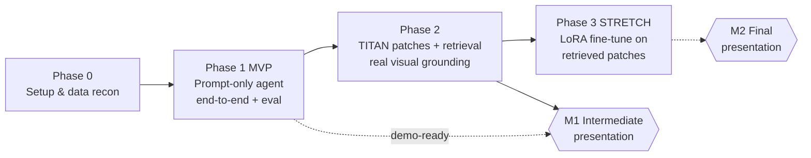

# Team Work Plan — MLMI REG² Pathology Report Generation

**Execution plan for a team of 4.** This is the "what do I do Monday morning" doc.
It turns the high-level `[docs/project_overview.md](project_overview.md)` (the
scientific reference) into a phased, de-risked, owner-assigned set of TODOs.

> Read this first; read `project_overview.md` for the *why* and the deep design.

---

## 0. TL;DR

We are short on time, so we **ship a thin end-to-end slice first** and deepen it.

- **What we're building (simpler version):** a system that walks a *deterministic*
  diagnostic graph over a uterine WSI, asking one clinical question per node,
  answering each with a vision-language model (VLM), and emitting both a
  **reasoning chain** and a **final pathology report** — exactly the two REG²
  deliverables.
- **The trick:** the graph + controller + retriever + VLM-backend scaffolding
  already exists in this repo. Wiring it is cheap. The *expensive* parts are
  (1) LoRA fine-tuning and (2) building retrieval-consistent training samples.
  So we isolate those into a final stretch phase that can be cut without killing
  the project.
- **MVP = prompt-only.** No fine-tuning. An off-the-shelf hosted VLM
  (`Qwen3-VL-8B-Instruct`) answers each node with guided decoding. This already
  produces a full reasoning chain + report and "before" numbers for M1.
- Then we add **real TITAN patch retrieval** (visual grounding), and only then,
  if time allows, **LoRA fine-tuning** on retrieved patches.

---

## 1. Phase roadmap

| Phase | Goal | Exit criteria (Definition of Done) |
|---|---|---|
| **P0 — Setup & recon** | Everyone can run code on the cluster; we know the data. | Container runs on a compute node; vLLM endpoint reachable; `case_class` distribution table produced; clean A/B training subset chosen. |
| **P1 — MVP (prompt-only)** | A *working* end-to-end agent + evaluation harness. | For ≥20 cases: graph traversal → reasoning chain + report, scored by all REG² metrics. Baselines B1/B2 recorded. No fine-tuning, thumbnail/simple visual input. |
| **P2 — TITAN retrieval** | Replace dumb visual input with real top-K patch retrieval. | Per-slide cached `embeddings.pt`/`coords.pt`; `TitanRetriever` returns sensible patches on sample cases; metrics re-run with retrieval on. |
| **P3 — LoRA (stretch)** | Train a backend on retrieval-consistent samples. | Training set built *via the retriever*; one LoRA run finishes; fine-tuned backend beats prompt-only on Edge-F1. Cut if time runs out. |

**Hard rule:** P1 must be demo-ready before anyone starts P3. A working
prompt-only system is worth far more than a half-finished fine-tune.

---

## 2. What already exists (reuse, don't rebuild)

| Asset | State | Reuse in |
|---|---|---|
| `[graph/diagnostic_graph.py](../graph/diagnostic_graph.py)` | Placeholder graph, correct schema, `validate_graph()` works | P1 — encode the real graph |
| `[graph/controller.py](../graph/controller.py)` | Deterministic traversal, swappable `AnswerBackend`, memory, `DummyBackend` | P1 — harden with retry/consistency |
| `[baselines/zero_shot.py](../baselines/zero_shot.py)` | Full agent loop on an OpenAI-compatible endpoint w/ guided decoding | P1 — *this is basically the MVP backend* |
| `[extraction/extract_report_parts.py](../extraction/extract_report_parts.py)` | **Works**, produced `report_parts_extracted.json` (organ/specimen/procedure) | P1 — extend to full Q→A chains |
| `[data/report_parts_extracted.json](../data/report_parts_extracted.json)` | Partial WP3 output already on disk | P1 — bootstrap labels |
| `[retrieval/titan_retriever.py](../retrieval/titan_retriever.py)` | Cosine retrieval skeleton, `text_encoder=None` | P2 — wire real TITAN encoder |
| `[data/uterus-flow-diagram.drawio](../data/uterus-flow-diagram.drawio)` | The real reasoning structure | P1 — source for the graph |
| `[tests/test_graph.py](../tests/test_graph.py)` | Graph integrity + traversal smoke test | all phases — keep green |

---

## 3. Cluster assets we standardize on

From `ls models / repos / containers` on the cluster:

**Models** (`/mnt/projects/mlmi/reg2/models`)
- `Qwen3-VL-8B-Instruct` → **MVP backbone** (already served, already used in
  `extract_report_parts.py`).
- `medgemma-1.5-4b-it` → medical specialist baseline / comparison.
- `Qwen3-VL-30B-A3B-Instruct` → bigger upper-bound baseline (B3-style).
- `InternVL3_5-8B` / `InternVL3_5-14B` → fine-tune candidates for P3
  ("generalists fine-tuned > specialists", per overview §10).

**Repos** (`/mnt/projects/mlmi/reg2/repos`)
- `TITAN` → retrieval backbone (image + text encoders, shared 768-dim space).
- `Patho-R1` → pathology reasoning model: strong baseline + reference for
  step-wise reasoning prompts.
- `quilt-llava` → pathology VLM baseline.

**Containers** (`/mnt/projects/mlmi/reg2/containers`)
- Use `dominik_20260529_base.sqsh` as the **team base image**.
- `qwen25_graphrag.sqsh` = newest graph-oriented image (fallback / reference).
- Always export to a **new** `.sqsh` after changes (see
  `[docs/cluster_setup.md](cluster_setup.md)` §3.4).

---

## 4. The 4 owners (parallel lanes)

We run as **4 parallel WP owners**, not a strict G1/G2 split — but the mapping to
the PDF's groups is noted so we stay aligned with the course structure.
(G1 = step-wise reasoning ≈ B + C; G2 = interactive agent/memory ≈ D + A infra.)

### Owner A — Data & WSI pipeline
Owns: `[notebooks/explore_wsi.ipynb](../notebooks/explore_wsi.ipynb)`, a new
`scripts/extract_patches.py`, `scripts/encode_titan.py`, the embeddings cache.

- [ ] **P0** Finish the explore notebook: count `.svs` files in `TUMUntera/`,
      build the `case_class` (A–E) distribution table, report-length-per-class.
- [ ] **P0** Resolve two-slide cases (cervical + corpus): default = pool patch
      embeddings into one matrix per case (confirm with Han — see §6).
- [ ] **P1** Thumbnail/low-mag export per slide for the prompt-only MVP (a single
      down-sampled image the VLM can ingest — no retrieval yet).
- [ ] **P2** Patch extraction: `openslide` read @ 20×, 256×256 grid, Otsu/grayscale
      background filter (mean > 220 = glass → drop). Target ~500–2000 tiles/slide.
- [ ] **P2** Encode patches with the **frozen TITAN image encoder**; cache per
      slide: `embeddings.pt` `[N×768]` + `coords.pt` `[N×2]`. Run as an `sbatch`
      job overnight (never on head node).

### Owner B — Graph & Q→A labels
Owns: `[graph/diagnostic_graph.py](../graph/diagnostic_graph.py)`,
`[extraction/qa_extractor.py](../extraction/qa_extractor.py)`, the per-case label JSON.

- [ ] **P0/P1** Translate `uterus-flow-diagram.drawio` into a **compact** real
      graph (~15–25 nodes, the high-frequency paths — *not* the full WHO taxonomy):
      Organ/Procedure → Specimen → Compartment → Local features → Integration →
      Diagnosis → Report. Replace the placeholder `GRAPH`; keep `validate_graph()`
      passing and `[tests/test_graph.py](../tests/test_graph.py)` green.
- [ ] **P1** Extend the working `extract_report_parts.py` logic into
      `qa_extractor.py` to produce a **full Q→A chain per case**, with each answer
      aligned to a graph node and "not mentioned" where absent.
- [ ] **P1** Output per-case JSON: `slide_id`, `case_class`, `qa_chain`
      (the ground-truth path), `final_report` — the labels for eval (and P3 training).
- [ ] **P1** **Hand-validate ~20–30 class A/B cases** against the graph before
      running on all data; fix the extraction prompt / graph coverage as needed.

### Owner C — Retrieval & model serving
Owns: `[retrieval/titan_retriever.py](../retrieval/titan_retriever.py)`,
`[configs/paths.yaml](../configs/paths.yaml)`,
`[scripts/cluster/start_qwen_server.sh](../scripts/cluster/start_qwen_server.sh)`,
P3 fine-tune scripts.

- [ ] **P0** Stand up / confirm the vLLM OpenAI-compatible endpoint for
      `Qwen3-VL-8B-Instruct`; record host/port and exact model string. Update
      `configs/paths.yaml` (it currently points at `Qwen2.5-7B-Instruct`).
- [ ] **P2** Wire the real TITAN **text + image** encoders from `repos/TITAN`
      into `TitanRetriever.encode_query()` / the encode pipeline (currently
      `text_encoder=None`). Implement the `level` hook (low-mag for global nodes,
      high-mag for local nodes) at least as a stub.
- [ ] **P2** Validate retrieval quality: for a known "myometrial invasion" case,
      confirm top-K patches look right (sanity check, not a metric).
- [ ] **P3 (stretch)** Build retrieval-consistent training samples (use the
      retriever to pick patches per question, exactly as at inference) and run
      **one LoRA fine-tune** on `InternVL3_5-8B` / `Qwen3-VL-8B`. Expose it as a
      drop-in `FineTunedBackend` (same `AnswerBackend` interface).

### Owner D — Agent loop & evaluation
Owns: `[graph/controller.py](../graph/controller.py)`,
`[baselines/zero_shot.py](../baselines/zero_shot.py)`, a new `eval/metrics.py`,
`eval/run_eval.py`.

- [ ] **P0/P1** Smoke-test: run `zero_shot.py` through the controller against the
      real endpoint for one case (text-only first, then with thumbnail input).
- [ ] **P1** Harden `controller.py`: growing `(Q,A)` memory in the prompt,
      low-confidence retry (re-retrieve excluding current patches), and a
      **rule-based** consistency check from tree logic (no neural net).
- [ ] **P1** Build the **REG² eval harness** (`eval/metrics.py`):
      - Reasoning chain: **Binary Path Validity**, **Edge-F1**, **MESS** (semantic
        similarity via biomedical embeddings).
      - Report: **ROUGE-L**, **BLEU-4**.
      - Sanity: Visual Grounding Score, Counterfactual Score (P2+).
- [ ] **P1** Run baselines and record the "before" table:
      - **B1** direct generation (pooled/thumbnail → VLM → report, no reasoning).
      - **B2** zero-shot CoT through the graph (the MVP itself).
      - **B3** (optional) `Qwen3-VL-30B-A3B` as a stronger upper bound.

---

## 5. First-week concrete TODOs

Each owner does *one small, shippable* thing in week 1 so we have a spine fast.

| Owner | Week-1 deliverable |
|---|---|
| A | Run/extend `explore_wsi.ipynb` → `case_class` count table + report-length stats; commit the chosen clean A/B training subset list. |
| B | Encode the drawio flow into nodes/edges, replace the placeholder `GRAPH`, and hand-write 5 example Q→A chains to sanity-check coverage. |
| C | Confirm the live vLLM endpoint/port + exact `Qwen3-VL-8B-Instruct` model string; update `configs/paths.yaml`. |
| D | Wire `zero_shot.py` through the controller against the real endpoint for one slide (text-only smoke test) and stub `eval/metrics.py`. |

**Integration checkpoint (end of week 1):** B's real graph + C's live endpoint +
D's controller run together on **one** case end-to-end (text-only). That single
green run de-risks the entire project.

---

## 6. Open questions — confirm with Dr. Han Li

1. **`case_class` A–E meaning** — does it encode report richness/completeness
   (A = richest)? Determines our clean training subset.
2. **Two-slide cases** — OK to pool cervical + corpus patch embeddings into one
   matrix per case?
3. **The reasoning tree** — is there an official/canonical version of the
   diagnostic graph beyond `uterus-flow-diagram.drawio`, or do we encode that one?
4. **REG² metric definitions** — exact spec for Binary Path Validity / Edge-F1 /
   MESS (which biomedical embedding model for MESS?) and the official test split.
5. **Report target format** — free-text English report, or a structured template?

---

## 7. Simplifications baked in (and what we deferred)

| Decision | MVP choice | Why / when we revisit |
|---|---|---|
| Fine-tuning | **None in MVP** — prompt-only VLM w/ guided decoding | The main time sink; deferred to P3 stretch |
| Visual input | Thumbnail / few fixed patches | Real TITAN top-K retrieval arrives in P2 |
| Graph size | Compact (~15–25 nodes, common paths) | Avoids modeling the full WHO uterine taxonomy |
| Training data | Class A/B only | Richest reports → cleanest Q→A chains |
| Two-slide cases | Pool embeddings | Simpler; confirm with supervisor (§6) |
| Q→A extraction | Local Qwen on cluster (no paid API) | Reuses the working `extract_report_parts.py` path |

---

## 8. Milestones & deliverables

- **M1 — Intermediate presentation:** the prompt-only MVP running end-to-end on
  ≥20 cases, the REG² metric table (B1/B2 baselines), the real graph, and the
  validated Q→A label set. Bonus: P2 retrieval wired in.
- **M2 — Final presentation:** P2 retrieval fully integrated, comparison of
  prompt-only vs. retrieval-grounded vs. (if reached) LoRA fine-tuned backend
  across all metrics; integrated agent loop with memory + self-correction; final
  documentation.

**Guiding principle:** every phase ends with a runnable system and a number on a
slide. We always have something to present, even if P3 never lands.
